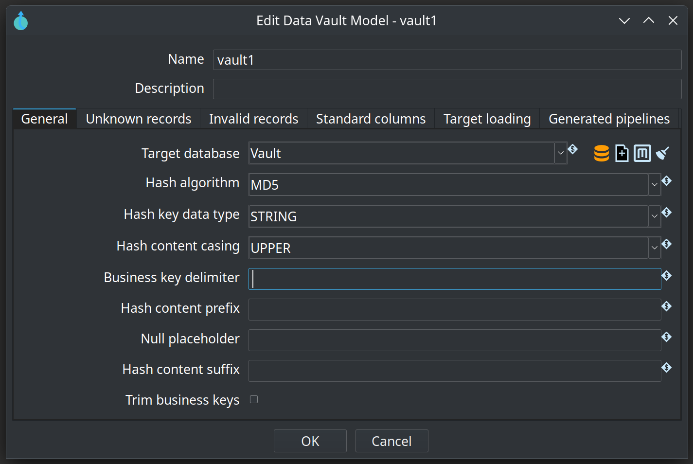
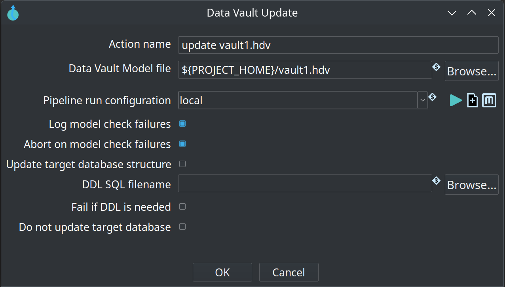
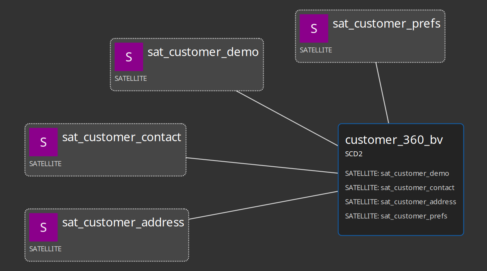
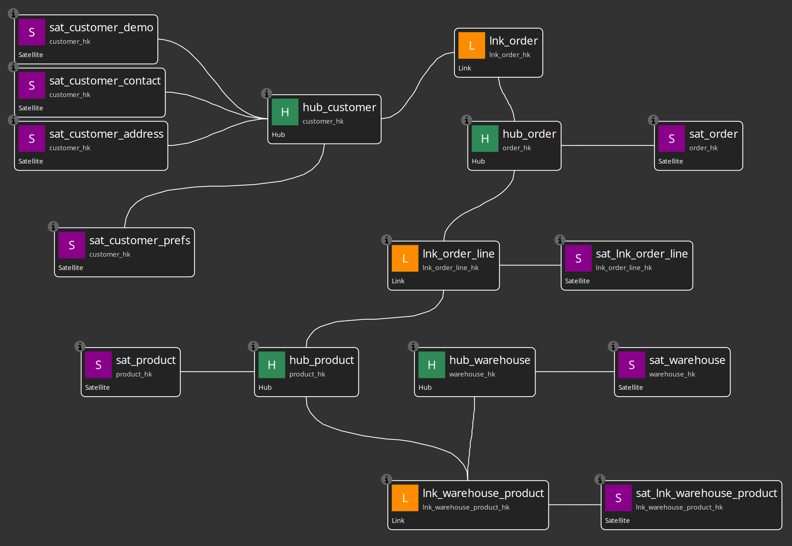

<!--
Licensed to the Apache Software Foundation (ASF) under one
or more contributor license agreements.  See the NOTICE file
distributed with this work for additional information
regarding copyright ownership.  The ASF licenses this file
to you under the Apache License, Version 2.0 (the
"License"); you may not use this file except in compliance
with the License.  You may obtain a copy of the License at
  http://www.apache.org/licenses/LICENSE-2.0
Unless required by applicable law or agreed to in writing,
software distributed under this License is distributed on an
"AS IS" BASIS, WITHOUT WARRANTIES OR CONDITIONS OF ANY
KIND, either express or implied.  See the License for the
specific language governing permissions and limitations
under the License.
-->

# Hop Data Vault 2.0 Plugin

Apache Hop plugin for **Data Vault 2.0**, **Business Vault**, and **dimensional** modeling, validation, and model-driven loading. Version **0.3.0-SNAPSHOT** targets **Apache Hop 2.18.1** and **Java 21**.

**Model once. Generate loads and consumption layers.** Sources live in the Hop **Data Catalog**; visual **`.hdv`**, **`.hbv`**, and **`.hdm`** models drive workflow actions and optional **execution maps** (`.hem`).

## Tuturials

* [Hop Data Vault Tutorial - 1 - Creating your first data vault model](https://youtu.be/YRUwPdDyNDE)
* [Hop Data Vault Tutorial - 2 - Updating your data vault](https://www.youtube.com/watch?v=k64kxMmyA4U)


## Features

Full capability list with maturity labels: **[docs/feature-overview.md](docs/feature-overview.md)**

Highlights:

- **Data Catalog** — `DV_SOURCE` record definitions under `hop/{project}/sources`; catalog validation with proposals and acknowledgements
- **Catalog versions + schema gate** — tag source contracts, **Validate resource definitions** CI action, impact blast radius, Markdown/HTML reports
- **Raw Data Vault** — `.hdv` modeler, Check model, Data Vault Update action, hybrid integration modes
- **Business Vault** — `.hbv` SCD2 (single and multi-satellite), PIT tables, Business Vault Update action
- **Dimensional modeler** — `.hdm` Kimball loads, Dimensional Publish/Update actions
- **Execution maps** — crawl workflows and models into `.hem` lineage graphs
- **AI Help** — optional LLM advisory on models, pipelines, and workflows







## Documentation

Full index: **[docs/README.md](docs/README.md)**

| Audience | Document |
|----------|----------|
| Everyone (start here) | [`docs/feature-overview.md`](docs/feature-overview.md) |
| Modelers (tutorial) | [`docs/getting-started-retail.adoc`](docs/getting-started-retail.adoc) |
| Advanced fixtures | [`docs/getting-started-integration-tests.adoc`](docs/getting-started-integration-tests.adoc) |
| Managers / architects | [`docs/presentations/hop-data-vault-overview.md`](docs/presentations/hop-data-vault-overview.md) |

**Data Vault reference** (AsciiDoc under `docs/`):

| Document | Topic |
|----------|--------|
| [`docs/datavault-plugin.adoc`](docs/datavault-plugin.adoc) | Plugin overview, visual editor, workflows |
| [`docs/datavault-configuration.adoc`](docs/datavault-configuration.adoc) | Embedded `.hdv` configuration |
| [`docs/dv-integration-modes.adoc`](docs/dv-integration-modes.adoc) | Hop managed / external / custom pipelines |
| [`docs/dv-hub.adoc`](docs/dv-hub.adoc) / [`dv-link.adoc`](docs/dv-link.adoc) / [`dv-satellite.adoc`](docs/dv-satellite.adoc) | Table metadata |
| [`docs/datavault-update-action.adoc`](docs/datavault-update-action.adoc) | Data Vault Update action |

**Business Vault reference:**

| Document | Topic |
|----------|--------|
| [`docs/business-vault-overview.adoc`](docs/business-vault-overview.adoc) | `.hbv` modeler and table types |
| [`docs/business-vault-scd2.adoc`](docs/business-vault-scd2.adoc) | SCD2 and multi-satellite merge |
| [`docs/business-vault-configuration.adoc`](docs/business-vault-configuration.adoc) | Embedded `.hbv` configuration |
| [`docs/business-vault-update-action.adoc`](docs/business-vault-update-action.adoc) | Business Vault Update action |

Also: [`docs/ai-advisory.md`](docs/ai-advisory.md), [`docs/datavault-source.adoc`](docs/datavault-source.adoc), [`docs/datavault-source-database.adoc`](docs/datavault-source-database.adoc), [`docs/record-definition-input.adoc`](docs/record-definition-input.adoc), [`docs/date-dimension-generator.adoc`](docs/date-dimension-generator.adoc).

Screenshots are in [`docs/images/`](docs/images/).

## Repository layout

| Folder | Purpose |
|--------|---------|
| [`integration-tests/`](integration-tests/) | Plugin regression suites and golden-dataset tests — see [integration-tests/PROJECT.md](integration-tests/PROJECT.md) |
| [`retail-example/`](retail-example/) | Full-stack retail demo (CSV → DV → BV → DM) — see [retail-example/README.md](retail-example/README.md) |
| [`scripts/`](scripts/) | Shared Docker runners (`run-hop.sh`, `run-postgres.sh`) and retail data generators |

### Integration tests

Register `integration-tests/` as Hop project **`hop-data-vault`**. Configure **`CRM`** and **`Vault`** database connections, install the plugin, then:

```bash
./scripts/run-postgres.sh up
./scripts/run-hop.sh integration-tests tests/run-tests.hwf
```

Or from `integration-tests/`: `./run-tests.sh`

### Retail example demo



Register `retail-example/` as Hop project **`retail-example`**, then:

```bash
./scripts/run-postgres.sh up
./scripts/run-hop.sh retail-example workflows/run-retail-initial.hwf
./scripts/run-hop.sh retail-example workflows/run-retail-update.hwf   # repeat for monthly batches
```

## Building

```bash
mvn clean package
```

Artifacts:

- `target/hop-datavault-0.3.0-SNAPSHOT.jar`
- `target/hop-datavault-0.3.0-SNAPSHOT.zip` (ready-to-unzip plugin layout)

## Installation (external plugin)

1. Unzip the assembly zip into your Hop installation, or manually copy the jar to:
   ```
   $HOP_HOME/plugins/misc/datavault/hop-datavault-0.3.0-SNAPSHOT.jar
   ```
2. Restart Hop GUI.
3. New metadata types appear under **Metadata → Data Vault**. **Data Vault Update**, **Business Vault Update**, and **Validate resource definitions** actions are available in workflows. `.hdv` and `.hbv` files open in the visual modelers.

## Usage

1. Define **Data Vault Sources** as catalog `DV_SOURCE` records (`hop/{project}/sources`) for your staging / CRM tables.
2. Create a **Data Vault Model** (`.hdv`): add hubs, links, and satellites on the canvas, connect relationships, and add notes as needed.
3. Click **Edit model** to set the target database, hashing rules, sentinel records, and pipeline options.
4. Use **Check model**, **Generate DDL**, or **Debug** on the toolbar to validate and inspect before production loads. Use the canvas or table **context menus** (icon actions) to add and edit objects.
5. Add a **Data Vault Update** action to a workflow, point it at the `.hdv` file, and run.
6. Optionally create a **Business Vault model** (`.hbv`), link it to the `.hdv`, define SCD2 tables, and run **Business Vault Update**.

For multi-active satellites, set **`drivingKey`** (vault column) and **`drivingKeySourceField`** (source column). For scheduled partial loads, tag sources with **`group`** and set **`recordSourceGroup`** on the update action.

For load end dating, enable **`useLoadEndDate`** in the model configuration and set **`loadEndDateField`** (e.g. `x_load_end_ts`). Current satellite rows are those where the end-date column is null:

```sql
SELECT * FROM sat_customer WHERE x_load_end_ts IS NULL
```

## Common Data Vault 2.0 options included

- Hashing: MD5 / SHA1 / SHA256 / SHA512
- HEX (default), String, or Binary hash keys (Binary needs Hop 2.19.0+; see [issue 7346](https://github.com/apache/hop/issues/7346))
- Trimming + casing normalization
- Delimiter + null placeholder
- Unknown and invalid sentinel record handling
- Column naming conventions (load timestamp, record source)
- Hashdiff vs **load end date** satellite patterns
- Multi-active satellites via driving keys
- Record source groups for partial model updates

## Roadmap / 0.3.x focus

**Shipped in 0.3.0 preview:** catalog version tags, schema impact simulation, **Validate resource definitions** CI/CD gate (compare modes, failure severity, Markdown/HTML reports, downstream impact), retail `work/` runtime tree, schema-gate docs and screenshots.

**Also shipped (0.2.x line):** dimensional modeler, execution maps, catalog-first sources, data quality rules and gates, multi-DB integration hardening, incremental Business Vault SCD2, primary-key import/detection, SQL Server / Unicode EDW hardening.

**Planned:** BV naming rules engine, Marquez / OpenLineage export, hash-key ModPartitioner parallelism, additional source types.