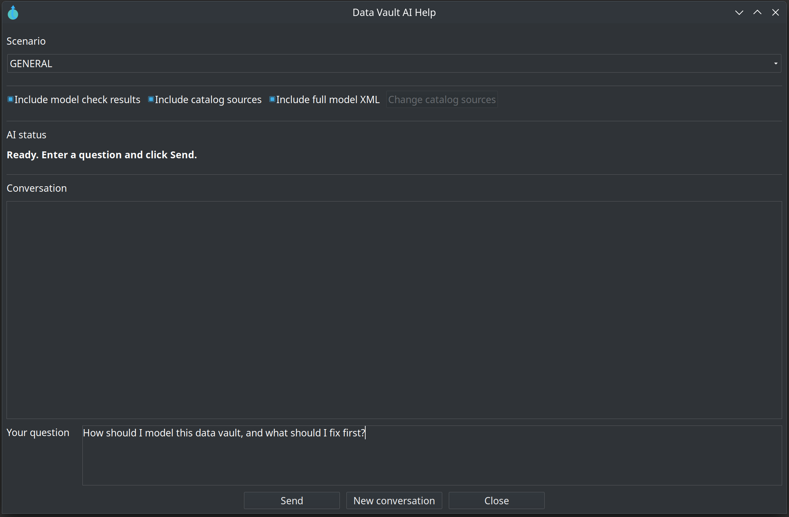
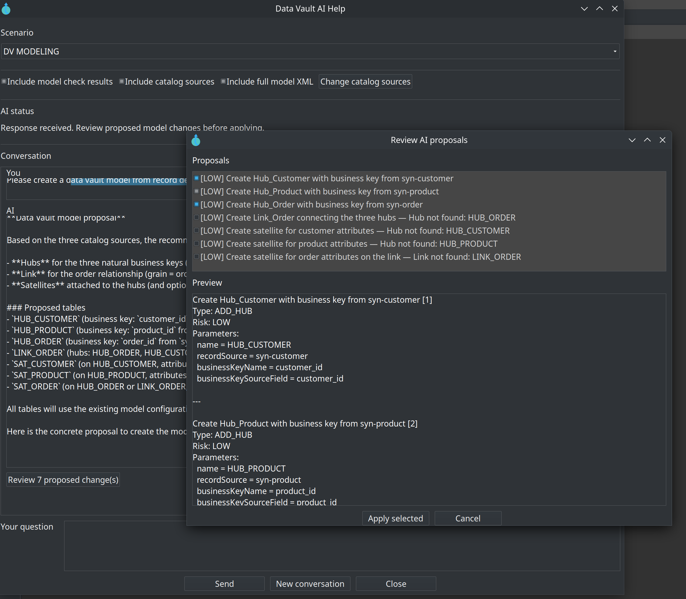

# Data Vault AI Help & Advisory

The Apache Hop Data Vault plugin includes an AI-powered assistant (the **AI Help** or **AI Advisor**) designed to accelerate enterprise data warehousing modeling and integration. By integrating a Large Language Model (LLM), the AI Helper can analyze catalog sources, validate models, suggest layout updates, perform type mappings, build hubs, links, and satellites, and troubleshoot integration errors.

---

## Prerequisites & Installation

To use the AI Helper:
1. Ensure the Hop **Language Model Chat** transform (`hop-transform-languagemodelchat`) is installed in your Apache Hop distribution (bundled by default under the plugin’s dependencies).
2. Configure your preferred AI provider in **Hop GUI → Configuration → AI Assistant**.
3. Enable the **Enable AI advisory** flag and select or configure your model details.

> **Note:** AI settings previously stored under **Data Vault 2.0** configuration are migrated automatically to **AI Assistant** on first load.

---

## LLM Provider Configuration

The AI Advisor supports various LLM providers using standard Hop Language Model Chat adapters. Select a provider preset or configure a custom one:

| Provider / Preset | API Base URL (Default) | Model Name (Default) | Key Requirement |
| :--- | :--- | :--- | :--- |
| **Grok (xAI)** | `https://api.x.ai/v1` | `grok-4` | API key from [console.x.ai](https://console.x.ai) |
| **OpenAI** | `https://api.openai.com/v1` | `gpt-4o-mini` | API key from [platform.openai.com](https://platform.openai.com) |
| **Google (Gemini)**| `https://generativelanguage.googleapis.com/v1beta/openai` | `gemini-2.5-flash` | API key from [Google AI Studio](https://ai.google.dev/) |
| **Anthropic** | *(Uses default endpoint)* | `claude-3-5-sonnet-20241022` | API key from Anthropic console |
| **Mistral** | `https://api.mistral.ai/v1` | `mistral-small-latest` | Mistral API Key |
| **Ollama** | `http://localhost:11434` | `llama3.2` | Local Ollama instance (No API key needed) |
| **Hugging Face**| *(Uses default endpoint)* | *(Varies)* | Hugging Face Hub Token |
| **Custom** | Specify your custom endpoint | *(Varies)* | API key or token as required |

---

## How to Use AI Help

### Data Vault modeler

1. Open your Data Vault model (`.hdv`) in the visual modeler canvas.
2. Click **AI Help** on the modeler toolbar (next to **Check model**), or right-click the canvas and choose **AI Help** under **Help**.
3. Select an advisory **Scenario** corresponding to your goal.
4. Set your **Context Inclusions** (described below) and type your question in the prompt input field.
5. Click **Send**. The advisor runs the prompt in the background, updating the conversation transcript when a response is ready.

### Pipelines and workflows

Pipeline and workflow **AI Help** supports multi-turn advisory chat and, when the model suggests concrete edits, **structural proposals** you can review and apply to the open graph. See [Pipeline & Workflow AI Help — M2](plans/hop-ai-assistant-m2.md) for proposal types, validation rules, and bundled Hop standards.

Open a pipeline (`.hpl`) or workflow (`.hwf`) and use:

- **AI Help** on the graph toolbar
- Right-click the canvas → **Basic** → **AI Help**
- Right-click a transform or action → **Basic** → **AI Help** (sets focus on that node)

**Pipeline scenarios:** General, Transform selection, Error diagnosis, Pipeline design.

**Workflow scenarios:** General, Action selection, Error diagnosis, Workflow design.

**Context inclusions:** pipeline/workflow check results, transform/action plugin catalog, optional full XML, and execution log excerpt from the Hop GUI log panel.

When a response includes `hop_proposals`, click **Review N proposed change(s)** in the transcript (same flow as the Data Vault modeler). Applied changes register undo on the pipeline/workflow graph; follow-up turns include summaries of what you applied.

### Advisory Scenarios

The Advisor uses tailored system prompt templates to optimize responses for different modeling phases:

* **General**: Default scenario for miscellaneous queries, best practices, and general assistance.
* **Source Analysis**: Guidance on parsing raw databases, files, and catalog sources.
* **Type Mapping**: Advice on mapping source data types to physical target table data types.
* **Data Vault Modeling**: In-depth recommendations on designing hubs, links, satellites, and reference tables.
* **Hop Integration**: Help with configuring pipelines, workflows, and execution parameters in Hop.
* **Error Diagnosis**: Analysis of validation warnings, errors, or execution logs to troubleshoot issues.

### Context Inclusions & Options

You can control what metadata is sent to the LLM to balance response accuracy and prompt token limits:

* **Include model check results**: Automatically validates your open model (using **Check model**) and appends validation results (errors, warnings, checks) to the prompt.
* **Include catalog sources**: Includes metadata schemas (Record Definitions) from your catalog. Click **Change catalog sources** to select specific sources (remembered throughout the conversation).
* **Include full model XML**: Sends the entire `.hdv` model XML. This is larger but allows the AI to perform comprehensive reviews. *Note: Full XML is sent on the first turn only to conserve tokens.*

---

## Interactive Structural Proposals

In addition to providing conversational guidance, the AI can propose specific modifications to your open artifact. When a response contains actionable edits, a **Review … proposed change(s)** button appears in the conversation history.

- **Data Vault model** (`.hdv`): table/hub/link/satellite proposals (`dv_proposals`) — details below.
- **Pipeline** (`.hpl`) and **workflow** (`.hwf`): graph topology proposals (`hop_proposals`) — see [M2 documentation](plans/hop-ai-assistant-m2.md).

Clicking this button opens the **Proposal Review Dialog** where you can:
1. **Select & Preview Changes**: Select or unselect specific changes. The preview area displays structural details of each action.
2. **Review Validation Status**: The dialog validates proposed actions against your current model and selected catalog schemas:
   * **[LOW/MEDIUM/HIGH] Risk**: Each proposal has a designated risk level based on the impact on your model.
   * **Blocked**: Actions that would invalidate your model (e.g., adding a table with an already existing name) are automatically unchecked and labeled with a descriptive blockage reason.
   * **Warning**: Warnings are displayed in parentheses for potentially risky operations.
3. **Apply Selected**: Click **Apply** to execute the validated changes directly to your active visual modeler. An undo point is registered, allowing you to use the standard **Undo** button in the Hop modeler toolbar if needed.

### Applyable Structural Proposal Types

The AI can suggest the following structured modifications:

| Proposal Type | Expected Parameters | Description / Effect |
| :--- | :--- | :--- |
| `ADD_HUB` | `name`, `recordSource`, `tableName` (opt), `hashKeyFieldName` (opt), `businessKeysJson` (opt), `locationX` / `locationY` (opt) | Adds a new Hub table mapped to a source and its business keys. |
| `ADD_LINK` | `name`, `hubNames` (comma list), `tableName` (opt), `linkHashKeyFieldName` (opt), `locationX` / `locationY` (opt) | Creates a new Link connecting two or more existing hubs. |
| `ADD_SATELLITE` | `name`, `recordSource`, `hubName` / `linkName` (either), `tableName` (opt), `attributesJson` (opt), `locationX` / `locationY` (opt) | Creates a Satellite attached to a Hub or Link with specified attributes. |
| `SET_BUSINESS_KEYS` | `tableName`, `businessKeysJson` / `businessKeyName` & `businessKeySourceField` & `businessKeyRecordSource` | Updates or overwrites business keys on an existing Hub. |
| `BIND_RECORD_SOURCE` | `tableName`, `recordSource` | Binds a record source to an existing Hub or sets the record source for a Satellite. |
| `SET_TABLE_LOCATION`| `tableName`, `locationX`, `locationY` | Updates the coordinate position of a table in the visual canvas. |
| `ADD_MODEL_NOTE` | `text` | Creates a floating text note on the modeling canvas. |
| `SET_CONFIGURATION_PROPERTY` | `propertyName`, `value` | Updates configuration settings (e.g., `sortRowsSize`, `targetTableParallelCopies`, `targetTableBatchSize`, `targetDatabase`, `dataCatalogConnection`). |
| `RENAME_TABLE` | `tableName`, `newName` | Safely renames an existing Hub, Link, or Satellite. |

---

## Privacy & Security

The Hop Data Vault AI Helper values the security of your enterprise metadata:
* **No Secret Leaks**: API keys are securely stored in your local Hop configuration file; they are never sent inside prompts.
* **Redacted Database Connections**: Database metadata connection descriptions are limited to the name, type, database name, and host. **Usernames, passwords, ports, and connection URLs are explicitly excluded** before sending.
* **Data Scoping**: Only catalog source schemas and model components that you explicitly check and approve are uploaded to your chosen LLM provider.

---

## Programmatic API

For headless, automated, or test environments, the underlying AI services can be invoked programmatically.

**Data Vault modeler**

* [DvAiContextBuilder](../src/main/java/org/apache/hop/datavault/ai/DvAiContextBuilder.java): Assembles and redacts context bundles, combining scenario details, model XML, structures, and catalog schemas.
* [DvAiAdvisorService](../src/main/java/org/apache/hop/datavault/ai/DvAiAdvisorService.java): Communicates directly with the configured language model.
* [DvAiConversationSession](../src/main/java/org/apache/hop/datavault/ai/DvAiConversationSession.java): Manages state and conversation turns for interactive applications.
* [DvAiProposalApplier](../src/main/java/org/apache/hop/datavault/ai/DvAiProposalApplier.java): Validates and writes approved proposals directly back to the model memory.

**Pipeline and workflow (M2)**

* [PipelineAiAdvisorService](../src/main/java/org/apache/hop/datavault/ai/pipeline/PipelineAiAdvisorService.java) / [WorkflowAiAdvisorService](../src/main/java/org/apache/hop/datavault/ai/workflow/WorkflowAiAdvisorService.java): LLM calls with M2 prompt supplement and `hop_proposals` parsing.
* [HopAiProposalParser](../src/main/java/org/apache/hop/datavault/ai/HopAiProposalParser.java): Extracts proposals from raw assistant text.
* [PipelineAiProposalValidator](../src/main/java/org/apache/hop/datavault/ai/pipeline/PipelineAiProposalValidator.java) / [WorkflowAiProposalValidator](../src/main/java/org/apache/hop/datavault/ai/workflow/WorkflowAiProposalValidator.java): Topology validation before apply.
* [PipelineAiProposalApplier](../src/main/java/org/apache/hop/datavault/ai/pipeline/PipelineAiProposalApplier.java) / [WorkflowAiProposalApplier](../src/main/java/org/apache/hop/datavault/ai/workflow/WorkflowAiProposalApplier.java): Applies selected proposals.

Full M2 design and proposal tables: [plans/hop-ai-assistant-m2.md](plans/hop-ai-assistant-m2.md).