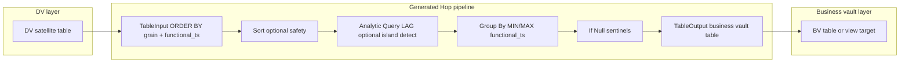

# Business Vault functional SCD2 from DV satellites

Add a Business Vault layer to hop-data-vault that generates Hop pipelines from DV satellite history: collapse attribute versions into functional SCD2 intervals (`valid_from` / `valid_to`) using Sort, Group By, Analytic Query where needed, If Null sentinels, and TableOutput — with configurable functional timestamp per table and LOAD_DATE fallback.

## Problem statement

Raw Data Vault satellites store **insert-only history** keyed by parent hash (and optional driving key) with a **technical load timestamp**. Consumption layers (business vault, reporting, dbt marts) often need:

- Standardized column names and types
- **Functional timelines** (when the source says a value was true), not when the warehouse loaded it
- **SCD Type 2** rows: `valid_from` / `valid_to` (or `from_ts` / `to_ts`) with open-ended sentinels (`1900-01-01`, `9999-12-31`)

Today this is hand-built in SQL/dbt. Hop already has the building blocks and this project already generates satellite pipelines with **Group By** (`DvSatellite.addTargetTableInput`, lines 1203–1247) — the business vault feature extends that pattern for **outbound** consumption, not inbound CDC.

## Proposed architecture



### Placement in this repo

Extend **hop-data-vault** (not a separate plugin in v1). Business vault is a direct derivative of DV satellite metadata already modeled here. Keeps one `.hdv` model as source of truth; avoids duplicating hub/satellite definitions.

Future: optional extraction to `hop-business-vault` if the layer grows large (PIT, bridges, multi-sat joins).

## Metadata model (v1)

Add a new metadata type **`BusinessVaultSatellite`** referenced from the Data Vault model or from a new **Business Vault** tab on `.hdv`:

| Field | Purpose |
|-------|---------|
| `name` | Logical BV object name |
| `sourceSatelliteName` | DV satellite in the same model (required) |
| `targetTableName` | Physical BV table (default derived from name) |
| `targetDatabase` | Optional override; default = model target DB or separate BV connection |
| `functionalTimestampField` | Column on satellite stream for timeline (source effective date, attribute, etc.) |
| `functionalTimestampFallback` | When empty → model `loadDateField` (**configurable with LOAD_DATE fallback**) |
| `validFromField` / `validToField` | Output column names (defaults `valid_from`, `valid_to`) |
| `openStartSentinel` / `openEndSentinel` | Defaults `1900-01-01 00:00:00`, `9999-12-31 23:59:59` |
| `attributeMappings` | Optional rename map: DV attr → BV column (identity default) |
| `includeHashKey` | Whether to expose parent HK in BV table |
| `includeBusinessKeys` | Optional: join hub in pipeline to denormalize BKs (phase 2) |
| `refreshStrategy` | `FULL_REBUILD` (truncate + load) vs `INSERT_ONLY` (phase 2) |

Validation in `check()`:

- Source satellite exists and has attributes
- Functional timestamp field exists on satellite layout (or fallback load date exists in config)
- Target table name unique within model

## Pipeline generation algorithm

New class **`BvSatellitePipelineSupport`**, following `DvSatellite.generateUpdatePipelines` style: build `PipelineMeta` with `TableInputMeta`, `GroupByMeta`, `TableOutputMeta`, etc.

### Step 1 — Read satellite history

`TableInput` SQL against DV satellite table:

```sql
SELECT <grain>, <attrs>, <functional_ts>, <optional record_source>
FROM <satellite_table>
ORDER BY <hash_key> [, <driving_key>] , <functional_ts>
```

- **Grain**: parent hash key + driving key when multi-active
- **Attributes**: mapped BV columns from satellite attribute list
- **Functional ts**: resolved field or fallback `loadDateField` from `DataVaultConfiguration`

### Step 2 — Sort (defensive)

`Sort` on same keys as ORDER BY — guarantees Group By / Analytic Query correctness if DB ignores ORDER BY.

### Step 3 — Version collapsing (two modes)

**Mode A — Simple (MVP default, `collapseMode=SAME_ATTRIBUTES`)**

`GroupBy` with:

- **Group fields**: grain + all attribute columns (and optional record source if part of uniqueness)
- **Aggregations**: `MIN(functional_ts)` → `valid_from`, `MAX(functional_ts)` → `valid_to`

Correct when: DV satellite only inserts on real attribute changes and identical attribute sets only repeat on **contiguous** loads.

**Mode B — Island detection (`collapseMode=SCD2_ISLANDS`)**

For alternating attribute values (A → B → A), naive Group By merges non-contiguous A rows incorrectly.

Pipeline addition before Group By:

1. `Analytic Query`: group = grain; LAG previous row attribute hash or concatenated attrs
2. `Calculator` or `FilterRows`: `changed = (attrs != prev_attrs)`
3. Running-sum / `Add sequence` grouped by grain → `version_island_id`
4. `GroupBy`: group = grain + `version_island_id` + attrs; MIN/MAX functional_ts

Phase 1 ships **Mode A** with documented limitation; Mode B as fast follow.

### Step 4 — Open interval sentinels

`If Null` transform (add `hop-transform-ifnull` to `pom.xml` + `dependencies.xml`):

- `valid_from` null → `openStartSentinel` (1900-01-01)
- `valid_to` null → `openEndSentinel` (9999-12-31)

### Step 5 — Load business vault table

`TableOutput` to BV target (v1: **truncate table** then insert full rebuild).

DDL: `getTargetTableLayout()` on `BusinessVaultSatellite` — grain columns + mapped attrs + `valid_from` + `valid_to` (+ optional HK).

## GUI and workflow integration

### Visual modeler

- **Table context menu** on satellites (left-click icon): **Generate business vault pipeline** / **Add business vault satellite** — no double-click/right-click
- Toolbar or model context: **Build business vault** (batch all BV definitions)

### Workflow action (v1 or v1.1)

**`BUSINESS_VAULT_BUILD`** action (parallel to `ActionDataVaultUpdate`):

- Data Vault Model file (`.hdv`)
- Pipeline run configuration
- Optional: selected BV satellite names filter
- Generate + execute pipelines; log row counts

Reuse orchestration patterns from `DvPipelineOrchestratorSupport` if multiple BV tables.

## Testing

Add suite under `project/tests/`:

1. Seed DV satellite with known history
2. Run generated BV pipeline
3. Golden CSV unit test on BV table: version count, `valid_from`/`valid_to`, sentinels

Edge cases:

- Duplicate consecutive identical rows (Mode A collapse)
- Attribute change mid-stream (Mode B)
- Multi-active satellite with driving key as part of grain
- Functional ts = dedicated column vs LOAD_DATE fallback

## Documentation

- New `docs/business-vault-scd2.adoc` (user reference, post-implementation)
- Update `README.md`, `docs/datavault-plugin.adoc`, `project/PROJECT.md`
- Cross-link from `docs/dv-satellite.adoc`

---

## GitHub issue (copy-ready)

### Title

**Business Vault: generate functional SCD2 timelines from DV satellite history**

### Summary

Build a **business vault** consumption layer on top of the raw Data Vault. The first step in many BV projects is a table (or dbt view) that standardizes column names/types and materializes a **functional SCD2 timeline** for satellite attributes: when any tracked field changes for a grain key, create a new version using the **source functional date of change**, not the technical load date.

Hop can generate this pipeline from DV satellite metadata using standard transforms.

### Motivation

- DV satellites store insert-only history with **load timestamps** (technical timeline).
- Business users and marts need **valid_from / valid_to** on attribute snapshots (functional timeline).
- Today this is rebuilt manually in SQL/dbt; we already generate DV load pipelines with **Group By** in `DvSatellite` — the inverse transform chain is a natural Hop fit.

### Proposed pipeline (generated)

1. **Table Input** — read DV satellite `ORDER BY` grain (hash key + optional driving key) and functional timestamp
2. **Sort** — enforce order
3. **Group By** — group on grain + all attribute columns; `MIN(functional_ts)` → `valid_from`, `MAX(functional_ts)` → `valid_to`
4. **If Null** — open intervals: `1900-01-01` (first `valid_from`), `9999-12-31` (last `valid_to`)
5. **Table Output** — load business vault table (v1: full rebuild)

**Functional timestamp**: configurable per business-vault table; fallback to satellite `LOAD_DATE` when not specified.

### Enhancements (phased)

- **Island detection** when attribute sets reappear non-contiguously (A→B→A): `Analytic Query` LAG + version island id before Group By
- Column rename map (DV → business-friendly names)
- Optional hub join to denormalize business keys
- Workflow action **Business Vault Build** (like Data Vault Update)
- GUI: add/configure BV satellites from satellite context menu on `.hdv` canvas

### Acceptance criteria

- [ ] Metadata defines BV satellite → DV satellite mapping, functional ts field, valid_from/to names, sentinels
- [ ] `check()` validates source satellite and timestamp field
- [ ] Generated pipeline runs in sample project and produces expected SCD2 rows
- [ ] Documentation and sample test under `project/tests/`
- [ ] Mode documented when simple Group By is insufficient (alternating attribute values)

### References

- Existing Group By usage: `DvSatellite.addTargetTableInput` (LAST_INCL_NULL for merge leg)
- Hop Analytic Query (LAG/LEAD): https://hop.apache.org/manual/latest/pipeline/transforms/analyticquery.html
- Related future work: `docs/dimensional-modeler-plan.md` (Kimball SCD2 via satellite chain)

---

## Implementation phases

| Phase | Deliverable | Effort |
|-------|-------------|--------|
| **1** | `BusinessVaultSatellite` metadata + pipeline generator (Mode A) + unit test | Core |
| **2** | GUI context menu + Debug/open pipeline + `check()` | Medium |
| **3** | `BUSINESS_VAULT_BUILD` workflow action | Medium |
| **4** | Mode B island detection + hub BK denormalization | Follow-up |

## Key files to add/change

- **New**: `BusinessVaultSatellite.java`, `BvSatellitePipelineSupport.java`, `BvSatelliteUpdateContext.java`
- **Extend**: `DataVaultModel.java` (list of BV satellites), `HopGuiVaultGraph.java` (context actions)
- **Deps**: `hop-transform-ifnull` in pom + dependencies.xml
- **Tests**: `project/tests/business-vault/`
- **Docs**: `docs/business-vault-scd2.adoc`

## Risks and mitigations

| Risk | Mitigation |
|------|------------|
| Naive Group By merges non-contiguous identical attrs | Document limitation; ship Mode B flag; test alternating-value case |
| Functional ts not in satellite | Fallback to LOAD_DATE; validation warns when dedicated field missing |
| Large satellite full rebuild | v1 truncate+load; later incremental MERGE by grain+valid_from |
| Multi-active grain | Include driving key in group fields (same as DV satellite CDC) |

## Todos

- [ ] **metadata-bv-satellite** — Add `BusinessVaultSatellite` metadata type with functional ts field, sentinel config, attribute mappings, and `DataVaultModel` reference list
- [ ] **pipeline-generator** — Implement `BvSatellitePipelineSupport`: TableInput → Sort → GroupBy (MIN/MAX) → IfNull → TableOutput; resolve functional ts with LOAD_DATE fallback
- [ ] **check-validation** — Wire `check()` for BV definitions: source satellite exists, timestamp field resolvable, unique target names
- [ ] **gui-context-menu** — Add satellite/table context menu actions to create BV satellite and open generated pipeline (`HopGuiVaultGraph`)
- [ ] **workflow-action** — Add `BUSINESS_VAULT_BUILD` workflow action (model file, run config, execute generated pipelines)
- [ ] **island-mode** — Phase 2: Analytic Query + island id for non-contiguous attribute reappearance (`collapseMode=SCD2_ISLANDS`)
- [ ] **project-tests** — Sample project test suite with golden CSV for functional SCD2 output
- [ ] **docs-issue** — Add `docs/business-vault-scd2.adoc`; update README, `datavault-plugin.adoc`, `project/PROJECT.md`; file GitHub issue