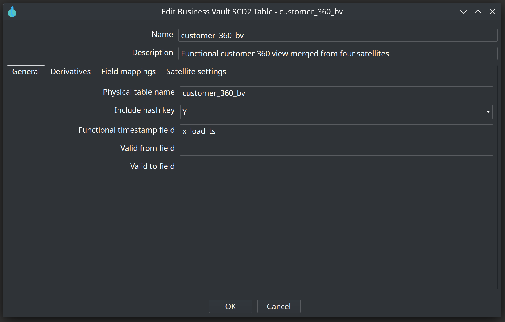
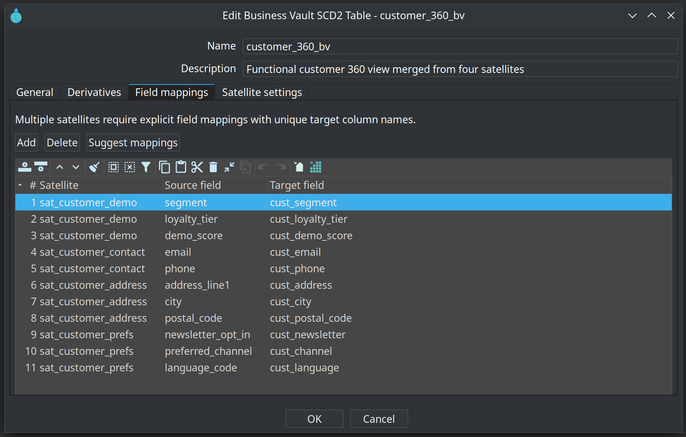
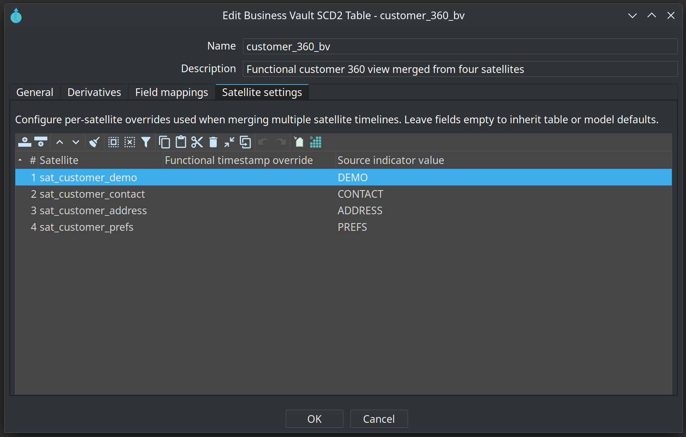
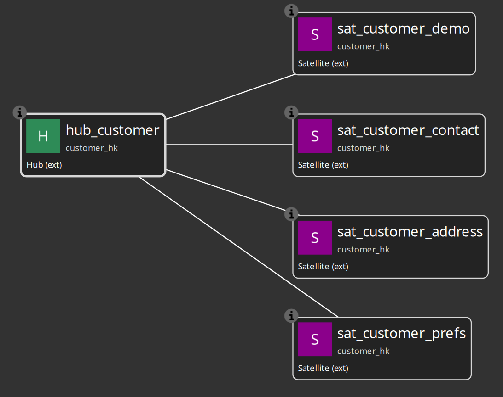

= Business Vault SCD2
:toc: macro
:toclevels: 3

toc::[]

SCD2 tables are the primary Business Vault output today. They materialize **functional timelines** from raw Data Vault satellite history.

== What gets generated

For each SCD2 table the plugin builds a Hop pipeline that:

1. Reads satellite history via `TableInput` SQL (grain + functional timestamp + attributes)
2. Adds source indicators when multiple satellites feed one BV table
3. Merges streams (multi-satellite) with `SortedSchemaMerge`
4. Repeats sparse attribute columns across merged rows
5. Computes validity bounds with `Analytic Query` (LAG/LEAD)
6. Applies open-interval sentinels with `If Null`
7. Collapses duplicate timestamps with `Group By`
8. Loads the Business Vault target table with `TableOutput`

Use **Debug** or **Show build pipeline** on an SCD2 table in the `.hbv` editor to inspect the generated pipeline before running a workflow.

== Single-satellite SCD2

The simplest case: one DV satellite derivative → one BV table.

* Set the satellite as a **derivative** on the SCD2 table
* Configure **functional timestamp** (per table, or model default, or load-date fallback)
* Attribute columns pass through with DV names unless you add field mappings

Example: `integration-tests/tests//basic/vault1.hbv` builds `sat_customer_hb` from `sat_customer`.

== Multi-satellite SCD2

When an SCD2 table references **two or more** satellites (e.g. Customer 360 from demo, contact, address, and preference satellites), you must provide:

* **Field mappings** — map each `(satellite, source field)` to a BV target column name
* **Satellite configs** — optional per-satellite functional timestamp override and source indicator value

Validation enforces:

* All referenced satellites share the same hub (or link) parent
* Every mapped source field exists on the satellite
* No duplicate BV target column from different sources
* Explicit mappings when multiple satellites are present

Example: `integration-tests/tests//multi-satellite-bv/customer-360.hbv` → table `customer_360_bv` with 11 field mappings across 4 satellites.

image::images/business-vault-model-customer-360.png[Customer 360 Business Vault model on the canvas,align="center"]

=== Functional timestamp resolution

Priority order:

1. Per-satellite override in **Satellite configs**
2. Per-table **functional timestamp** field on the SCD2 table
3. Model-level **functional timestamp** in Business Vault configuration
4. **Load date fallback** (typically `x_load_ts` from Data Vault configuration)

The functional timestamp drives SCD2 interval boundaries — not the technical load date unless you choose it explicitly.

=== Valid from / valid to

Defaults come from Business Vault configuration (`x_from_ts`, `x_to_ts` in the sample project). Override per table if needed.

Open intervals use sentinels from configuration (default `1900-01-01 00:00:00` and `9999-12-31 23:59:59`).

== SCD2 table dialog (key fields)

[cols="1,3", options="header"]
|===
|Field |Description

|Name
|Logical name of the SCD2 table in the `.hbv` model.

|Physical table name
|Target table in the Business Vault database.

|Derivatives
|One or more DV satellite references. At least one satellite is required.

|Include hash key
|When enabled, the parent hash key column is included in the BV table.

|Functional timestamp
|Column on the satellite stream used as the timeline (see resolution order above).

|Valid from / Valid to
|Output column names for SCD2 interval bounds.

|Field mappings
|Required for multi-satellite tables. Maps satellite attribute → BV column.

|Satellite configs
|Per-satellite functional timestamp and source indicator for multi-satellite merges.
|===

The Customer 360 sample uses all three SCD2 dialog areas:

== Target databases

SCD2 pipeline generation requires:

* **Data Vault target database** — on the linked `.hdv` configuration (read satellite history)
* **Business Vault target database** — on the `.hbv` configuration (write BV table)

Both connection names must resolve in Hop project metadata. **Check model** on the `.hbv` file validates this before pipeline generation.

If you change the linked `.hdv` file on disk, use **Reload DV model** on the Business Vault toolbar before generating pipelines.

== External satellites

Satellites marked **External read-only** in the `.hdv` model are skipped by Data Vault Update but remain fully visible to Business Vault generation. Ensure:

* Physical table names match the warehouse
* Attribute lists describe actual columns
* The vault database connection can read those tables

See `integration-tests/tests//multi-satellite-bv/customer-360-external.hdv` and `.hbv` for a working example.

== Running loads

* **Debug** — generate and open build pipeline(s) in Hop GUI (no data write unless you run the pipeline)
* **Business Vault Update** action — model check, optional DDL, generate, stage, and execute build pipelines

See link:business-vault-update-action.adoc[Business Vault Update Action].