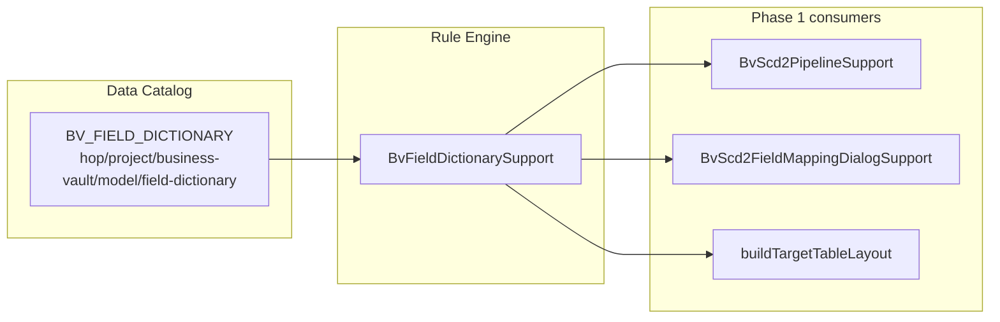

# BV Field Dictionary (Phase 1: Naming & Typing Rules)

Introduce a catalog-backed Business Vault field dictionary with naming and typing rules (`_ts`, `_dt`, control columns), and wire it into SCD2 pipeline generation and mapping suggestions. Phase 1 stops at rules; the mapping registry UI comes later on the same catalog foundation.

## Goal

Treat all Business Vault outbound tables consistently by centralizing **how Raw Vault columns are renamed, typed, and excluded** when building consumption-layer tables. Phase 1 delivers the **rules engine + catalog storage + SCD2 integration** — not the full cross-model mapping editor (that becomes Phase 2 on the same catalog types).



## Current gaps (why this helps)

Today BV outbound naming is fragmented:

- Control columns split across [`BusinessVaultConfiguration`](../src/main/java/org/apache/hop/datavault/metadata/businessvault/BusinessVaultConfiguration.java) (`valid_from`/`valid_to`) and DV config (`x_load_ts`, `x_record_source`) with no enforced `_ts`/`_dt` convention
- Attribute renames live only on each [`BvScd2Table.fieldMappings`](../src/main/java/org/apache/hop/datavault/metadata/businessvault/BvScd2Table.java); single-satellite pipelines pass DV names through unchanged ([`BvScd2PipelineSupport`](../src/main/java/org/apache/hop/datavault/metadata/businessvault/BvScd2PipelineSupport.java))
- Per-table `BvScd2FieldMapping` replaced the early idea of model-level attribute mappings; see [`business-vault-scd2.adoc`](business-vault-scd2.adoc)

## Catalog design

Follow the existing `DvSourceRecord` pattern: structured payload on a `RecordDefinition`.

| Piece | Proposal |
|-------|----------|
| **Type** | Add `BV_FIELD_DICTIONARY` to [`RecordDefinitionType`](../src/main/java/org/apache/hop/catalog/model/RecordDefinitionType.java) |
| **Payload** | New `BvFieldDictionaryRecord` on [`RecordDefinition`](../src/main/java/org/apache/hop/catalog/model/RecordDefinition.java) (like `dvSource`) |
| **Namespace** | `hop/{project}/business-vault/{model}/field-dictionary` via [`BvCatalogNamespaces`](../src/main/java/org/apache/hop/datavault/catalog/BvCatalogNamespaces.java) |
| **Key** | Fixed name per BV model, e.g. `field-dictionary` (one profile per `.hbv`) |
| **Service** | New `BvFieldDictionaryCatalogService` (mirror [`DvSourceCatalogService`](../src/main/java/org/apache/hop/datavault/catalog/DvSourceCatalogService.java)): `resolve`, `upsert`, `ensureDefault` |

### `BvFieldDictionaryRecord` contents (v1)

```java
// Semantic kinds for control + business columns
enum BvFieldSemanticKind {
  HASH_KEY, DRIVING_KEY, FUNCTIONAL_TIMESTAMP, VALID_FROM, VALID_TO,
  RECORD_SOURCE, LOAD_DATE, LOAD_END_DATE, HASHDIFF, ATTRIBUTE
}

// Per-kind outbound naming
class BvControlFieldRule {
  BvFieldSemanticKind kind;
  String outboundName;        // e.g. x_load_ts, x_from_ts, x_to_ts, x_record_source
  String outboundType;        // Timestamp, Date, String, ...
}

// Suffix rules applied when deriving attribute names
class BvSuffixRule {
  String hopTypeOrPattern;    // Timestamp, Date, Integer, ...
  String suffix;              // _ts, _dt, ...
}

// DV technical fields to exclude from BV attribute selection by default
List<BvFieldSemanticKind> excludedFromAttributes;

// Optional alias map: DV canonical name -> outbound name (e.g. LOAD_DATE -> x_load_ts)
Map<String, String> dvFieldAliases;
```

**Default profile** (seeded on first resolve, overridable in catalog):

| Semantic kind | Default outbound name | Suffix/type hint |
|---------------|----------------------|------------------|
| FUNCTIONAL_TIMESTAMP | `x_load_ts` | Timestamp, `_ts` |
| VALID_FROM | `x_from_ts` | Timestamp, `_ts` |
| VALID_TO | `x_to_ts` | Timestamp, `_ts` |
| RECORD_SOURCE | `x_record_source` | String |
| ATTRIBUTE (Date) | derive from source + `_dt` | Date |
| ATTRIBUTE (Timestamp) | derive from source + `_ts` | Timestamp |
| Excluded | HASHDIFF, LOAD_END_DATE | never mapped as business attrs |

## Rule engine

New package: `org.apache.hop.datavault.metadata.businessvault.dictionary`

| Class | Responsibility |
|-------|----------------|
| **`BvFieldDictionary`** | In-memory model loaded from catalog |
| **`BvFieldDictionarySupport`** | Pure functions: `resolveControlFieldName(kind)`, `resolveAttributeTargetName(sourceName, valueMeta)`, `resolveOutboundType(valueMeta, kind)`, `isExcludedDvField(name, layout)`, `applyAliases(dvFieldName)` |
| **`BvFieldDictionaryValidationSupport`** | Validate profile (non-empty control names, no duplicate outbound names, known types) |

**Resolution order** (explicit overrides win):

1. Per-table `BvScd2FieldMapping.targetFieldName` (unchanged — table-specific business names like `cust_segment` stay)
2. Dictionary alias / suffix rules (new default path)
3. [`BusinessVaultConfiguration`](../src/main/java/org/apache/hop/datavault/metadata/businessvault/BusinessVaultConfiguration.java) / per-table fields (fallback when catalog profile missing)
4. DV [`DataVaultConfiguration`](../src/main/java/org/apache/hop/datavault/metadata/DataVaultConfiguration.java) (last resort)

## SCD2 integration (Phase 1 wiring)

Update [`BvScd2PipelineSupport`](../src/main/java/org/apache/hop/datavault/metadata/businessvault/BvScd2PipelineSupport.java):

1. **Load dictionary** in `createContext` / `generatePipeline` via `BvFieldDictionaryCatalogService.resolve(bvModel, metadataProvider, variables)`
2. **Control columns** — replace hard-coded resolves (`resolveFunctionalTimestampField`, `resolveValidFromField`, `resolveValidToField`, `resolveRecordSourceField`) to consult dictionary first
3. **Single-satellite path** — when no explicit `field_mappings`, auto-derive target names through `resolveAttributeTargetName` (finally implements planned `attributeMappings` behavior without per-table duplication)
4. **Multi-satellite path** — unchanged mapping model, but `BvScd2FieldMappingDialogSupport.suggestMappings()` uses dictionary for default `targetFieldName` instead of raw source / `satellite_source` heuristic
5. **`buildTargetTableLayout`** — outbound types from dictionary rules (e.g. all control timestamps as `ValueMetaTimestamp`)

No change to Repeat Fields / merge logic — only names/types at select and layout boundaries.

## Catalog UI (minimal for Phase 1)

Extend [`RecordDefinitionDetailsPanel`](../src/main/java/org/apache/hop/catalog/hopgui/perspective/RecordDefinitionDetailsPanel.java) with a **BV Field Dictionary** tab when `type == BV_FIELD_DICTIONARY`:

- Editable grid: semantic kind → outbound name → type
- Editable suffix rules table
- Excluded technical fields checklist
- Save via `BvFieldDictionaryCatalogService.upsert`

Also add an **Open field dictionary** link on the BV model General tab ([`HopGuiBusinessVaultModelDialog`](../src/main/java/org/apache/hop/datavault/hopgui/file/businessvault/HopGuiBusinessVaultModelDialog.java)) that navigates to / creates the catalog entry.

This gives one catalog place to view/edit conventions without building the full mapping matrix yet.

## Tests & fixture

| Test | Covers |
|------|--------|
| `BvFieldDictionarySupportTest` | Suffix rules, control names, exclusions, alias map |
| `BvFieldDictionaryCatalogServiceTest` | Round-trip resolve/upsert against memory catalog |
| Update `BvScd2PipelineSupportTest` | Single-sat pipeline applies `_ts` renames when dictionary loaded |
| Update `customer-360.hbv` fixture | Optional: align control columns to `x_from_ts`/`x_to_ts` via dictionary defaults |

## Phase 2 preview (out of scope now)

On the same catalog foundation, add:

- `BV_FIELD_MAPPING` records: `(sourceRecordDef, targetModel, targetElement, sourceField, targetField)`
- Unified mapping perspective tab (source → DV / BV / dim)
- Reuse [`DvFieldMappingValidationSupport`](../src/main/java/org/apache/hop/datavault/metadata/DvFieldMappingValidationSupport.java) patterns for cross-layer validation

Phase 1 deliberately builds the dictionary types and catalog service API so Phase 2 mappings can reference semantic kinds and outbound names instead of inventing a parallel system.

## Files to touch (Phase 1)

| Area | Files |
|------|-------|
| Catalog model | `RecordDefinitionType.java`, `RecordDefinition.java`, new `BvFieldDictionaryRecord.java` + rule POJOs |
| Catalog service | `BvFieldDictionaryCatalogService.java`, `BvCatalogNamespaces.java` |
| Rule engine | `BvFieldDictionary.java`, `BvFieldDictionarySupport.java`, validation + tests |
| Pipeline | `BvScd2PipelineSupport.java`, `BvScd2FieldMappingDialogSupport.java` |
| Config link | `BusinessVaultConfiguration.java` — optional `fieldDictionaryCatalogConnection` override |
| UI | `RecordDefinitionDetailsPanel.java`, `HopGuiBusinessVaultModelDialog.java`, i18n properties |
| Seed | Default JSON under `project/catalog-data/.../field-dictionary.json` for customer-360 exercise |

## Todos

- [ ] **catalog-model** — Add BV_FIELD_DICTIONARY type, BvFieldDictionaryRecord POJOs, and namespace helper
- [ ] **catalog-service** — Implement BvFieldDictionaryCatalogService (resolve, upsert, ensureDefault) with memory-catalog tests
- [ ] **rule-engine** — Build BvFieldDictionarySupport: control names, suffix rules, exclusions, type resolution
- [ ] **scd2-wiring** — Integrate dictionary into BvScd2PipelineSupport resolves, single-sat rename path, and buildTargetTableLayout
- [ ] **suggest-mappings** — Update BvScd2FieldMappingDialogSupport to suggest target names from dictionary
- [ ] **catalog-ui** — Add BV Field Dictionary tab in RecordDefinitionDetailsPanel + link from BV model dialog
- [ ] **fixtures-tests** — Seed customer-360 dictionary fixture; extend BvScd2PipelineSupportTest for dictionary-driven renames