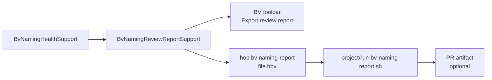

# BV Naming Rules Engine (Complete Plan)

> Layered rules engine, acknowledgements with comments, architect health check, and exportable naming quality reports for code review (CLI + GUI) — giving reviewers semantic context a GitHub diff cannot provide.
>
> Supersedes the catalog-first approach in [bv-field-dictionary-plan.md](bv-field-dictionary-plan.md) (deferred).

## Summary

Three audiences, one rules engine:

| Audience | Need | Delivery |
|----------|------|----------|
| **Modeler / analyst** | Smart Suggest, non-blocking warnings, keep intentional names | SCD2 mapping dialog + Acknowledge with comment |
| **Functional architect** | Wildgrowth visibility, conformance trends | Naming health check (GUI + export) |
| **Code reviewer** | Naming quality beyond text diff | **Naming review report** (Markdown/JSON/CSV, CLI + GUI) |

---

## 1. Rules engine (unchanged core)

Package: `org.apache.hop.datavault.metadata.businessvault.naming`

**Rules:** `technical_field`, `control_column`, `type_suffix`, `redundant_table_prefix`, `vague_token`, `language_mismatch`, `name_collision`

**Context:** table name, entity tokens, source/target fields, `SatelliteAttribute` type/description, siblings, glossary (NL/FR/EN), existing acknowledgements.

**Suggestion pipeline:** strip redundant entity prefix → satellite facet on collision → type suffix → ranked top 3 with rationale. AI only on explicit **Suggest alternatives (AI)** for vague/language.

**Customer 360:** `cust_segment` flagged `redundant_table_prefix`; suggest `segment`.

Feasibility: excellent for structural rules; good for redundancy/collisions; medium for vague; good+ for language with glossary + AI.

### High-value rules (detail)

**Table context redundancy** — Do not repeat entity information already implied by the target table name. Table `customer_360_bv` + field `cust_segment` → WARNING `redundant_table_prefix`. Suggest `segment` (or satellite facet on collision, e.g. `contact_email`, not `cust_email`).

**Vague tokens** — Bare tokens like `value`, `date`, `type`, `status` carry little meaning. Tiered detection: whole field → WARNING; weak qualifier → INFO; qualified compound (`customer_type`) → pass.

**Language (NL / FR / EN)** — Glossary-first with optional AI fallback on user request. Flag mixed languages per table; suggest glossary replacements (`klant` → `customer`).

---

## 2. Acknowledge warning with comment (Phase A)

Extend [BvScd2FieldMapping](../src/main/java/org/apache/hop/datavault/metadata/businessvault/BvScd2FieldMapping.java):

```java
@HopMetadataProperty(key = "naming_ack", groupKey = "naming_acks")
private List<BvNamingAcknowledgement> namingAcknowledgements;

// ruleId, comment (required), acknowledgedAt, acknowledgedBy
```

- WARNING in mapping dialog → **Acknowledge…** → required comment → **Justified exception**
- Revoke acknowledgement restores WARNING
- Rename `targetFieldName` clears stale acks
- Health check: **unreviewed deviation** vs **justified exception** counts

**Organizational reality:** standards are few; exceptions are many. Acknowledgements let modelers keep intentional names while architects measure unreviewed wildgrowth separately from justified exceptions.

---

## 3. Naming quality health check (architect)

BV toolbar **Naming health…** + model Check summary.

Metrics: conforming / justified / unreviewed / technical; breakdown by rule and table; CSV export.

| Classification | Meaning |
|----------------|---------|
| **Conforming** | Matches standards |
| **Justified exception** | Deviates with acknowledgement + comment |
| **Unreviewed deviation** | Deviates without acknowledgement — wildgrowth KPI |
| **Technical** | DV control columns tracked separately |

---

## 4. Naming review report (code reviewer)

### Problem

A GitHub `.hbv` diff shows XML changes to `targetFieldName` values but not:

- Which naming rules fire and why
- Whether deviations are acknowledged (and with what comment)
- Suggested standard alternatives
- Source field types from the linked `.hdv`
- Aggregate conformance score for the model/table

Reviewers need a **self-contained naming quality report** alongside the PR diff.

### Report generator

`BvNamingReviewReportSupport` — wraps `BvNamingHealthSupport` + formatted output.

**Scope flags:**

| Scope | Use case |
|-------|----------|
| Full model (default) | New `.hbv` or model-wide review |
| `--table customer_360_bv` | PR touches one SCD2 table only |
| `--changed-only` (optional, Phase B) | Tables with git-detected changes in PR |

### Report structure (Markdown primary)

```markdown
# BV Naming Review: customer-360.hbv

## Summary
- Conformance: 72% (18/25 business fields)
- Unreviewed deviations: 3  ← reviewer focus
- Justified exceptions: 8 (with comments)
- Technical columns: 4

## Action required (unreviewed)
| Table | Field | Rule | Actual | Suggested | Source |
| customer_360_bv | status | vague_token | status | demo_status | sat_customer_demo.status |

## Acknowledged exceptions (review comments)
| Field | Rule | Comment | By | Date |
| cust_segment | redundant_table_prefix | Downstream CRM contract | matt | 2026-06-27 |

## Conforming fields
(collapsed list)

## Outbound layout: customer_360_bv
Resolved column list from buildTargetTableLayout…
```

JSON mirrors same structure for CI artifacts. CSV flattens findings for spreadsheets.

### Delivery channels



| Channel | Phase | Notes |
|---------|-------|-------|
| **Hop GUI** | A | BV toolbar → *Export naming review report…* (Markdown/JSON/CSV file chooser) |
| **Hop CLI** | A | New command plugin mirroring [SvgExportCommand](../src/main/java/org/apache/hop/datavault/command/svg/SvgExportCommand.java): `hop bv naming-report <path.hbv> [--table name] [--format md\|json\|csv] [-o output]` |
| **Docker script** | A | `project/run-bv-naming-report.sh` — same pattern as `run-svg.sh` for reviewers without local Hop |
| **CI / PR** | A doc, B automation | Document running script on changed `.hbv` files; upload `naming-review.md` as artifact; optional GitHub Action later |

### Reviewer workflow

1. Author opens PR with `.hbv` (and possibly `.hdv`) changes
2. Author or CI runs: `./project/run-bv-naming-report.sh tests/multi-satellite-bv/customer-360.hbv -o naming-review.md`
3. Author attaches `naming-review.md` to PR (or CI posts as comment artifact)
4. Reviewer reads diff **plus** report:
   - Challenge weak ack comments ("It's because I said so" is valid but reviewer may ask for more)
   - Focus on **unreviewed deviations** section
   - Verify outbound layout matches downstream expectations
5. Approve / request changes on naming grounds with evidence from report

### What reviewers see that diff cannot show

- Rule `redundant_table_prefix` fired 11 times with pattern analysis
- Acknowledgement comment per field (stored in `.hbv`, rendered in report)
- `segment` → suggested `segment` while actual is `cust_segment`
- Language inconsistency across table (NL+EN mix %)
- Resolved outbound column order and types

### Implementation files

| Area | Files |
|------|-------|
| Report core | `BvNamingReviewReport`, `BvNamingReviewReportSupport`, `BvNamingReviewMarkdownWriter`, `BvNamingReviewJsonWriter` |
| CLI | `BvNamingReportCommand` (register like `SvgExportCommand`) |
| GUI | [HopGuiBusinessVaultGraph](../src/main/java/org/apache/hop/datavault/hopgui/file/businessvault/HopGuiBusinessVaultGraph.java) toolbar action |
| Docker | `project/run-bv-naming-report.sh`, note in [PROJECT.md](../project/PROJECT.md) |
| Tests | `BvNamingReviewReportTest` — Customer 360 fixture produces expected Markdown sections |

---

## Phasing (consolidated)

### Phase A

- Rules engine + Smart Suggest
- Acknowledgements (metadata + dialog UI)
- Health check (GUI)
- **Naming review report (Markdown + JSON + CSV)**
- **`hop bv naming-report` CLI**
- **`run-bv-naming-report.sh`**

### Phase A.2

- Glossary (NL/FR/EN) + language rule
- AI suggest fallback (user-triggered)

### Phase B

- Project-scoped standards catalog
- Project-wide rollup + trend snapshots
- `--changed-only` scope via git integration

---

## ROI gate

Ship only what surfaces in Suggest, WARNING, **Acknowledge**, Health check, or **Review report export**. Storage-only features do not ship.

---

## Todos

- [ ] **naming-ack-metadata** — BvNamingAcknowledgement on BvScd2FieldMapping/BvScd2Table; ack UI in HopGuiBvScd2TableDialog
- [ ] **naming-rule-engine** — BvNamingRuleEngine: structural, redundancy, vague, collision rules + BvNamingSuggestSupport
- [ ] **naming-health** — BvNamingHealthSupport: conforming / justified / unreviewed classification
- [ ] **naming-review-report** — BvNamingReviewReportSupport + Markdown/JSON/CSV writers; GUI export + hop bv naming-report CLI
- [ ] **run-bv-naming-report-sh** — project/run-bv-naming-report.sh Docker wrapper; document PR review workflow in PROJECT.md
- [ ] **glossary-language-ai** — BvNamingGlossary + language rule; optional AI suggest on user click
- [ ] **tests-review-report** — BvNamingReviewReportTest with customer-360.hbv: summary, unreviewed, ack sections