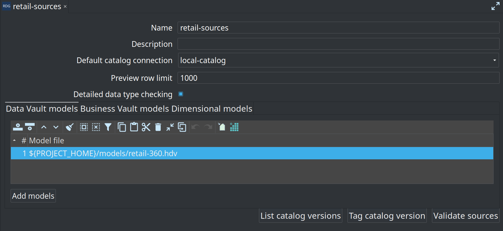

= Data Catalog
:toc: macro
:toclevels: 3

toc::[]

The hop-datavault plugin stores **record definitions** — especially Data Vault sources (`DV_SOURCE`) — in the Hop **Data Catalog**. Modelers work in the **Data Catalog** perspective; generated pipelines and transforms resolve definitions by namespace and name.

== Local file catalog

Sample projects use a file-based catalog configured in `metadata/data-catalog/local-catalog.json`:

[source,json]
----
{
  "name": "local-catalog",
  "enabled": true,
  "catalog": {
    "FILE": {
      "pluginId": "FILE",
      "storageDirectory": "${PROJECT_HOME}/work/edw-catalog"
    }
  }
}
----

Definitions are JSON files under the FILE catalog **storage directory** (retail example: `work/edw-catalog/`, gitignored). The path after the storage root must match the record's **`namespace`** field. Other projects may still use a tracked folder such as `catalog-data/` — the path is only a metadata property.

== Namespaces

The plugin derives the default sources namespace from the open Hop project:

* Pattern: `hop/{project-folder-name}/sources`
* Examples:
** `retail-example/` → `hop/retail-example/sources`
** `integration-tests/` → `hop/integration-tests/sources`

Additional namespaces appear when models publish catalog entries, for example:

* `hop/{project}/models/{model-name}/` — DV table definitions
* `hop/{project}/business-vault/{model-name}/` — BV target tables
* `hop/{project}/dimensional/{model-name}/` — dimensional table definitions

The catalog **key** is `namespace/name` (for example `hop/retail-example/sources/E2E-customer-hub`).

== Folder layout example (retail-example)

[source]
----
work/edw-catalog/              # gitignored runtime FILE catalog
└── hop/
    └── retail-example/
        ├── sources/           # DV_SOURCE feeds (from bootstrap / generate-catalog-sources)
        ├── models/retail-360/ # Published DV table layouts
        ├── business-vault/    # Published BV tables
        ├── dimensional/       # Published dimensional tables
        └── operations/        # Ops / quality table stubs (published at runtime)
----

== Working in Hop GUI

. Open the Hop project (so `${PROJECT_HOME}` resolves).
. Open the **Data Catalog** perspective.
. Browse the tree by namespace.
. Double-click a record to open its editor.
. Press **F5** or use refresh if files changed on disk.

If a record appears in the tree but fails to open, the **`namespace`** in the JSON file likely does not match its directory path. Fix the namespace and refresh.

== Record definition types

| Type | Role |
|------|------|
| `DV_SOURCE` | Data Vault source feed — see link:datavault-source.adoc[Data Vault Source] |
| Other catalog types | Published model targets, conformed dimensions, pipeline inputs |

== Validation

Use **Validate** on catalog record groups to run feed-level **schema** checks. Issues can include remediation proposals and acknowledgements — see link:resource-definition-validation.adoc[Resource definition validation].

For **content** rules (not empty, allowed values, ranges, nulls), bind quality rules on the record definition and use the **Measure data quality** / **Evaluate quality gate** workflow actions — see link:data-quality.adoc[Data quality].

Model-level **Check model** validates `.hdv` / `.hbv` / `.hdm` structure separately; these layers complement each other.

[[catalog-versions]]
== Catalog versions

File-based catalogs can freeze **source record definitions** under a semantic tag (for example `v2.4.0` or `2026-Q3-Release`). Tags are a design-time baseline for schema comparison and CI gates; they are independent of DTAP database state.

=== Storage layout

Versions live under the catalog storage directory in a **non-hidden** folder named `catalog-versions` (not `.catalog-versions`):

[source]
----
{storageDirectory}/                 # e.g. work/edw-catalog/
├── hop/.../sources/*.json          # working tree (editable)
└── catalog-versions/
    ├── versions.json               # tag → snapshot index
    └── snapshots/<snapshot-id>/
        ├── manifest.json
        └── records/hop/.../*.json  # immutable copies
----

The working-tree catalog **list** API ignores `catalog-versions/` so snapshots never appear as live records. Retail stores the live catalog under gitignored `work/edw-catalog/`; a **seed** for demo tag `v1.0.0` lives in `fixtures/schema-gate-baseline/` and is copied by `bootstrap-retail-work.py`.

=== Tagging from Hop GUI

. Open metadata type **Resource definition group**.
. Select the group that references your DV/BV/DM models (for example `retail-sources`).
. Set the **Default catalog connection** (FILE catalog, for example `local-catalog`).
. Use **Tag catalog version** to snapshot all source definitions currently referenced by the group's models.
. Use **List catalog versions** to review existing tags, timestamps, and record counts.
. Use **Validate sources** for an interactive schema check (optionally against a tagged baseline via the CI action).

Duplicate tags are rejected. Snapshot contents are immutable: editing working-tree JSON after tagging does not change the frozen version.

=== Scope (MVP)

* Snapshots cover **source record definitions** discovered from the resource definition group (hubs, satellites, links, BV SCD2 feeds, and DM `RECORD_DEFINITION` sources).
* Model files (`.hdv` / `.hbv` / `.hdm`) remain versioned in Git; they are not copied into the snapshot.
* Only the **FILE** catalog implementation is supported.

Use tagged versions as the expected contract for the **Validate resource definitions** workflow action (compare tagged catalog vs live source or vs working tree, with optional Markdown/HTML reports and downstream impact). Full UI, compare modes, and DTAP recipe: link:resource-definition-validation.adoc[Resource definition validation].

== Related documents

* link:datavault-source.adoc[Data Vault Source]
* link:record-definition-input.adoc[Record Definition Input transform]
* link:resource-definition-validation.adoc[Resource definition validation]