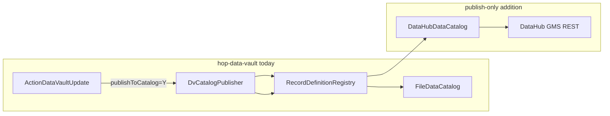

# DataHub publish-only catalog integration

Add a **publish-only** DataHub backend for the hop-data-vault data catalog so Data Vault Update can push vault target table metadata to a DataHub GMS instance. DV source record definitions remain in the file-based `local-catalog`; DataHub receives target table snapshots only.

**Scope:** publish/upsert on DV Update — not full catalog CRUD in the Hop GUI, not lineage.

**Difficulty:** moderate (roughly 1–2 weeks for an experienced Java developer new to DataHub; 2–4 weeks if learning DataHub concepts at the same time).

---

## Context

The hop-data-vault catalog layer was designed for external backends like DataHub (`IDataCatalog` SPI), but only the **FILE** backend exists today (`FileDataCatalog`). Apache Hop core does not ship a DataHub connector; there is no prior art in this repository.

Current catalog layout in the sample project:

| Connection | Storage | Purpose | Git |
|------------|---------|---------|-----|
| `local-catalog` | `catalog-data/` | DV source record definitions | Tracked |
| `vault-catalog` | `vault-catalog/` | DV target table snapshots from test runs | Ignored |

A third connection, e.g. `datahub-catalog`, would be the remote publish target for production or integration testing.

---

## What already works



- **No DV core changes required** — `DvCatalogPublisher` and `ActionDataVaultUpdate` already call `RecordDefinitionRegistry.upsert(connectionName, ...)`. Point a `DataCatalogMeta` connection at DataHub and publishing flows through unchanged.
- **Rich domain model** — `RecordDefinition` carries physical table ref, column layout (`IRowMeta`), DV type (`DV_HUB` / `DV_LINK` / `DV_SATELLITE`), tags, origin, and custom properties.
- **Sources stay in file catalog** — `DvCatalogPublisher` publishes target tables only; sources are read from `local-catalog` via `DvSourceCatalogService.DEFAULT_SOURCE_CATALOG_CONNECTION`.

### Key classes today

| Class | Role |
|-------|------|
| `org.apache.hop.catalog.spi.IDataCatalog` | Catalog backend SPI (`connect`, CRUD, `list`) |
| `org.apache.hop.catalog.impl.file.FileDataCatalog` | Only implementation (`PLUGIN_ID = "FILE"`) |
| `org.apache.hop.catalog.metadata.DataCatalogMetaObjectFactory` | Instantiates catalog backends by type id |
| `org.apache.hop.catalog.registry.RecordDefinitionRegistry` | Facade used by DV layer and GUI |
| `org.apache.hop.datavault.catalog.DvCatalogPublisher` | Builds and upserts table `RecordDefinition`s |

---

## What makes it non-trivial

| Area | Why it takes work |
|------|-------------------|
| **DataHub learning curve** | GMS, dataset URNs, aspects (`schemaMetadata`, `datasetProperties`, `globalTags`), REST ingestion vs GraphQL |
| **URN / identity mapping** | FILE keys are `namespace + name`; DataHub uses URNs like `urn:li:dataset:(platform, name, env)` |
| **Schema mapping** | Hop `IRowMeta` types → DataHub `SchemaField` native types and paths |
| **Upsert semantics** | Aspect-based ingestion (versioned proposals), not file overwrite |
| **Testing** | Running DataHub instance (typically Docker Compose); unit tests can mock HTTP |
| **Dependencies** | No DataHub client in `pom.xml` today — add `java.net.http` + Jackson, or Acryl REST emitter libraries |

---

## Recommended implementation path

### 1. New catalog type skeleton (~1 day)

Add `org.apache.hop.catalog.impl.datahub.DataHubDataCatalog` implementing `IDataCatalog` with `PLUGIN_ID = "DATAHUB"`.

Wire into existing factory/editor plumbing:

- `DataCatalogMetaObjectFactory` — register `DATAHUB` in `getKnownTypeIds()` and `newCatalog()`
- `DataCatalogPluginFactory.copySettings()` — copy GMS URL, token, fabric, platform mapping
- `DataCatalogMetaEditor` + i18n — connection fields in Hop GUI

**Minimal config fields:**

- `gmsUrl` (e.g. `http://localhost:8080`)
- `accessToken` (personal access token for local dev)
- `fabric` / environment (`DEV`, `PROD`)
- `defaultDataPlatform` (e.g. `postgres` when Vault is PostgreSQL)
- Optional: map Hop `DatabaseMeta` names → DataHub platform strings

### 2. RecordDefinition → DataHub mapper (~2–3 days)

New class, e.g. `DataHubRecordDefinitionEmitter`:

| Hop field | DataHub aspect |
|-----------|----------------|
| `physicalTable.databaseMetaName` + `tableName` | Dataset URN name segment |
| `fields` (`IRowMeta`) | `schemaMetadata.fields` |
| `type` (`DV_HUB`, etc.) | `globalTags` or custom properties |
| `description`, `tags`, `glossaryTerms` | `datasetProperties`, tags, glossary |
| `origin.lastWorkflow`, `updatedAt` | Optional `auditStamp` / custom property |

Use REST ingest (`POST /aspects?action=ingestProposal`) for simplicity in Java, or the official Java emitter for maintained serializers.

### 3. Write path only (~2–3 days)

In `DataHubDataCatalog`:

- `connect()` — validate GMS reachable, store HTTP client
- `create()` / `update()` — delegate to upsert emitter
- `read()` — return `null` (not required for publish-only)
- `list()` — return empty list or throw unsupported
- `delete()` — no-op or unsupported

Add a sample `project/metadata/data-catalog/datahub-catalog.json` connection (disabled by default).

### 4. Tests and documentation (~2–3 days)

- **Unit tests** — URN builder + schema field mapper (no GMS)
- **Smoke test** — optional `DataHubCatalogPublishSmoke` behind an env flag (pattern: `DvCatalogPublishSmoke`)
- **Docker** — document DataHub quickstart alongside `project/docker/` test harness
- **PROJECT.md** — three-catalog layout: `local-catalog`, `vault-catalog`, `datahub-catalog`

### 5. Workflow usage (no code change)

On the initial Data Vault Update action in a workflow:

```xml
<publishToCatalog>Y</publishToCatalog>
<dataCatalogConnection>datahub-catalog</dataCatalogConnection>
```

`local-catalog` remains the default for source reads via `DvSourceCatalogService`.

---

## Out of scope (publish-only)

- Browsing DataHub datasets in the Hop **Data Catalog perspective**
- Importing or editing DV sources from DataHub
- **Lineage** (OpenLineage / `DataJob` edges) — separate, high-effort item
- Bidirectional sync (DataHub schema changes → Hop catalog)

**Follow-on effort estimates:**

- Full CRUD + GUI browse: +1–2 weeks
- Lineage: +2 weeks on top

---

## Risks and mitigations

| Risk | Mitigation |
|------|------------|
| URN collisions across models | Include model namespace in dataset name or custom properties |
| Vault DB differs per environment | Parameterize fabric; use RDBMS profile name in URN |
| GMS auth variants (OIDC, PAT) | Start with personal access token; extend later |
| Large schema payloads | Batch aspect proposals; DV models publish a small table set per run |

---

## Implementation checklist

- [ ] **datahub-skeleton** — `DataHubDataCatalog` + `DATAHUB` plugin ID; wire factory, plugin factory, editor, i18n
- [ ] **urn-schema-mapper** — URN builder and `RecordDefinition` → DataHub `schemaMetadata` / `datasetProperties` emitter
- [ ] **write-path** — `connect` + create/update upsert via GMS REST; stub read/list/delete
- [ ] **test-docs** — Unit tests for mapping; optional GMS smoke test; Docker/docs in `PROJECT.md`

---

## Bottom line

The architecture is ready: a new `IDataCatalog` implementation plus HTTP/mapping code. The FILE backend (`FileDataCatalog`, ~215 lines) is a good shape reference; a DataHub adapter will likely be **400–800 lines** including mapper, client, GUI fields, and tests — complexity comes from the DataHub API, not from Data Vault integration.