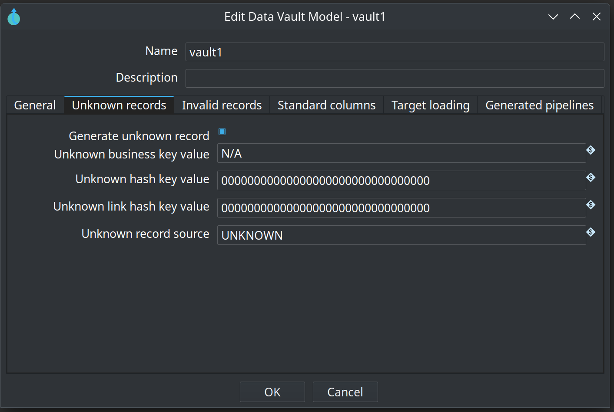
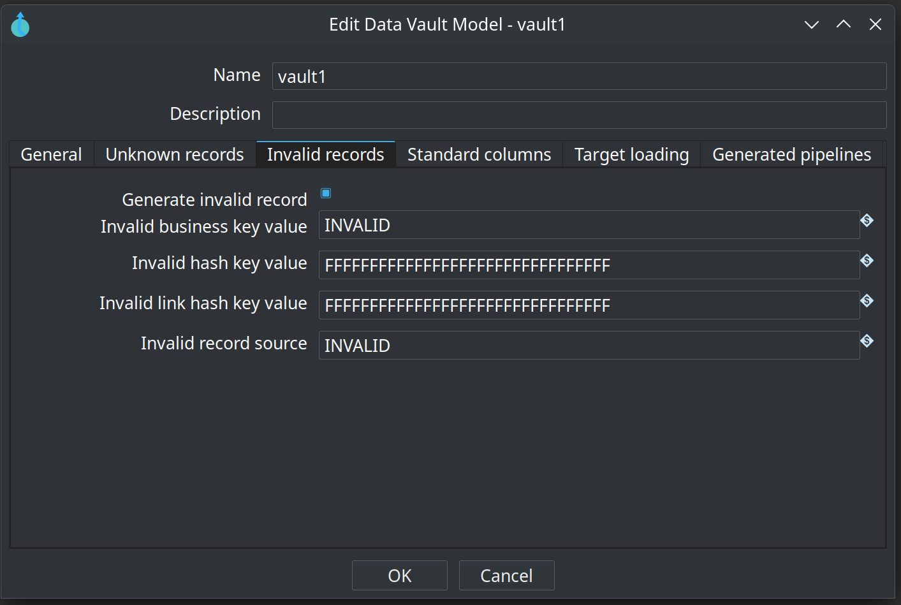
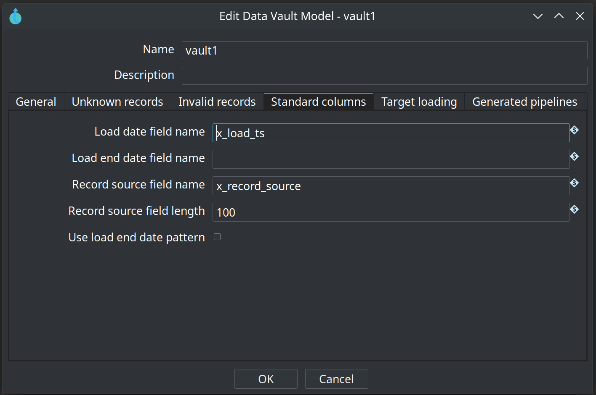
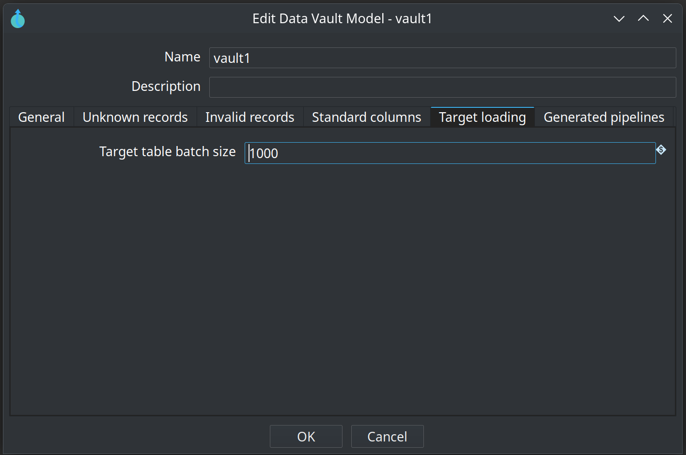
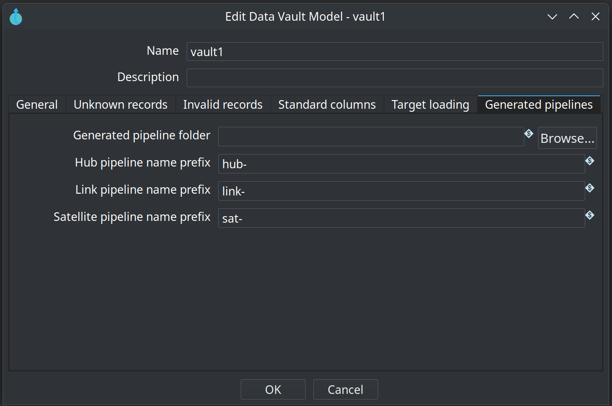

= Data Vault Configuration
:toc: macro
:toclevels: 3

toc::[]

Each **Data Vault Model** (`.hdv` file) embeds its own configuration. The settings control how hash keys are computed, how target tables are named and created, how sentinel rows are handled, and how generated update pipelines write to the database.

There is one target database per model. Hashing and naming rules defined here apply to every hub, link, and satellite in that model unless a table dialog provides a specific column-name override (for example a per-hub hash key field name).

[#_edit_model_dialog]
== Edit model dialog

Open the configuration from the visual model editor with the **Edit model** toolbar button. The dialog has a name and description at the top, then six tabs for the embedded configuration.

image::images/data-vault-model-dialog.png[Edit Data Vault Model — General tab (target database and hashing),align="center"]

=== General tab

Target database and hashing strategy.

[cols="1,3", options="header"]
|===
|Option |Description

|Target database
|The Hop database connection (DatabaseMeta) where Data Vault tables are created and loaded. Used for DDL generation, SQL quoting, and all generated pipelines that write to the vault.

|Hash algorithm
|Algorithm for surrogate hash keys (MD5, SHA-256, SHA-1, SHA-512). Affects computation and maximum key length.

|Hash key data type
|Physical storage for hash keys: HEX (default), STRING, or BINARY. HEX and STRING are safe on all supported Hop versions. BINARY is more compact but requires Apache Hop *2.19.0 or later* for correct sorting in generated pipelines (see https://github.com/apache/hop/issues/7346[Hop issue 7346]); until 2.19 is released, prefer HEX.

|Hash content casing
|Upper-case, lower-case, or preserve business key casing before hashing. UPPER is the usual Data Vault choice.

|Business key delimiter
|String used to concatenate composite business keys and link hash inputs (for example `||`).

|Hash content prefix / suffix
|Optional text prepended or appended to the concatenated key content before hashing. Supports variables.

|Null placeholder
|Value substituted for NULL key parts during hashing (default `^^`).

|Trim business keys
|Remove leading and trailing whitespace before hashing (recommended, on by default).
|===

=== Unknown records tab

Controls generation of the classic Data Vault "unknown" / ghost sentinel row in hubs and links.

[cols="1,3", options="header"]
|===
|Option |Description

|Generate unknown record
|When enabled, the model expects an unknown sentinel row in hubs (and corresponding link entries). The Data Vault Update action can insert missing sentinel rows before loading when **Ensure unknown and invalid records** is enabled.

|Unknown business key value
|Business key value stored in unknown hub rows. Also used to compute the hub hash when Unknown hash key value is empty.

|Unknown hash key value
|Optional fixed hash key for unknown hub rows. Supports variables and Hop hexadecimal expressions. When empty, the hash is derived from the unknown business key value.

|Unknown link hash key value
|Optional fixed hash key for unknown link rows. When empty, derived from participating hub unknown hash values.

|Unknown record source
|RECORD_SOURCE value written into unknown sentinel rows (default `UNKNOWN`).
|===

=== Invalid records tab

Controls generation of an "invalid" / error sentinel row for malformed or rejected keys.

[cols="1,3", options="header"]
|===
|Option |Description

|Generate invalid record
|When enabled, the model expects an invalid sentinel row in hubs and links. Missing rows can be inserted by the Data Vault Update action.

|Invalid business key value
|Business key value for invalid hub rows. Used for hash computation when Invalid hash key value is empty.

|Invalid hash key value
|Optional fixed hash key for invalid hub rows (default all `FF` bytes for MD5-style keys).

|Invalid link hash key value
|Optional fixed hash key for invalid link rows.

|Invalid record source
|RECORD_SOURCE value for invalid sentinel rows (default `INVALID`).
|===

=== Standard columns tab

Names and patterns for columns present on every Data Vault table.

[cols="1,3", options="header"]
|===
|Option |Description

|Load date field name
|Column for the batch load timestamp (default `LOAD_DATE`). Every generated pipeline writes the same load date for all rows in one action run.

|Load end date field name
|Column name for an optional load end timestamp on satellites when end-dating is used.

|Record source field name
|Column that identifies the originating feed (default `RECORD_SOURCE`).

|Record source field length
|Character length of the record source column in target tables. Supports variables (default 100).

|Use load end date pattern
|Documents that satellites use an end-dating approach. Generated pipelines today perform insert-only change detection; this flag is mainly for documentation and future extensions.
|===

=== Target loading tab

Options for how generated pipelines write rows to target tables.

[cols="1,3", options="header"]
|===
|Option |Description

|Target table batch size
|Commit size for Table Output transforms in generated pipelines (default 1000). Supports variables.
|===

=== Generated pipelines tab

Where and how update pipelines are named when the plugin generates them at runtime.

[cols="1,3", options="header"]
|===
|Option |Description

|Generated pipeline folder
|When set, each generated update pipeline is saved as a `.hpl` file in this folder before execution. Supports variables (for example `${PROJECT_HOME}/generated-pipelines`). Leave empty to run in memory only.

|Hub pipeline name prefix
|Prefix for hub pipeline names (default `hub-`). Full name: prefix + target table name + `-` + source name.

|Link pipeline name prefix
|Prefix for link pipelines (default `link-`).

|Satellite pipeline name prefix
|Prefix for satellite pipelines (default `sat-`).
|===

== Plugin-wide GUI options

In addition to the per-model configuration above, Hop GUI exposes two global options under **Configuration → Data Vault 2.0**:

image::images/hopgui-configuration-perspecive-data-vault-options.png[Hop GUI Data Vault 2.0 configuration options,align="center"]

[cols="1,3", options="header"]
|===
|Option |Description

|Draw hash keys in model
|When enabled, hash key column names are drawn on table cards in the visual model editor.

|Maximum undo/redo operations kept in memory
|Number of gzip-compressed XML snapshots kept for undo/redo on `.hdv` files (default 200). Older snapshots are discarded when the limit is exceeded.
|===

These settings are stored in the Hop GUI configuration, not inside individual `.hdv` files.

== Per-table column overrides

While the model configuration drives hashing and most column naming, individual table dialogs still allow targeted overrides where that makes sense:

* **Hub** – Optional hash key field name and record source field name overrides.
* **Link** – Optional link hash key field name and record source field name overrides.
* **Satellite** – Uses the parent hub's hash key column name for the foreign key in the satellite table.

There is no longer a separate per-table "configuration picker" metadata reference; all hashing rules come from the model's embedded configuration.

== How the configuration affects daily work

* The target database connection is required for **Generate DDL**, **Debug**, and the **Data Vault Update** action. Business Vault SCD2 generation also reads satellite history from this connection when a `.hbv` model links to the `.hdv` file.
* Tables marked **External read-only** do not require Hop to load data, but the target database name must still be set so downstream features can resolve the connection. See link:dv-integration-modes.adoc[Data Vault integration modes].
* Hash algorithm and data type directly influence storage size and join performance.
* Naming settings (LOAD_DATE, RECORD_SOURCE, etc.) should be agreed early with consumers of the Data Vault.
* Unknown and invalid sentinel settings matter when downstream facts or links must reference "missing" or "bad" keys.
* **Check model** warns when no target database is configured, because DDL, hashing, and pipeline generation depend on it.

Configure these settings when you create or adopt a model. They are persisted inside the `.hdv` file and travel with the model between environments (subject to connection name resolution in each Hop project).