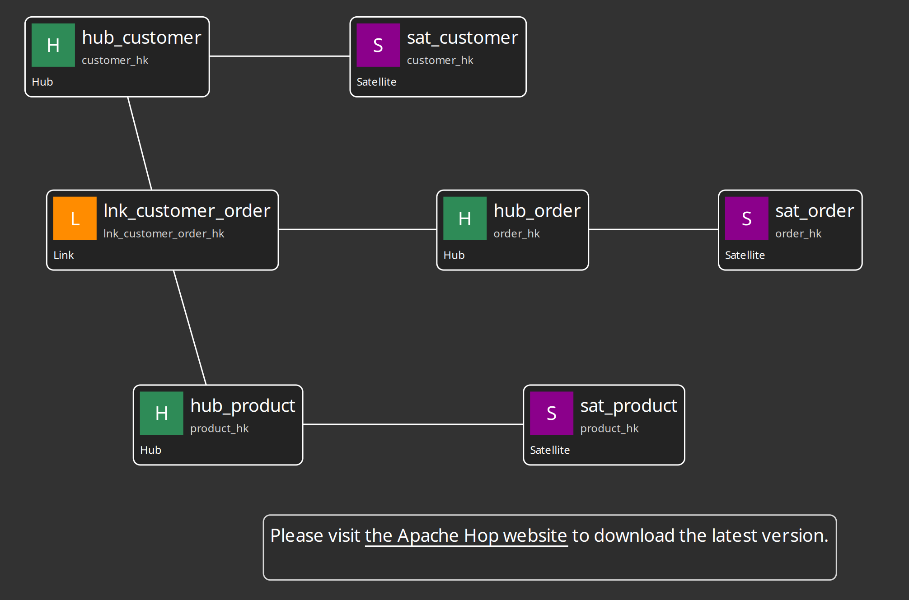
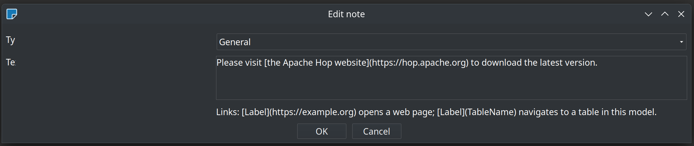
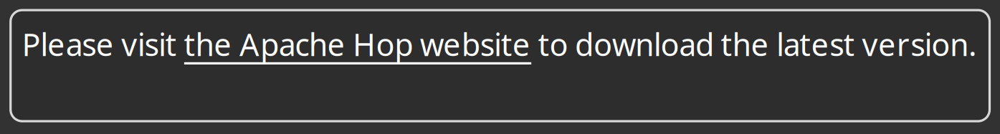
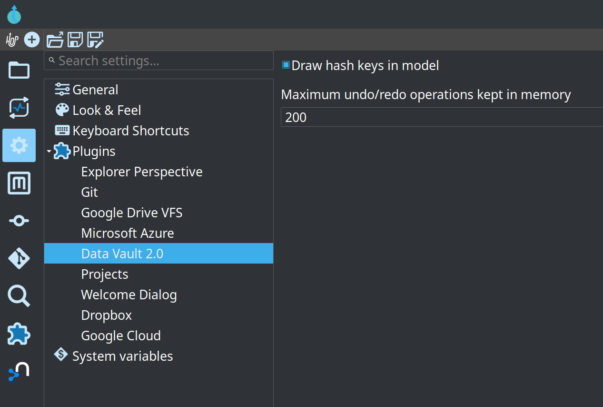

= Apache Hop Data Vault 2.0 Plugin
:toc: macro
:toclevels: 3

toc::[]

The Data Vault 2.0 plugin helps you design and load a Data Vault 2.0 data warehouse using Apache Hop. Instead of writing many similar pipelines by hand, you create a visual model of your Hubs, Links, and Satellites. Hop then generates the pipelines needed to load data into those structures.

== What the plugin is for

Data Vault 2.0 is a modeling technique for building scalable, auditable enterprise data warehouses. It uses three main building blocks:

* **Hubs** – Core business concepts (Customer, Product, Order, etc.) identified by their natural business keys.
* **Links** – The relationships between Hubs.
* **Satellites** – The time-varying descriptive details that hang off Hubs and Links.

The plugin lets you capture this model once, together with the rules for hashing, naming, and loading. You can then:

* Visually design the model inside Hop GUI.
* Automatically generate and run the pipelines that keep the Data Vault up to date.
* Use a single workflow action to load an entire model in a controlled, repeatable way.

The generated load processes follow the standard Data Vault 2.0 "insert-only" approach:

* New business keys or relationships are added to Hubs and Links.
* For Satellites, a new row is added only when descriptive attributes actually change for a given parent key.
* Every row loaded in one run receives the same load date, making it easy to know what was processed together.

== Typical workflow

1. Define **Data Vault Sources** that describe where your raw data lives (database connection, table, column layout, and record-source semantics).
2. Create **Hub**, **Link**, and **Satellite** definitions and group them into a **Data Vault Model** (saved as a `.hdv` file). Each model carries its own embedded **configuration** (target database, hashing rules, column names, sentinel records, and pipeline options).
3. Lay objects out on the visual canvas, connect relationships, and add annotation notes where helpful.
4. Use the **Check model** toolbar button to catch missing pieces or broken references early.
5. Use **Generate DDL** to preview CREATE/ALTER statements, or **Debug** to generate and open a sample update pipeline for selected tables.
6. In a workflow, add the **Data Vault Update** action, point it at your `.hdv` model, choose a pipeline run configuration, and run the full load (with optional model checks and DDL handling).

This approach gives you consistent, maintainable Data Vault loads that stay in sync with your model.

== Visual model editor

When you open a `.hdv` file you get a graphical editor comparable to the pipeline graph in Hop GUI.

=== Canvas interactions

The model editor follows the same touch-friendly interaction model as the rest of Hop GUI: **left-click context menus with icon actions**. There is no right-click menu and no double-click editing.

* **Drag** Hubs, Links, and Satellites to position them on the canvas (drag the table icon body, not the name).
* **Left-click the canvas background** to open the model context menu: Add Hub, Add Satellite, Add Link, Add note, Paste, Import sources, Edit model properties, and more.
* **Left-click a table icon** (the body of the card, not the name) to open the table context menu: Edit, Delete, Show update pipeline.
* **Left-click a table name** to open that table's properties dialog directly (the name is shown underlined on hover).
* **Left-click a note** to open the note context menu: Edit, Delete.
* **Drag relationships** from one table to another using the middle mouse button or Shift+left-click on a table icon, then drop on a valid target. Supported pairs are hub↔satellite, hub↔link, and link↔satellite. The model stores the relationship by updating the appropriate name references on the table objects.
* **Lasso-select** multiple objects; use the selection toolbar buttons or keyboard shortcuts to copy, cut, paste, or delete.
* **Annotation notes** document the model without affecting loads. Add a note from the canvas context menu, edit or delete from the note context menu, and drag the resize handles to change size. Notes support types (General, Important, Warning, Information) and lightweight link syntax: `[Label](https://example.org)` opens a URL; `[Label](TableName)` navigates to a table in the model.

Rendered like this:

=== Toolbar

The model editor toolbar provides the main operations:

[cols="1,3", options="header"]
|===
|Button |Purpose

|Edit model
|Opens the model properties dialog (name, description, and all configuration tabs). See link:datavault-configuration.adoc#_edit_model_dialog[Data Vault Configuration].

|Import sources
|Imports database tables as new Data Vault Source metadata objects (connection, schema, and field layout).

|Check model
|Runs validation and shows results in a Hop check dialog (missing keys, broken references, duplicate names, source-to-target type compatibility, and more). Always uses detailed data type checking (live source schema where supported).

|AI Help
|Opens the Data Vault AI Helper/Advisor dialog to interact with a Large Language Model (LLM) assistant for source analysis, type mapping, modeling advice, and troubleshooting. The assistant can also propose direct model changes that you can preview, validate, and selectively apply. See link:ai-advisory.md[AI advisory for Data Vault modeling] for details.

|Generate DDL
|Collects CREATE/ALTER statements for every table in the model against the configured target database and opens them in the SQL editor.

|Debug
|Generates update pipeline(s) for the selected table(s) and opens them in Hop for inspection or manual execution.

|Copy / Cut / Paste / Delete
|Clipboard operations for selected tables and notes (same pattern as pipeline graphs).

|Undo / Redo
|Snapshot-based undo/redo for model edits. The number of undo points kept in memory is configurable under Hop GUI → Configuration → Data Vault 2.0 (default 200).

|Zoom
|Zoom in, out, 100%, and fit-to-screen, plus a zoom level selector.
|===

=== Edit model and configuration

Click **Edit model** on the toolbar to open the model dialog. The **General** tab holds the model name and description; the remaining tabs edit the embedded configuration (target database, hashing, sentinel records, standard columns, target loading, and generated pipeline options).

image::images/data-vault-model-dialog.png[Edit Data Vault Model dialog — General tab,align="center"]

See link:datavault-configuration.adoc[Data Vault Configuration] for a full description of every setting and tab screenshot.

=== Check model and Debug

**Check model** runs the same validations used by the Data Vault Update action. It reports structural problems (missing business keys, unattached satellites, links with fewer than two hubs, duplicate names, references to sources or hubs that do not exist) and **source-to-target field type compatibility** before any load pipelines are generated.

==== Source-to-target type validation

For every mapped field the check compares the source column type to the target column type:

* **Hub** business keys (per record source on the hub)
* **Satellite** explicit attributes, auto-attributes (when no attribute list is defined), and driving keys
* **Link** hub-key mappings (`BusinessKeySource` entries)

Validation always uses **detailed data type checking** in the GUI: for database sources the plugin reads the live table schema. Stored `SourceField` metadata in the Data Vault Source is still used for target lengths and as a fallback when live resolution is unavailable.

Results use standard Hop check severities:

* **Error** — type mismatch; source string/binary length or numeric precision exceeds the target definition
* **Warning** — source length smaller than target (informational); stored source metadata differs from the live schema (possible DDL drift)
* **Comment** — fast-check mode notice, or live resolution skipped for non-database sources

The Data Vault Update action exposes the same validation with a **Detailed data type checking** checkbox on the Model tab (default: enabled). When model check logging is on, errors are written with `logError` and warnings with `logBasic`.

**Debug** generates the actual update pipeline(s) for the selected table(s) and opens them in Hop so you can review or run them manually. Use **Show update pipeline** from a table's context menu, or the toolbar **Debug** button when tables are selected. When the model defines a generated-pipeline folder, debug pipelines can be saved there as well.

== The Data Vault Update action

For production use you normally drive loads from a workflow using the **Data Vault Update** action. It:

* Loads the model from the `.hdv` file.
* Optionally runs the same model checks that the visual editor uses (with optional detailed data type checking).
* Can be configured to log issues or abort if errors are found (check errors are logged with `logError`).
* Optionally ensures unknown and invalid sentinel rows exist in hubs and links before loading.
* Generates CREATE/ALTER DDL for the single target database when schema changes are needed.
* Generates an update pipeline for every table in the model (optionally filtered by record source group).
* Stages generated pipelines and runs them through a parallel orchestrator (`parallelPipelineCopies`, optional staging folder).
* Runs all pipelines using the pipeline run configuration you specify.
* Uses one consistent load date for the entire batch.
* Collects row counts and error information from the generated pipelines.

image::images/action-data-vault-update.png[Data Vault Update action dialog,align="center"]

See link:datavault-update-action.adoc[Data Vault Update Action] for all options and tab descriptions.

== What you can configure

Each Data Vault Model embeds a **configuration** object that controls:

* Which database the Data Vault lives in (one target database per model).
* Hash algorithm (MD5, SHA-256, etc.) and how hash keys are stored (BINARY is usually best for production; HEX and STRING are easier when you need to read values directly).
* Names for standard columns such as LOAD_DATE and RECORD_SOURCE.
* Whether business keys should be trimmed and upper-cased before hashing.
* A placeholder to use for NULL values during hashing.
* Unknown and invalid sentinel record generation and values.
* Target table batch size and optional folder/prefix settings for generated pipelines.

Most hashing and naming settings apply model-wide. Individual hubs, links, and satellites can still override specific column names (for example the hash key field name or record source field name on a hub) where the dialog provides that option.

== Sources

Before you can load a Hub, Link, or Satellite you need **Data Vault Source** metadata that describes where the data comes from and how rows should be tagged with a record source value.

* A Data Vault Source gives the feed a logical name, optional static or column-based record source indicator, and an optional **group** tag used to filter which sources are processed in a given workflow run.
* For database feeds, the source editor includes a **Database** tab with the connection, schema, table, and field layout (including primary-key flags). Physical source details are embedded in the Data Vault Source rather than maintained as a separate metadata type.

The Import button (in the source editor and on the model toolbar) can read the live column list from a database, which saves typing and helps ensure lengths and types are accurate.

Hubs have a dedicated **Record sources** tab where you attach multiple sources to a single hub table. Business keys on the hub can be tagged with a Source system so each source can use its own column names. Links and satellites reference a single default record source.

See link:datavault-source.adoc[Data Vault Source] and link:datavault-source-database.adoc[Database source details].

== Hubs, Links, and Satellites

Each definition has its own dialog with the fields relevant for that type:

* **Hubs** need one or more business keys and one or more record sources. Use **Get Keys** to pull business keys from a chosen source.
* **Satellites** attach to a Hub or a Link. Use **Get Attributes** to populate the attribute list from the source.
* **Links** connect two or more Hubs, with optional driving keys and explicit hub source key field mappings when column names differ from the hub definitions.

See link:dv-hub.adoc[Hubs], link:dv-link.adoc[Links], and link:dv-satellite.adoc[Satellites] for field-level reference.

== Plugin-wide GUI options

Under **Hop GUI → Configuration → Data Vault 2.0** you can set options that apply across all open models:

* **Draw hash keys in model** – When enabled, hash key column names are shown on table cards in the visual editor.
* **Maximum undo/redo operations kept in memory** – Size of the snapshot undo stack for `.hdv` files (default 200).

== Current capabilities

Today the plugin fully supports modeling and incremental loading of Hubs, Links, and Satellites, including:

* Composite business keys and multi-active satellites.
* Role-playing hubs in links via driving keys.
* Explicit source-to-hub key mappings for links.
* Static or column-based record source indicators and record source groups for partial loads.
* Unknown and invalid sentinel rows in hubs and links.
* Choice of hash algorithm and hash key storage format.
* Automatic creation or alteration of target tables (DDL) before loading.
* Model validation that catches structural problems and source-to-target type mismatches before you run a load.
* Parallel staged pipeline execution for faster multi-table updates.
* Visual debugging, DDL preview, clipboard editing, undo/redo, and production execution via workflow actions.
* Canvas annotation notes with typed styling and in-model navigation links.

The plugin is designed to grow. Future additions may include more source types, point-in-time (PIT) tables, bridge tables, and more declarative DDL options.

If you are new to Data Vault 2.0, the plugin encourages good practices by making the key decisions (hashing, naming, source tracking, change detection) explicit and reusable through the model configuration and source metadata objects.