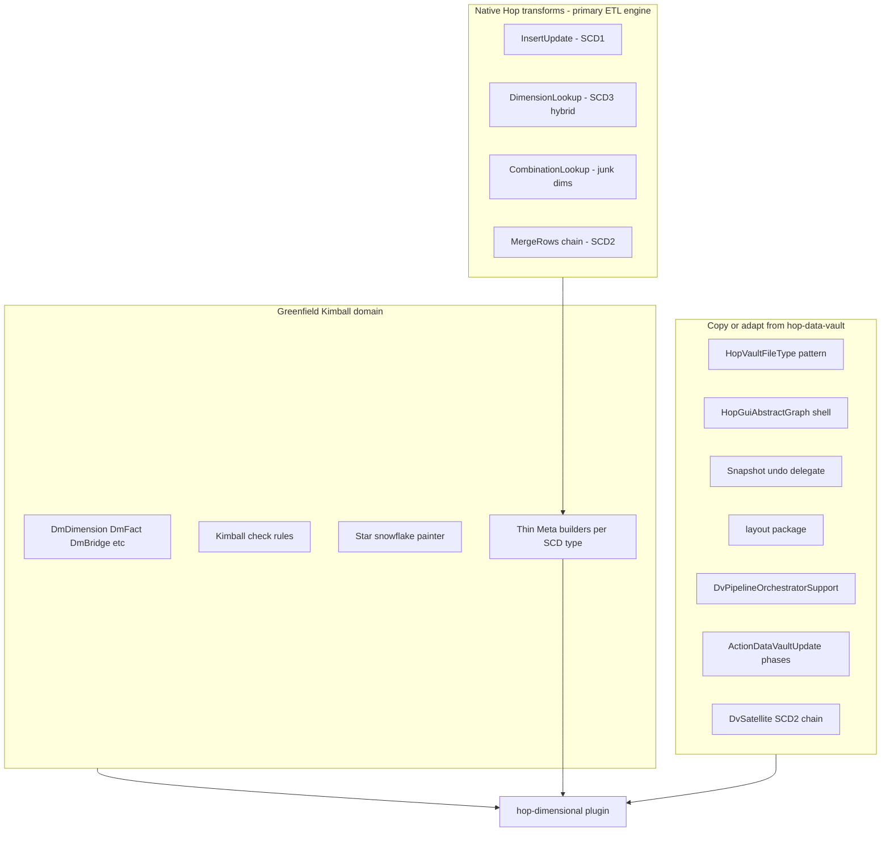
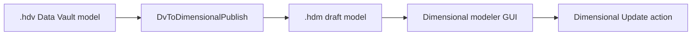

# Dimensional Modeler — Grand Plan

> Phase plan for a sibling Apache Hop plugin (`hop-dimensional`) that mirrors the Data Vault
> modeler architecture for Kimball star/snowflake modeling. Pipeline generation is driven by
> native Hop warehouse transforms where possible.

## Strategic thesis

The Data Vault plugin is a **Hop GUI file-type framework** for warehouse modeling: `.hdv` file →
visual graph → metadata-driven DDL + pipeline generation → workflow action with orchestrated
parallel execution.

The dimensional modeler should be a **parallel plugin** (`hop-dimensional`), not a bolt-on inside
`hop-data-vault`. Kimball semantics are different enough that sharing a single model file or table
interface would create permanent coupling pain. What we copy is the **machinery**; what we invent is
the **Kimball domain**.



---

## Pipeline generation strategy

**Do not hand-roll generic MergeRows chains for every SCD type.** Map each Kimball pattern to the
Hop transform that already implements it. Generators become **thin builders** that configure
`*Meta` classes from model metadata — same pattern as `DvHub` configuring `TableInputMeta`,
`MergeRowsMeta`, etc.

### SCD type → Hop transform matrix

| Kimball pattern | Hop transform | Generator approach | DV analog |
|-----------------|---------------|-------------------|-----------|
| **SCD Type 1** | `InsertUpdate` | Lookup on natural/grain key; map all Type-1 attributes to update fields | Simpler than satellite — no history |
| **SCD Type 2** | MergeRows → FilterRows → TableOutput + `Update` | **Copy/adapt `DvSatellite` load-end-date chain** — proven in this project | Direct port of satellite CDC pattern |
| **SCD Type 3 / hybrid** | `DimensionLookup` (`update=true`) | Per-attribute `DimensionUpdateType`: `INSERT` (history), `UPDATE` (overwrite), `LAST_VERSION` (previous-value column) | Native hybrid SCD — no custom chain |
| **Junk dimension** | `CombinationLookup` | Key fields = flag/indicator combo; returns surrogate key; optional `replaceFields` | Trivial pipeline — often 2 transforms total |
| **Fact FK resolution** | `DimensionLookup` (`update=false`) | One lookup per dimension role on stream; punch-through for late-arriving dims per config | Lookup-only mode |
| **Bridge / factless / snapshots / aggregates** | Mix of above + TableOutput | Phase C — still mostly InsertUpdate + DimensionLookup + TableOutput | Greenfield topology, native transforms where possible |

### Typical generated pipeline topologies

**SCD1 dimension** (3 transforms):

```
Source TableInput → Insert/Update → (done)
```

**SCD2 dimension** (satellite pattern, ~6–8 transforms):

```
Source TableInput → Target TableInput (WHERE end_date IS NULL)
  → MergeRows → FilterRows (changed)
  → TableOutput (insert new version)
  → Update (set end_date on prior row)
```

Lift from `DvSatellite.generateUpdatePipelines()` — swap hash key for natural/surrogate key,
attribute list from `DmDimension`.

**SCD3 / hybrid dimension** (2 transforms):

```
Source TableInput → Dimension Lookup/Update
```

Configure `DLFields`: `technicalKey`, `version`, `dateFrom`/`dateTo`, per-field update types.

**Junk dimension** (2 transforms):

```
Source TableInput → Combination Lookup/Update
```

Configure key fields from junk-dim attribute bitmap; surrogate key field from
`DimensionalConfiguration`.

**Transaction fact** (N+2 transforms):

```
Source TableInput
  → Dimension Lookup (role: Customer, update=false)
  → Dimension Lookup (role: Product, update=false)
  → … per grain FK
  → TableOutput (fact table)
```

### DDL must align with transform contracts

`getTargetTableLayout()` must produce schemas the transforms expect:

| Transform | Required columns |
|-----------|-----------------|
| Dimension Lookup | Technical key, version, date_from, date_to, natural key lookup fields, attribute fields |
| Combination Lookup | Technical key (+ optional hash field), key combination columns |
| Insert/Update | Natural key columns + all Type-1 attributes |
| SCD2 (satellite style) | Surrogate/natural key + attributes + effective_start + effective_end (+ current flag optional) |

`DimensionalConfiguration` mirrors DV config: standard column names (`dim_key`, `version`,
`date_from`, `date_to`, `load_dt`) so generators and DDL stay consistent.

---

## Reuse inventory

| Layer | Reuse | Notes |
|-------|-------|-------|
| Hop plugin shell, ELK, orchestrator, action phases | **80–95%** | pom, assembly, dependencies.xml, Jandex |
| GUI graph shell, undo, clipboard, notes | **70–90%** | `HopGuiVaultGraph` → `HopGuiDimensionalGraph` |
| **SCD2 pipeline generator** | **~70% adapt** | Port from `DvSatellite` |
| **SCD1 / SCD3 / junk generators** | **~50% new builders, 0% custom runtime logic** | Configure native transforms |
| **Fact FK lookup generator** | **~40%** | Thin `DimensionLookupMeta` builder per role |
| Kimball metadata, dialogs, painter, validation | **Greenfield** | Grain, measures, bridges, conformed dims |
| DV publish adapter | **0% now** | Later phase |

**Bottom line:** ~60% infrastructure reuse. ~40% ETL reuse because Hop already ships the warehouse
transforms — we generate configuration, not algorithms.

### Copy-and-rename map (GUI)

| Vault | Dimensional |
|-------|-------------|
| `HopVaultFileType` | `HopDimensionalFileType` (`.hdm`) |
| `HopGuiVaultGraph` | `HopGuiDimensionalGraph` |
| `DataVaultModelPainter` | `DimensionalModelPainter` |
| `DvHubDialog` etc. | `DmDimensionDialog`, `DmFactDialog`, `DmBridgeDialog`, … |
| `VaultElkLayout` | `DimensionalElkLayout` |

---

## Kimball metadata model

Full catalog: dimensions (SCD 1/2/3/6), junk, transaction + periodic + accumulating snapshot +
factless facts, bridges, aggregates, conformed dims, role-playing edges.

### Entity types (`DmTableType`)

| Type | Kimball role | Key metadata |
|------|-------------|--------------|
| **Dimension** | Conformed / standalone dim | Natural key, surrogate key strategy, attributes, SCD type, effective dates, current flag, outrigger refs |
| **JunkDimension** | Low-cardinality combos | Bitmap of source flags/indicators → single surrogate |
| **Fact** | Transaction | Grain declaration, measures (additive/semi/non-additive), degenerate dims, dimension roles |
| **PeriodicSnapshotFact** | Grain = snapshot period + context | Snapshot date, balance measures |
| **AccumulatingSnapshotFact** | Milestone grain | Multiple date FKs, row updates across lifecycle |
| **FactlessFact** | Event coverage / attendance | Dimension FKs only, no measures |
| **Bridge** | Many-to-many | Two+ dimension refs, weight/allocation factor |
| **AggregateFact** | Pre-computed rollup | Base fact ref, reduced grain, derived measures |

### Relationships (typed graph edges)

Unlike DV (satellite→hub, link→hubs), Kimball needs **typed edges**:

- **Fact→Dimension**: FK column name, **role name** (OrderDate vs ShipDate)
- **Dimension→Dimension**: snowflake outrigger
- **Bridge↔Dimension**: many-to-many resolution
- **Conformed dimension registry**: logical name → physical `DmDimension`

**Dimension attribute metadata:** `ScdUpdatePolicy` enum routed to the correct builder:

- `TYPE1` → `DmInsertUpdateBuilder`
- `TYPE2` → `DmScd2DimensionBuilder` (satellite chain only — no Dimension Lookup SCD2)
- `TYPE3_CURRENT` / `TYPE3_PREVIOUS` → `UPDATE` / `LAST_VERSION` in Dimension Lookup
- Junk dim flag columns → Combination Lookup key fields

---

## Maven dependencies (hop-dimensional)

Add alongside existing DV transform deps (tableinput, mergerows, filterrows, tableoutput, update,
getfilenames, pipelineexecutor):

| Artifact | Used for |
|----------|----------|
| `hop-transform-insertupdate` | SCD1 dimensions, bridge upserts, accumulating snapshot updates |
| `hop-transform-dimensionlookup` | SCD3/hybrid dims, fact FK lookups |
| `hop-transform-combinationlookup` | Junk dimensions |

---

## Generator package structure

```
org.apache.hop.dimensional.pipeline/
├── DmPipelineBuilderSupport.java          # shared: source TableInput, DB connection, commit size
├── DmInsertUpdateBuilder.java             # SCD1 → InsertUpdateMeta
├── DmDimensionLookupBuilder.java          # SCD3/hybrid + fact lookups → DimensionLookupMeta
├── DmCombinationLookupBuilder.java          # Junk → CombinationLookupMeta
├── DmScd2DimensionBuilder.java              # adapted from DvSatellite satellite chain
├── DmFactLoadBuilder.java                   # orchestrates lookup chain + TableOutput
└── DmGeneratedPipelineSupport.java          # copy of DvGeneratedPipelineSupport
```

---

## Workflow action: Dimensional Model Update

Clone `ActionDataVaultUpdate` structure:

1. Load `.hdm` model
2. `model.check()` — Kimball lint
3. Optional DDL (CREATE/ALTER dim/fact/bridge/agg tables)
4. `ensureSpecialRecords()` — unknown/invalid dimension rows
5. Per-table `generateUpdatePipelines()` — collect all `.hpl`
6. Stage → orchestrate (N parallel copies) → cleanup model folder
7. Merge `Result`

---

## DV → dimensional publish (later phase)

Independent `.hdm` models are the primary path. Publish adapter is a **separate workflow** once both
plugins exist:



**Mapping rules (starting point):**

- Hub → Dimension (business keys → natural key; hash key → surrogate key candidate)
- Hub satellite → Dimension attributes (SCD2 if satellite has history pattern)
- Link → Factless fact or Bridge (depending on measure presence)
- Link satellite → Fact attributes or bridge attributes

Publish produces a **draft** `.hdm` for human review — not unattended production ETL.

---

## Delivery phases

### Phase A — Foundation

- `hop-dimensional` module scaffold (clone vault structure)
- `DimensionalModel`, `IDmTable`, all `DmTableType` stubs, `DimensionalConfiguration`
- `.hdm` file type + graph shell + ELK
- Warehouse transform compile deps (insertupdate, dimensionlookup, combinationlookup)
- DDL layouts aligned to transform contracts

### Phase B — Core loads (native transforms first)

- `DmInsertUpdateBuilder` — SCD1 dimensions
- `DmScd2DimensionBuilder` — port satellite chain from `DvSatellite`
- `DmDimensionLookupBuilder` — lookup-only for fact FKs
- `DmFactLoadBuilder` — transaction facts with role-playing lookups
- `ActionDimensionalUpdate` + orchestrator + basic-star tests

### Phase C — Full Kimball catalog

- `DmCombinationLookupBuilder` — junk dimensions
- `DmDimensionLookupBuilder` — SCD3/hybrid (`update=true`, per-field update types)
- Bridge, factless, periodic/accumulating snapshots, aggregates
- Conformed dim registry + validation

### Phase D — DV publish adapter

- `.hdv` → draft `.hdm` + optional GUI wizard / workflow action

### Phase E — Maturity

- DB source import, documentation, expanded golden-file suites

---

## Recommended repo layout

```
hop-dimensional/                          # new repo or sibling module
├── src/main/java/org/apache/hop/dimensional/
│   ├── metadata/                         # DimensionalModel, IDmTable, Dm*
│   ├── hopgui/file/dimensional/          # graph, painter, dialogs (copied from vault)
│   ├── layout/                           # copied ELK + DimensionalElkLayout
│   ├── pipeline/                         # transform Meta builders
│   ├── workflow/actions/dimensionalupdate/
│   ├── config/                           # DimensionalConfigOptionPlugin
│   └── publish/                          # Phase D: DvToDimensionalPublish
├── src/main/resources/.../messages/
├── project/                              # test harness (clone pattern)
└── docs/
```

Keep `hop-data-vault` stable. Extract shared ELK + orchestrator into `hop-warehouse-common` only if
duplication becomes painful — not in Phase A.

---

## Risk register

| Risk | Mitigation |
|------|------------|
| Dimension Lookup DDL layout is opinionated (tk, version, date range) | Encode layout rules in `DimensionalConfiguration`; validate in `check()` before codegen |
| SCD2 via satellite chain vs Dimension Lookup internal SCD2 | **Explicit policy: SCD2 = satellite chain only** |
| Role-playing = multiple Dimension Lookup transforms on same stream | Builder emits sequential lookups with distinct output field names per role |
| Combination Lookup auto-creates unseen combos | Desired for junk dims; document in modeler tooltip |
| `HopGuiVaultGraph` is 3000 lines — fork drift | Copy in Phase A; extract shared base only if warranted in Phase B |
| DV publish mapping ambiguity | Draft-only output; never auto-run ETL without modeler review |

---

## Division of labor

**Kimball expertise:** SCD policy per attribute, grain definitions, conformed dim rules, bridge
weight semantics, snapshot dating, validation rule catalog, DV→dimensional mapping decisions.

**Code:** Plugin shell, graph editor, XML serialization, DDL from layouts, thin transform builders,
orchestrated execution, test harness.

**Key insight:** We are not building a warehouse ETL engine — we are building a **Kimball model
compiler that targets Hop's existing warehouse transforms.**