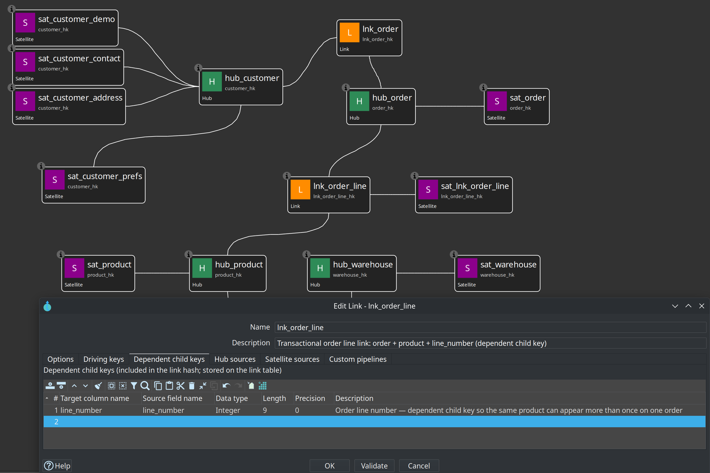

= Data Vault Link
:toc: macro
:toclevels: 3

toc::[]

A Link represents a relationship or association between Hubs. Examples include "Customer placed Order", "Product supplied by Supplier", "Employee assigned to Department", or any many-to-many connection you need to track.

The link table itself stores the hash keys of the participating hubs (plus driving keys when the same hub appears more than once with different roles, and optional *dependent child keys* for transactional grain), its own surrogate link hash key, the record source, and the load date.

Links can also have their own satellites when the relationship carries descriptive attributes that change over time.

== Transactional links (dependent child keys)

A **standard link** stores a *distinct list of relationships*. The link hash is built from the participating hub hashes only. If the same customer buys the same product at the same store twice, the second load produces the same link hash and is not inserted again.

A **transactional link** (also called a non-historized link in Data Vault 2.0 literature) keeps *one row per event or transaction*, even when the hub combination repeats. You do this by defining one or more **dependent child keys** on the link — for example a measurement timestamp, transaction id, or order line number.

Those values are:

* Stored as columns on the link table
* Included in the link hash calculation together with the hub hashes (in the order you list them, after the hubs)

So each distinct dependent-child combination gets its own link hash key. Satellites attached to the link then parent on that event-level key.

*Dependent child keys* are not the same as *driving keys*:

* **Driving keys** — role-playing the same hub type more than once (from location vs to location).
* **Dependent child keys** — making repeated occurrences of the *same* hubs unique (measurement every hour, sale line, sensor reading).

You can map any source column(s) as dependent child keys; the plugin does not hard-code timestamps versus ids.

Configure them on the link dialog **Dependent child keys** tab (target column name, source field, data type / length for DDL, optional description):

=== Retail worked example: order lines

In the link:getting-started-retail.adoc[retail example], **order lines** are modeled as a transactional link:

[cols="1,3", options="header"]
|===
|Object |Role

|`hub_order`, `hub_product`
|Participating hubs

|`lnk_order_line`
|Link hash = order HK + product HK + **`line_number`** (dependent child key)

|`sat_lnk_order_line`
|Measures only (`quantity`, `unit_price`, `discount_pct`) — standard satellite parented by the event-level link key

|`E2E-order-line` / `order_line_*.csv`
|Source grain: one row per order line
|===

Why not a standard link? The same product can appear twice on one order (for example two promotions with different unit prices). Without `line_number` in the link hash, both lines collapse to one `lnk_order_line_hk`.

Teaching contrast in the same model:

* `lnk_order` — standard link (customer placed this order once)
* `lnk_order_line` — transactional link (this *line* of the order)
* `lnk_warehouse_product` — standard link + satellite (product stocked in warehouse; stock is relationship *state*)

== How link updates work

When a link is loaded, the generated pipeline:

* Reads the raw business key values (and any driving keys and dependent child keys) from the source attached to the link.
* Calculates the hub hash keys for each participating hub, using either the hub's own business key names or the explicit mappings you provided.
* Calculates the link's own hash key from the hub hashes and any dependent child key values (in list order).
* Compares the resulting link rows against what already exists in the target link table.
* Inserts only truly new link rows (new relationships, or new transactional events when dependent child keys are used).
* Adds the batch load date and record source value.

The comparison is done on the link hash key, so only new combinations of hubs (and dependent child keys when configured) are loaded.

== Options in the Link dialog

[cols="1,3", options="header"]
|===
|Option |Description

|Name
|Name of the link definition. Used as the default physical table name.

|Physical table name
|Actual table name in the target database.

|Description
|Business description of the relationship this link represents.

|Default record source
|The Data Vault Source that supplies the relationship rows. This source must contain the business key values (or foreign keys) needed to identify the participating hubs.

|Participating hubs
|The list of hubs that take part in this relationship. You need at least two. The order in the list is the order in which the hub hash columns will appear in the link table and is also the order used when calculating the link hash key.

Add hubs by selecting them from the available hub definitions in the model.

|Driving key names
|Use this when the same hub participates more than once in the link with different roles. For example, a route link might connect two "Location" hubs: one as the origin and one as the destination. You would list driving key column names such as FROM_LOCATION_HK and TO_LOCATION_HK.

Driving keys disambiguate roles; they are a different concept from dependent child keys (see above).

|Dependent child keys
|Optional columns for transactional (non-historized) link grain. Each row has a target column name, optional source field name (defaults to the target name), data type / length for DDL, and optional description.

When set, these values are stored on the link and folded into the link hash after the participating hub hashes. Use them when the same hub combination must appear more than once (sensor readings, sales transactions, order lines, and similar event streams).

|Link hash key field name
|Name of the surrogate hash key column for the link itself. If you leave this empty, a name is derived from the link name (for example ORDER_CUSTOMER_LK).

|Hub source key fields
|This section lets you map the source columns that should be used to calculate each participating hub's hash key.

In many source systems the columns that identify a hub inside a relationship table have different names than the business keys in the hub's own source (for example customer_id in the customer hub source versus cust_fk or customer_id in an order source). When this happens, use the table in this section to tell the plugin exactly which source columns correspond to which hub's business keys.

For each participating hub you can enter the list of source business key field names (in the same order as the hub's business keys). If you leave a mapping empty for a hub, the plugin will use the business key names defined on that hub.

This mapping capability is one of the most practical features when integrating real-world source systems that do not use identical column naming across tables.

|Has descriptive attributes (link satellite)
|Check this box as a reminder that you intend to attach a satellite to this link. The flag itself does not change how the link is loaded, but the model check will emit a note when it is set.

|Integration mode (Options tab)
|Same as hubs and satellites: **Hop managed**, **External read-only**, or **Custom pipelines**. See link:dv-integration-modes.adoc[Data Vault integration modes].
|===

== Checks related to links

Clicking **Check model** will flag issues such as:

* Fewer than two participating hubs are defined.
* No link hash key field name was supplied (a default will be used).
* Driving keys are listed but one or more of them have no name.
* Dependent child keys are listed but a name (or resolvable source field) is missing, or the source field is not present on a link hub record source.
* A referenced hub does not exist in the current model.
* The "Has descriptive attributes" flag is on (informational note).
* **Source-to-target type mismatches** for hub-key field mappings: each `BusinessKeySource` entry is validated against the source column and the corresponding hub business key definition.

These checks run early and prevent many runtime surprises.

== Target table layout for links

The layout used for DDL and loading normally includes:

1. The link's own hash key column.
2. One column for each participating hub's hash key (in the order the hubs are listed in the link).
3. Dependent child key columns (if any), in the order defined on the link.
4. The record source column.
5. The load date column.

Driving key values may be stored when configured for role-playing. Dependent child keys are always materialised on the link when defined, because they are part of the link's identity and hash.

== Record source handling for links

The source query for a link includes the mapped business key fields, any driving keys, any dependent child key source fields, and the record source indicator (either a static value or a column from the source, depending on how you configured the Data Vault Source).

On the target side a NULL placeholder is used for the record source during the comparison step so that the actual record source value from the source leg can be passed through cleanly.

== Tips for links

* Define your hubs first. Links depend on them.
* When you have role-playing hubs (same hub used multiple times), always define driving keys so the relationships are unambiguous.
* When the same hubs can relate more than once (hourly sensor readings, repeated purchases, line items), add dependent child keys so each event gets its own link hash — do not rely on a link satellite alone to invent event identity under a single relationship hash.
* Use the Hub source key fields mapping whenever the column names in the relationship source differ from the hub business key names. This is very common and saves a lot of source-side view or staging work.
* If the relationship itself has attributes that change (for example contract terms, status, effective dates), create a satellite on the link and check the "Has descriptive attributes" box as documentation. For pure event facts, you may still attach a satellite for measures; after dependent child keys are set, that satellite parents on the event-level link key.
* Keep the list of participating hubs in a consistent order across the model if you care about column ordering in the physical link tables.