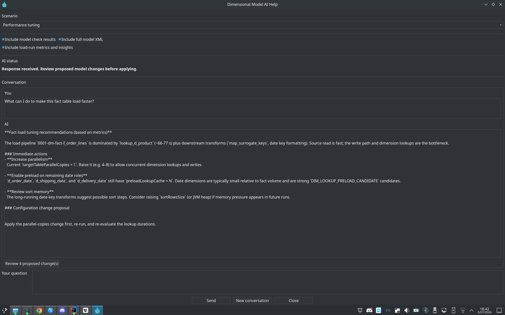
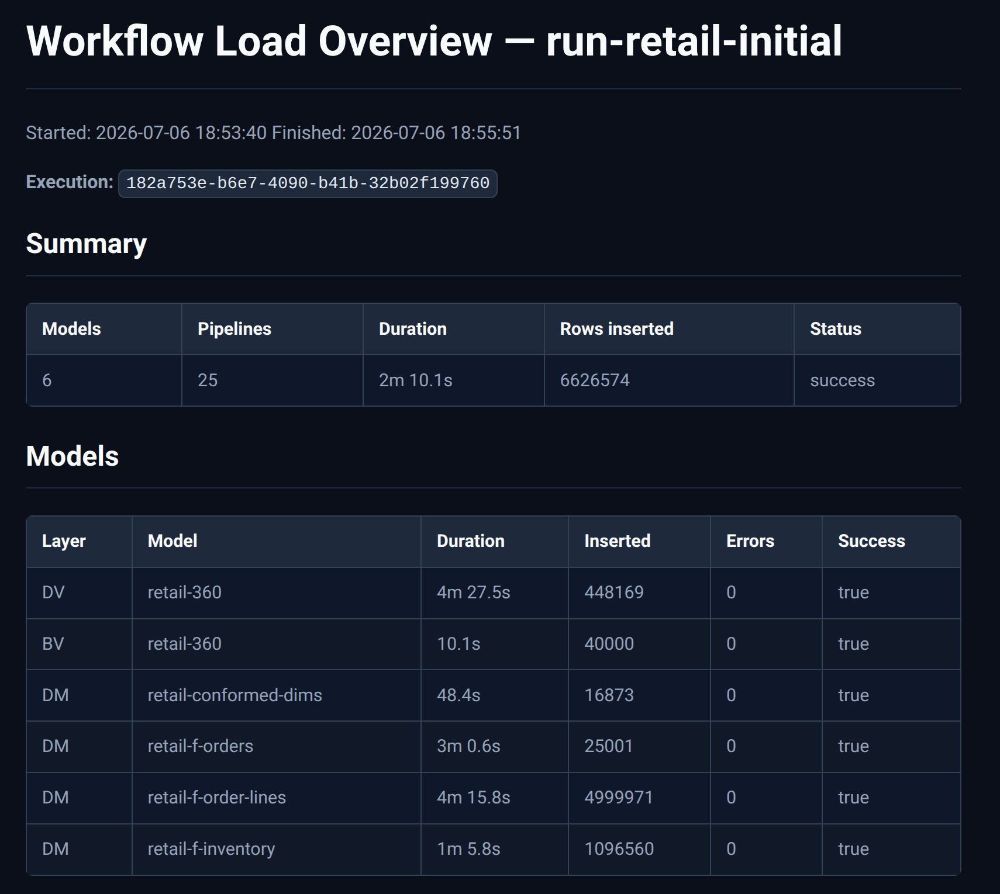
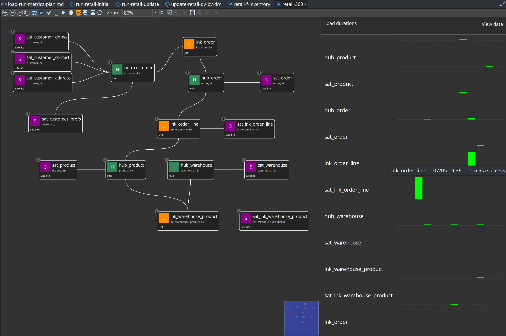

<!--
Licensed to the Apache Software Foundation (ASF) under one or more
contributor license agreements.  See the NOTICE file distributed with
this work for additional information regarding copyright ownership.
The ASF licenses this file to You under the Apache License, Version 2.0
(the "License"); you may not use this file except in compliance with
the License.  You may obtain a copy of the License at

     http://www.apache.org/licenses/LICENSE-2.0

Unless required by applicable law or agreed to in writing, software
distributed under the License is distributed on an "AS IS" BASIS,
WITHOUT WARRANTIES OR CONDITIONS OF ANY KIND, either express or implied.
See the License for the specific language governing permissions and
limitations under the License.
-->

# Hop Data Vault plugin — feature overview

Apache Hop plugin for **model-driven Data Vault 2.0**, **Business Vault**, and **dimensional** loading. Version **0.0.16-SNAPSHOT** (last 0.0.x) targets **Apache Hop 2.18.1** and **Java 21**.

**Model once. Generate loads and consumption layers.** The visual models (`.hdv`, `.hbv`, `.hdm`) are the contract between architects, modelers, and operations.

For a slide-style executive summary, see [presentations/hop-data-vault-overview.md](presentations/hop-data-vault-overview.md). For DV concepts and canvas usage, see [datavault-plugin.adoc](datavault-plugin.adoc).

---

## Feature maturity

| Feature | Status | Documentation |
|---------|--------|---------------|
| Data Catalog + `DV_SOURCE` record definitions | Available | [data-catalog.adoc](data-catalog.adoc), [datavault-source.adoc](datavault-source.adoc) |
| Resource definition validation (issues, proposals, acknowledgements) | Available | [resource-definition-validation.adoc](resource-definition-validation.adoc) |
| Data quality measure + quality gate (content rules, persist, alerts) | Available (Phase 2) | [data-quality.adoc](data-quality.adoc) |
| Data Vault modeler (`.hdv`) | Available | [datavault-plugin.adoc](datavault-plugin.adoc) |
| Model validation (Check model, type checking) | Available | [datavault-update-action.adoc](datavault-update-action.adoc) |
| Data Vault Update action | Available | [datavault-update-action.adoc](datavault-update-action.adoc) |
| Integration modes (managed / external / custom) | Available | [dv-integration-modes.adoc](dv-integration-modes.adoc) |
| Business Vault modeler (`.hbv`) | Available | [business-vault-overview.adoc](business-vault-overview.adoc) |
| BV SCD2 (single + multi-satellite merge) | Available | [business-vault-scd2.adoc](business-vault-scd2.adoc) |
| BV PIT tables | Available | [business-vault-pit.adoc](business-vault-pit.adoc) |
| Business Vault Update action | Available | [business-vault-update-action.adoc](business-vault-update-action.adoc) |
| Dimensional modeler (`.hdm`) | Available | [dimensional-modeler-overview.adoc](dimensional-modeler-overview.adoc) |
| Dimensional Update / Publish actions | Available | [dimensional-update-action.adoc](dimensional-update-action.adoc) |
| Execution maps (`.hem`) | Available | [execution-maps.adoc](execution-maps.adoc) |
| AI Help (model, pipeline, workflow) | Available | [ai-advisory.md](ai-advisory.md) |
| Record Definition Input transform | Available | [record-definition-input.adoc](record-definition-input.adoc) |
| Date Dimension Generator transform | Available | [date-dimension-generator.adoc](date-dimension-generator.adoc) |
| `hop svg` export | Available | [README.md](README.md#command-line-tools) |
| BV naming rules engine | Planned | [plans/bv-naming-rules-engine-plan.md](plans/bv-naming-rules-engine-plan.md) |
| Marquez / OpenLineage export | Planned | [plans/marquez-lineage-plan.md](plans/marquez-lineage-plan.md) |
| Hash-key ModPartitioner parallelism | Planned | [plans/hash-key-partitioning-plan.md](plans/hash-key-partitioning-plan.md) |

---

## Architecture (logical)

```
Sources (Data Catalog / CRM)
        │
        ▼
  Raw Data Vault (.hdv)
  hubs · links · satellites
        │
        ├── Hop-managed loads
        ├── External read-only tables
        └── Custom .hpl orchestration
        │
        ▼
  Business Vault (.hbv)
  SCD2 · PIT
        │
        ▼
  Dimensional marts (.hdm)
  dimensions · facts · bridges
```

---

## Major capabilities

### Data Catalog and sources

Record definitions of type **`DV_SOURCE`** describe logical feeds: record-source indicator, optional **group** for partial loads, and physical layout (database table today). Definitions live under namespace `hop/{project}/sources` in the project `catalog-data/` tree and open in the **Data Catalog** perspective.

Hubs, links, and satellites reference source **names**, not raw connection details — one stable vocabulary from catalog through models to generated pipelines.

### Raw Data Vault (`.hdv`)

Visual modeler for hubs, links, and satellites with embedded configuration (target database, hashing, sentinels, column names, pipeline options). Toolbar actions: **Edit model**, **Import sources**, **Check model**, **Generate DDL**, **Debug**, optional **AI Help**.

**Data Vault Update** workflow action validates (optionally), generates DDL, stages update pipelines, and runs them in parallel with a shared load timestamp.

### Model validation

**Check model** in the GUI and model checks in update actions share one engine: structural rules plus optional **detailed data type checking** against live source schemas. Catalog **resource definition validation** adds feed-level checks with remediation proposals and acknowledgements.

### Business Vault (`.hbv`)

Linked to a `.hdv` model. Defines **SCD2** consumption tables (single- or multi-satellite merge) and **PIT** helpers. **Business Vault Update** validates, optionally publishes target layouts to the catalog, generates SCD2 build pipelines, and orchestrates parallel execution.

### Dimensional modeler (`.hdm`)

Kimball star/snowflake modeling: dimensions, facts, junk dimensions, bridges, snapshot facts, and aggregates. **Dimensional Publish** drafts a `.hdm` from a `.hdv`; **Dimensional Update** loads the mart. Shares canvas interaction patterns with the DV modeler.

### Execution maps (`.hem`)

Crawl a root workflow or model and persist a graph of workflows, models, generated pipelines, and source datasets. Open `.hem` files in Hop GUI for execution and lineage views. The retail example includes maps for its main update workflow and the six-month simulation.


### AI Help

Optional LLM advisory on Data Vault models, pipelines, and workflows — scenarios, context inclusions, review-before-apply proposals. Configure under Hop GUI → **Configuration → AI Assistant**.

The **Performance tuning** scenario can include load-run metrics and propose model configuration changes (parallel copies, preload lookup cache) after review:



### Pipeline transforms

- **Record Definition Input** — stream catalog record definitions (or fields) as pipeline rows.
- **Date Dimension Generator** — populate standard calendar dimension attributes.

### Operations

Docker-based runners (`scripts/run-hop.sh`, `run-postgres.sh`), parallel pipeline orchestration, **record source group** partial loads, catalog-backed load-run metrics, workflow load overview reports (Begin/End Vault Update), and per-table duration bars on model graphs. See [operations.adoc](operations.adoc) and [performance-tuning.md](performance-tuning.md).





---

## Sample projects

| Project | Use for |
|---------|---------|
| **[retail-example](../retail-example/)** | Learning path — CSV → CRM → DV → BV → DM, initial and monthly updates |
| **[integration-tests](../integration-tests/)** | CI/regression — Customer 360, multi-active, external read-only, golden datasets |


**Recommended path:** [getting-started-retail.adoc](getting-started-retail.adoc) → reference adoc → [getting-started-integration-tests.adoc](getting-started-integration-tests.adoc) for advanced fixtures.

---

## 0.1.x focus

The transition from 0.0.x to 0.1.x emphasizes:

- Documentation completeness and accurate catalog-first workflows
- Validation UX (model checks + catalog issue handling)
- Retail tutorial as the primary onboarding path
- Hardening existing modelers and actions rather than large new subsystems