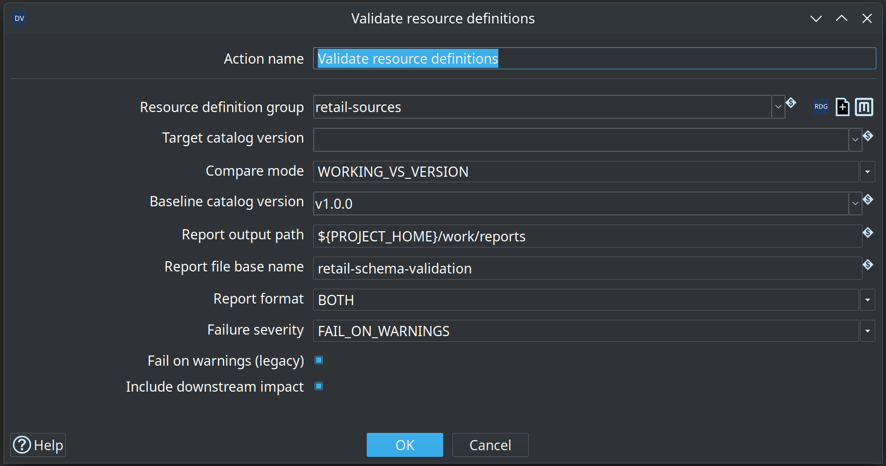
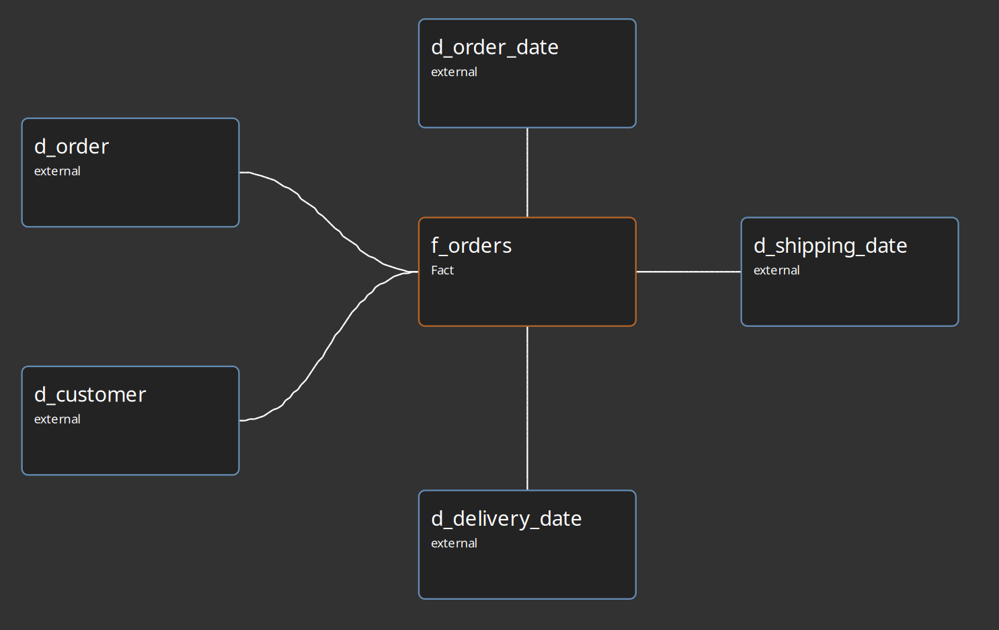
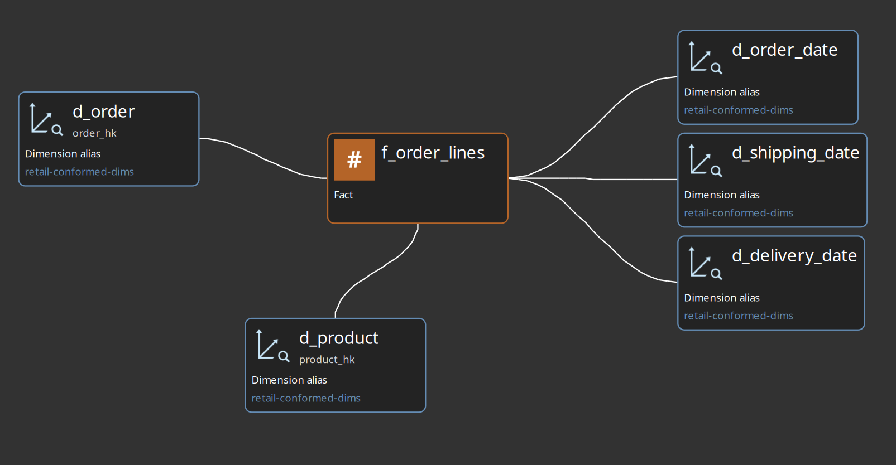
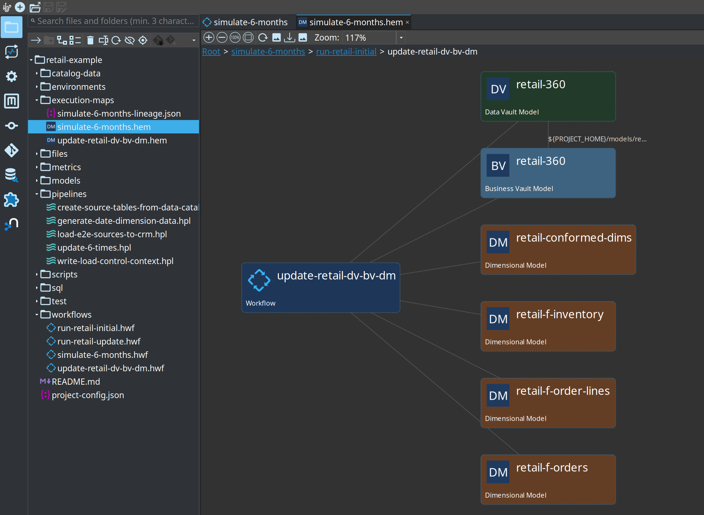

= Getting started — retail example
:toc: macro
:toclevels: 3

toc::[]

This is the **primary tutorial** for the hop-datavault plugin. You will run a full retail pipeline: source data → Data Vault → Business Vault → dimensional marts, including an incremental update wave.

For Customer 360 and other regression fixtures, see link:getting-started-integration-tests.adoc[Getting started — integration test fixtures].

Estimated time: 2–3 hours with Hop GUI, or follow command-line steps only in under an hour.

== Prerequisites

. Install Docker with Compose v2 and Python 3 (stdlib only).
. Build or download plugin **0.2.0-SNAPSHOT** for Apache Hop **2.18.1** (see link:../README.md[repository README]).
. Register `retail-example/` as a Hop project named **`retail-example`**.
. Configure database connections **`CRM`** and **`Vault`** from project metadata.
. Start PostgreSQL: from repo root, `./scripts/run-postgres.sh up`.

If you previously used an older single-database layout, reset once:

[source,bash]
----
./scripts/run-postgres.sh reset
./scripts/run-postgres.sh up
----

Project details: link:../retail-example/README.md[retail-example/README.md].

== Chapter 1 — Understand the layout

Retail uses two databases on port **54320**:

* **CRM** (`test_source`) — landing tables mimicking a source system
* **Vault** (`test_edw`) — Data Vault, Business Vault, dimensional tables, load control

Key files:

[cols="2,3", options="header"]
|===
|Path |Purpose

|`work/edw-catalog/hop/retail-example/sources/`
|`DV_SOURCE` record definitions (namespace `hop/retail-example/sources`; gitignored runtime catalog)

|`fixtures/schema-gate-baseline/`
|Seed for schema-gate tag `v1.0.0` (copied into `work/edw-catalog/catalog-versions/`)

|`models/retail-360.hdv`
|Data Vault model

|`models/retail-360.hbv`
|Business Vault model (SCD2 Customer 360)

|`models/retail-warehouse.hdm`
|Dimensional mart model

|`workflows/run-retail-initial.hwf`
|Full initial load

|`workflows/run-retail-update.hwf`
|Incremental monthly-style update

|`work/execution-maps/*.hem`
|Generated execution maps (after a run; gitignored)
|===

== Chapter 2 — Tour the Data Catalog

. Open Hop GUI with project **retail-example**.
. Switch to the **Data Catalog** perspective.
. Expand `hop/retail-example/sources` — entries such as `E2E-customer-hub`, `E2E-order-header`.
. Open one source — note **physical table** on CRM, **record source** field, and column layout.

Sources are JSON under the FILE catalog root (`work/edw-catalog/` for retail); the namespace in each file must match its folder path (`hop/retail-example/sources`). Initial setup runs `scripts/bootstrap-retail-work.py` to create the `work/` tree and generate E2E sources.

If entries appear in the tree but fail to open, press **F5** to refresh the catalog.

Reference: link:data-catalog.adoc[Data catalog], link:datavault-source.adoc[Data Vault sources].

== Chapter 3 — Explore the Data Vault model

. Open `models/retail-360.hdv`.
. Click **Edit model** — target database **Vault**, hashing and sentinel settings.
. Inspect hubs, links, and satellites on the canvas.
. Click **Check model** — resolve any errors before loading.

image::images/data-vault-model-retail-example.png[Retail 360 Data Vault model — hubs, links, and satellites on the Hop canvas,align="center"]

Optional: select a satellite, **Show update pipeline** — same generation logic as **Data Vault Update**.

== Chapter 4 — Run the initial load

From the repository root:

[source,bash]
----
./scripts/run-hop.sh retail-example workflows/run-retail-initial.hwf
----

The workflow drops and recreates schemas, bootstraps `work/` (FILE catalog + schema-gate baseline `v1.0.0`), generates CSV source files, loads CRM, runs the **schema gate**, **measures source data quality and applies a quality gate** (blocking findings stop the load), then runs Data Vault Update, Business Vault Update, and Dimensional Update. After the update it re-measures sources in **alert-only** mode.

In Hop GUI you can open `workflows/run-retail-initial.hwf` and run it with a configured pipeline run configuration.

== Chapter 4b — Schema gate and catalog versions

Retail wires **Validate resource definitions** in `workflows/run-retail-update-models.hwf` (shared by initial and update):

* Group: `retail-sources`
* Compare mode: `WORKING_VS_VERSION` against baseline tag **`v1.0.0`**
* Reports: `work/reports/retail-schema-validation.md` and `.html`
* Downstream impact enabled

Design-time: open metadata **Resource definition group** `retail-sources` for **Tag catalog version**, **List catalog versions**, and **Validate sources**.

image::images/resource-definition-group-editor-with-version-mgt-buttons.png[Resource definition group retail-sources with catalog version and Validate sources buttons,align="center"]

Full parameter reference, GUI issue dialogs, and sample HTML reports: link:resource-definition-validation.adoc[Resource definition validation]. Content rules (nulls, domains) are separate — see link:data-quality.adoc[Data quality].

== Chapter 5 — Run an incremental update

[source,bash]
----
./scripts/run-hop.sh retail-example workflows/run-retail-update.hwf
----

Repeat to simulate monthly batches. Load control in Vault tracks `progress_date`; data generation scripts produce update-wave CSVs.

== Chapter 6 — Business Vault and dimensional layers

. Open `models/retail-360.hbv` — linked to `retail-360.hdv`.
. Inspect SCD2 table **customer_360_bv** (multi-satellite merge).
. Open `models/retail-conformed-dims.hdm` for shared dimensions, `models/retail-f-orders.hdm` for `f_orders`, and `models/retail-f-order-lines.hdm` for `f_order_lines`.

The `f_order_lines` fact in `retail-f-order-lines.hdm` reuses conformed dimensions from `retail-conformed-dims` and adds role-playing date dimensions for order, shipping, and delivery dates:

Reference: link:business-vault-overview.adoc[Business Vault overview], link:dimensional-modeler-overview.adoc[Dimensional modeler overview].

== Chapter 7 — Execution map (optional)

. Open a generated map under `work/execution-maps/` (for example `update-retail-dv-bv-dm.hem` or `simulate-6-months.hem` after a crawl/run).
. Explore the crawled graph: root workflow → nested workflows and pipelines → models → generated pipelines → source datasets.
. Drill into nodes (double-click) to focus on one layer at a time; use the breadcrumb bar to navigate back.

The **simulate-6-months** map crawls `workflows/simulate-6-months.hwf`: an initial load followed by `update-6-times.hpl`, which runs `run-retail-update.hwf` six times.

Reference: link:execution-maps.adoc[Execution maps].

== Chapter 8 — Troubleshooting

[cols="1,3", options="header"]
|===
|Symptom |What to check

|Connection errors
|Postgres running on 54320; `environments/local-docker-postgres.json` variables

|Catalog entry won't open
|Namespace matches folder; refresh catalog (F5)

|Model check type errors
|CRM tables exist; run initial workflow's CRM load first; validate catalog fields vs live schema

|Stale plugin behavior
|Restart Hop GUI after installing **0.2.0-SNAPSHOT**

|Need clean slate
|`./scripts/run-postgres.sh reset` then `up`, rerun initial workflow
|===

== Next steps

[cols="1,2", options="header"]
|===
|Topic |Document

|All major features
|link:feature-overview.md[feature-overview.md]

|Integration test fixtures (Customer 360, external read-only)
|link:getting-started-integration-tests.adoc[getting-started-integration-tests.adoc]

|Catalog validation UX
|link:resource-definition-validation.adoc[resource-definition-validation.adoc]

|Operations (Docker, partial loads)
|link:operations.adoc[operations.adoc]
|===