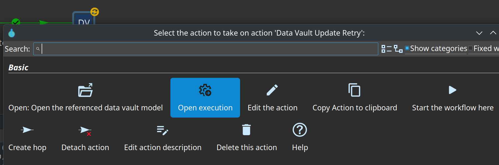

# Memory and performance tuning

Practical notes for tuning Data Vault update loads. Settings live in two places:

- **Model** (`.hdv` → Target loading tab): batch size, Table Output copies, Sort Rows in-memory buffer
- **Workflow** (Data Vault Update action): parallel pipeline copies, JVM heap on the run configuration

---

## Two kinds of parallelism

Generated update pipelines use parallelism at two independent levels. They stack: total resource use is roughly the product of both when loads run concurrently.

### 1. Parallel pipeline copies (orchestrator)

**Setting:** `parallelPipelineCopies` on the **Data Vault Update** workflow action (default `1`).

The action stages all generated `.hpl` files and runs them through a Get File Names → Pipeline Executor orchestrator. Each copy runs a different pipeline in parallel (round-robin over the staged files).

| Use case | Guidance |
|----------|----------|
| Many small hubs/links/sats | Increase copies (e.g. 2–4) to load several tables at once |
| One large satellite | Keep at `1` — a single heavy pipeline already saturates CPU and memory |
| Mixed model | Start low; raise copies only if individual pipelines are small and JVM headroom remains |

This does **not** split one satellite load across threads. It only runs **different** pipelines side by side.

### 2. Target table parallel copies (Table Output)

**Setting:** `targetTableParallelCopies` on the model **Target loading** tab (default `1`).

Applied to the generated **Table Output** transform as Hop transform copies. Rows are distributed round-robin across copies — there is **no hash-key affinity**, so merge/sort work upstream is still single-threaded per copy until rows reach Table Output.

| Observed effect | Notes |
|-----------------|-------|
| Faster Postgres inserts | Multiple concurrent `COPY`/batch writers (e.g. 4 copies ≈ 4 parallel DB connections) |
| Modest overall speedup | Merge Rows and Sort Rows still run on one copy each; DB write is only part of total time |
| More DB connections | Ensure Postgres `max_connections` and pool limits accommodate copies × concurrent pipelines |

Example from the large synthetic model (`integration-tests/files/large/syn-large.hdv`): `targetTableParallelCopies=4`.

**Future option:** hash-key mod partitioning (same partition count, aligned swimlanes through merge) is described in [hash-key-partitioning-plan.md](hash-key-partitioning-plan.md) — not implemented yet; pick up when loads outgrow round-robin copies.

---

## Sort Rows in-memory buffer

**Setting:** `sortRowsSize` on the model **Target loading** tab (label: *Sort rows in memory*, default `1000000`).

Link and satellite update pipelines sort by hash key before **Merge Rows**. This value is the number of rows Sort Rows holds in memory before spilling to disk (Hop `SortRowsMeta.sortSize`).

### Trade-off

| More in-memory rows | Fewer in-memory rows |
|---------------------|----------------------|
| Less temp-disk I/O | More external sort I/O |
| Higher CPU use (sort/merge in RAM) | Lower CPU, more disk wait |
| Higher JVM heap per pipeline | Lower memory footprint |

### Observed results (25M-row `sat_syn_order` initial load)

On an 8-core host with **16 GB JVM heap** allocated:

- Increased in-memory sort buffer → **~6 GB heap used**, CPU spread across all 8 cores
- External sort I/O dropped sharply
- **Initial load time cut roughly in half** vs default spill-heavy sort

The large test model uses `sortRowsSize=30000000` alongside `targetTableParallelCopies=4`.

### Tuning guidance

1. **Size for the largest sort in the run** — usually the biggest satellite. Aim to hold most or all of that stream in memory if heap allows.
2. **Leave headroom** — reserve memory for merge buffers, target Table Input, JDBC drivers, and Postgres client buffers. If heap is 16 GB, ~6 GB for sort on one large pipeline is a reasonable ceiling; going higher only helps if the row set still spills.
3. **Per-pipeline, not global** — each running pipeline has its own Sort Rows. `parallelPipelineCopies=3` with three heavy satellites can need **3×** the sort memory.
4. **Row width matters** — wide attribute sets use more bytes per row than the row count alone suggests.
5. **Diminishing returns** — once the sort stays in memory, the bottleneck often moves to target read (Table Input + Group By), Merge Rows, or database write. Tune `targetTableParallelCopies` and batch size next.

---

## Target table batch size

**Setting:** `targetTableBatchSize` on the model **Target loading** tab (default `1000`).

Commit size for Table Output. For **Native bulk loader** mode on MySQL/SingleStore, this value is also passed as the bulk loader batch size. Larger batches reduce commit overhead; very large batches increase memory per output copy and time between commits. For bulk initial loads, values in the thousands are typical; increase gradually if the database tolerates it.

---

## Native bulk loading

**Setting:** `targetLoadMode` on the model **Target loading** tab (default **Table Output**).

When set to **Native bulk loader** and the matching Hop database plugin is installed, generated hub/link/satellite insert pipelines end in a bulk loader transform instead of Table Output:

| Target database | Hop transform | Mechanism |
|-----------------|---------------|-----------|
| MySQL, SingleStore | MySQL bulk loader | `LOAD DATA` via named pipe |
| PostgreSQL | PostgreSQL bulk loader | `COPY FROM STDIN` (streaming) |
| Oracle | Oracle bulk loader | `sqlldr` direct-path stream |
| Snowflake | Snowflake bulk loader | Internal stage + `COPY INTO` |
| MonetDB | MonetDB bulk loader | Column-store bulk insert |
| Vertica | Vertica bulk loader | Direct `COPY` stream |
| Doris | Doris bulk loader | Stream Load HTTP API |

Notes:

- Only the **insert leg** uses bulk loading. Satellite load-end-date **Update** transforms are unchanged.
- Native bulk loaders run as a **single transform copy** (`targetTableParallelCopies` is ignored for this mode). Use **Staging file** mode when you need parallel shard files.
- Delimiter, enclosure, and encoding on the Target loading tab feed the bulk loader field format (defaults: comma, double quote, UTF-8).
- Install the matching `hop-databases-*` and bulk-loader transform plugins in the Hop runtime.

---

## Staging file + bulk command

**Setting:** `targetLoadMode` = **Staging file + bulk command**.

Generated insert pipelines end in **Text File Output** with `targetTableParallelCopies` parallel copies. Each copy writes `${bulkLoadStagingFolder}/${pipelineName}-${Internal.Transform.CopyNr}.csv`. A master workflow then runs each staged pipeline and bulk-loads every shard file.

| Target database | Workflow action | Notes |
|-----------------|-----------------|-------|
| MySQL, SingleStore | MySQL bulk load | `LOAD DATA LOCAL INFILE` from staged CSV |
| Microsoft SQL Server | MSSQL bulk load | `BULK INSERT` from staged CSV (UTF-8, header skipped) |
| PostgreSQL | Pipeline (CSV input → PGBulkLoader) | Client-side `COPY FROM STDIN` from staged CSV |

Operational notes:

- Set **Bulk load staging folder** to a path writable by Hop. PostgreSQL loads from the Hop client via PGBulkLoader; MySQL/SingleStore use `LOAD DATA LOCAL INFILE`.
- **Bulk load requires local file** (default on) documents that Hop and the DB client must access the CSV on the filesystem.
- Cleanup of pipeline staging (`.hpl`) and bulk CSV folders runs in a `finally` block after the master workflow finishes.

---

## Hash-key partitioning and bulk modes

Deferred [hash-key mod partitioning](hash-key-partitioning-plan.md) targets multi-copy **Table Output** with hash-key swimlanes. It does **not** apply to native bulk loaders (single writer) or staging-file mode (use parallel Text File Output copies for shard fan-out instead). The model check emits a warning when a non–Table Output load mode is selected.

---

## Suggested starting points

| Scenario | `parallelPipelineCopies` | `targetTableParallelCopies` | `sortRowsSize` |
|----------|--------------------------|-----------------------------|----------------|
| Dev / small feeds | 1 | 1 | default (`1000000`) |
| Production, many small tables | 2–4 | 1–2 | default |
| Large satellite initial load (10M+ rows) | 1 | 2–4 | Raise until sort stays in memory (monitor heap) |
| syn-large style (25M+ rows, 16 GB heap) | 1 | 4 | ~25M–30M rows if width is moderate |

Always align JVM `-Xmx` with these choices. Watch Hop logging and OS metrics (CPU, disk, heap) when changing more than one knob at a time.

---

## Monitoring a running update (Hop GUI)

While a Data Vault Update workflow is running, you can drill into live pipeline execution without waiting for the workflow to finish.

### Live stall badge on the workflow action

When a **Data Vault / Business Vault / Dimensional Update** action is executing, Hop paints a small status icon at the **bottom-right** of the action:

| Icon | Meaning |
|------|---------|
| Clock | Update running normally |
| Warning | No transform progress for about a minute (possible slow query, sort, or backpressure) |
| Failure | Errors detected in an active child pipeline |

Hover the icon for a short tooltip such as *Updating table d_customer of model retail-360*. Click it to open the **Live model update** dialog with per-pipeline transform metrics (rows in/out, buffer sizes, stall seconds) and a **Copy diagnostics** button for issue reports.

The action log also prints the **resolved staging folder** at orchestrator start (default `${java.io.tmpdir}/dv2/<model-name>/`, not necessarily `/tmp`) and repeats stall warnings about once per minute while a pipeline is quiet.

### Open execution from the workflow action

1. In the workflow execution view, click the running **Data Vault Update** action.
2. Choose **Open execution** from the context menu.

This opens the **DV Update Orchestrator** pipeline (`Get pipeline files` → **Execute update pipelines**). You can see which staged update pipelines are being picked up and how many executor copies are active (`parallelPipelineCopies`).

### Open execution from the orchestrator

From that orchestrator pipeline, click the running **Execute update pipelines** transform and choose **Open execution** again. That opens the **currently running** generated update pipeline (e.g. a single hub, link, or satellite load) so you can inspect transform metrics, row rates, and where time is spent (Sort Rows, Merge Rows, Table Output, and so on).

Use this when tuning `sortRowsSize` or `targetTableParallelCopies` — it shows whether sort is still spilling, whether multiple Table Output copies are busy, and which transform is the bottleneck.

### AI-assisted tuning

On DV/DM/BV models, open **AI Help**, choose the **Performance tuning** scenario, and enable **Include load-run metrics and insights**. The advisor correlates recent OPS metrics with model settings and can propose `SET_CONFIGURATION_PROPERTY` changes (for example raising `targetTableParallelCopies`) for review before apply. See [ai-advisory.md](ai-advisory.md#example-performance-tuning-on-a-dimensional-model).

### Execution information location

For richer history and metrics beyond the live GUI view, configure an **Execution Information Location** on the **Pipeline run configuration** selected in the Data Vault Update action (`Pipeline run configuration` field). Hop will persist execution data (status, timing, logging) to that location for orchestrator runs and the pipelines they launch. Point it at a folder or metadata store you use for operational analysis.

---

## Related docs

- [datavault-configuration.adoc](datavault-configuration.adoc) — full configuration reference
- [hash-key-partitioning-plan.md](hash-key-partitioning-plan.md) — deferred design for hash-key swimlanes through merge
- [Hop partitioning manual](https://hop.apache.org/manual/latest/pipeline/partitioning.html) — background on mod partitioning and data swimlanes