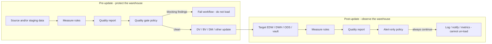
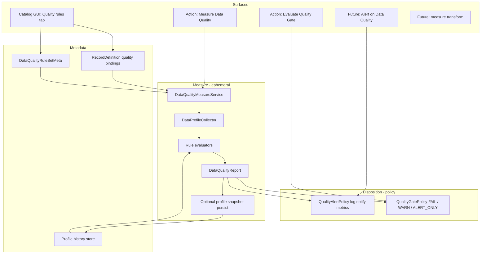

# Data Quality & Profiling Architecture (Issue #66 + beyond)

## Context

[Issue #66](https://github.com/mattcasters/hop-data-vault/issues/66) asks for **data-profiling / data-quality validations** beyond today’s schema-contract checks:

- Table not empty
- Column `gender` expected domain: `M` / `F` / `U` / null
- Numeric range (e.g. items 0–999)
- Column never null
- Central definition (Hop metadata), applied/stored with catalog record definitions
- A **separate workflow action** to validate sources using those rules

Today the plugin already has a strong **schema validation** path:

| Layer | What it checks | Key types |
|-------|----------------|-----------|
| Resource definition validation | Layout drift, readability, PK changes | `SourceRecordValidationService`, `ValidationReport` |
| Catalog acknowledgements | Suppress known schema issues | `RecordDefinitionValidationAcknowledgement` |
| Workflow action | Fail load on blocking schema issues | `ActionValidateResourceDefinitions` |
| Load-run metrics | Runtime row/transform stats + tuning insights | `LoadRunInsightEngine`, ops tables |

What is **missing** is a **content / batch-quality** layer: rules over *data values and aggregates*, used both to **gate loads** and to **verify / alert after loads** against sources and targets (EDW, DWH, ODS, vault tables, etc.).

This plan scopes **beyond the ticket**: a reusable Hop DI quality engine, catalog bindings, and a clean split between **measuring data** and **acting on results**.

---

## Architectural cornerstone: measure vs disposition

**Do not collapse “run checks on data” and “decide what the workflow does about it” into one blob.**

| Stage | Responsibility | Output | Can stop the load? |
|-------|----------------|--------|--------------------|
| **1. Measure** (ephemeral evaluation) | Execute rules / collect profile metrics against a dataset (source **and/or** target) | `DataQualityReport` + optional `DataProfileSnapshot` | No — pure observation |
| **2. Disposition** (policy) | Interpret the report under a policy | workflow fail, warn log, alert channel, metrics publish | **Depends on lifecycle** |

### Two lifecycle moments (same engine, different policy)



| Moment | Typical subject | Disposition | Why |
|--------|-----------------|-------------|-----|
| **Pre-update** | Landing/source extracts, staging tables, catalog `DV_SOURCE` feeds | **Quality gate** — fail workflow on blocking findings (optional fail-on-warning) | Still possible to refuse a bad batch before it corrupts the EDW |
| **Post-update** | Target hubs/sats, BV tables, dimensional marts, ODS | **Alert only** — log findings, publish metrics, optional notify; workflow result may still be success-with-warnings | Data is already written; rollback is rarely automatic. Alerting remains operationally critical |

Both moments use the **same measure pipeline** and the **same rule definitions**. Only the **disposition policy** and often the **catalog record target** (source vs published model table) differ.

This is intentionally similar to “ephemeral evaluation + quality gate,” with a second-class citizen that is equally important: **ephemeral evaluation + alert policy** after the run.

---

## Goals

1. **Protect loads** — pre-update gate can block DV/BV/DM (or any) update when batch quality fails.
2. **Verify targets** — post-update measure + alert on EDW/DWH/ODS/vault tables after a run.
3. **Separate measure from policy** — one evaluation engine; multiple disposition modes.
4. **Source and target agnostic** — rules attach to catalog record definitions (any physical dataset), not only `DV_SOURCE`.
5. **Reuse beyond Data Vault** — engine useful for general Hop DI.
6. **Central + local rules** — shared libraries and per-record bindings.
7. **History-ready metrics** — measure produces profiles; gates/alerts can later compare to prior runs.

## Non-goals (initial phases)

- Automatic rollback / compensating transactions after a failed post-update check.
- Replacing Hop’s row-level **Validator** transform (streaming per-row vs batch measure).
- Full statistical ML anomaly detection.
- Data-cleaning remediation pipelines (measure + gate/alert only in early phases).

---

## Recommended architecture

### Layered stack



### Package placement (reusability first)

| Package | Responsibility | Upstream potential |
|---------|----------------|--------------------|
| `org.apache.hop.quality` | Rule model, measure engine, report, gate/alert policies | High — general Hop DI |
| `org.apache.hop.catalog.model` | Bindings on `RecordDefinition`, document persistence | Medium |
| `org.apache.hop.catalog.quality` | Catalog physical ref → measure context (source **or** target) | Medium |
| `org.apache.hop.quality.workflow…` | Measure / gate / alert actions | High |
| DV docs & examples | Wire pre-gate before update, post-alert after update | Product-specific |

**Do not** bury the engine under `datavault.resourcedefinition` only.

---

## Core concepts

### 1. Rule (declarative, typed)

```text
DataQualityRule
  id              stable id (acks, history)
  name, description
  type            NOT_NULL | ALLOWED_VALUES | RANGE | MIN_ROW_COUNT | …
  severity        BLOCKING | WARNING | INFO   # semantic weight of a failure
  fieldName       optional column scope
  parameters      min, max, values, pattern, sql, …
  enabled
  evaluationHint  AUTO | SAMPLE | FULL_SCAN | SQL_PUSHDOWN
```

Severity on the **rule** answers “how bad is this finding?”  
Disposition policy answers “what does the workflow do with blocking/warning findings?”

Ticket examples:

| Example | Type | Scope | Parameters |
|---------|------|-------|------------|
| Table not empty | `MIN_ROW_COUNT` | dataset | `min=1` |
| gender ∈ {M,F,U,∅} | `ALLOWED_VALUES` | field | values + `nullAllowed=true` |
| items 0–999 | `RANGE` | field | `min=0`, `max=999` |
| name never null | `NOT_NULL` | field | — |

### 2. Rule set (Hop metadata — central library)

- **Key:** `data-quality-rule-set`
- **Class:** `DataQualityRuleSetMeta`
- Shared domains (“Retail codes”, “Mandatory BK columns”) reusable across sources **and** targets.

### 3. Binding on catalog record definition

Works for **any** catalog record that has a physical location — `DV_SOURCE`, published DV/BV/DM tables, future ODS definitions:

```text
qualityRules: List<RecordQualityRuleBinding>
  ruleSetName? / ruleId?  |  inlineRule?
  severityOverride? fieldNameOverride? enabled
```

Same rule library can bind to:

- Pre-load: `hop/.../sources/E2E-customer-demo`
- Post-load: `hop/.../models/retail-360/sat_customer_demo` (or BV/DM published defs)

### 4. Measure result (ephemeral first-class object)

```text
DataQualityReport
  runId, measuredAt, subjectKeys[]
  findings[]          # DataQualityFinding
  profile?            # DataProfileSnapshot computed during measure
  hasBlockingFindings / hasWarnings

DataQualityFinding
  ruleId, type, severity, fieldName
  message, actualSummary, expectedSummary
  metrics[]           # facts that justified the finding
```

Phase 1: report is **ephemeral** (in-memory / workflow log / optional result rows).  
Phase 2+: optional **persist** report + profile for history, dashboards, and post-hoc alert re-evaluation.

### 5. Disposition policy (separate from measure)

```text
QualityDispositionMode
  GATE_FAIL          # fail workflow if blocking (pre-update default)
  GATE_FAIL_WARNINGS # also fail on warnings
  ALERT_ONLY         # never fail workflow; log + optional notify (post-update default)
  MEASURE_ONLY       # produce report only; caller decides later
```

Optional alert sinks (phased):

- Workflow log (always)
- Result nrErrors / log text (gate)
- Publish findings to ops tables / metrics folder
- Future: mail, Slack, Hop notification plugins — keep behind a small `IQualityAlertSink` SPI

### 6. Evaluation modes (how measure reads data)

| Mode | When | How |
|------|------|-----|
| `SQL_PUSHDOWN` | DB / Iceberg when supported | aggregates in SQL |
| `SAMPLE` | GUI test, cheap pre-check | preview/limited scan |
| `FULL_SCAN` | Strict pre-gate | full stream; optional max-rows safety |

**AUTO** prefers pushdown when available.

### 7. Profile metrics (future-ready)

```text
DataProfileSnapshot
  recordKey, capturedAt, loadId?, lifecycle PRE|POST
  rowCount
  fieldProfiles[]: nullCount, distinctCount, min, max, topValues[]
```

Enables later historical rules (row-count delta, distinct BK vs yesterday) for **both** pre-gate and post-alert.

---

## Workflow shape (product usage)

### Ticket MVP — pre-update source gate

```text
[Measure Data Quality on sources]
        |
        v
[Evaluate Quality Gate FAIL_ON_BLOCKING] --fail--> stop
        |
      success
        v
[Data Vault Update / other load]
```

### Recommended full pattern — gate then alert

```text
[Measure Data Quality on sources]
        |
        v
[Evaluate Quality Gate FAIL_ON_BLOCKING]
        |
      success
        v
[Begin Vault Update … Update … End Vault Update]
        |
        v
[Measure Data Quality on target tables]
        |
        v
[Evaluate Quality Gate ALERT_ONLY]
        |
      always continue (findings logged / published)
```

Post-update never claims to “protect” the warehouse by blocking; it **detects residual or load-induced issues** (unexpected empty sat, distinct count collapse after merge, domain pollution that slipped past sample gates, etc.) and **makes someone aware**.

### Action design (approved: two separate actions)

Keep **measure** and **disposition** as distinct workflow steps (clearer ops intent than one multi-mode action):

| Action | Id | Role |
|--------|-----|------|
| **Measure Data Quality** | `MEASURE_DATA_QUALITY` | Run rules against catalog subjects → produce ephemeral `DataQualityReport` (log + optional persist / result attachment). Does **not** fail the workflow for rule findings (only infra errors). |
| **Evaluate Quality Gate** | `EVALUATE_QUALITY_GATE` | Consume a report (from prior measure step and/or re-measure) and apply policy: fail on blocking, optional fail on warnings. Pre-update protection. |

**Post-update alerting:** either a third thin action later (`ALERT_ON_QUALITY_REPORT`) or Evaluate Quality Gate with an explicit **alert-only** policy flag. Prefer a dedicated **Alert on Data Quality** action when post-update sinks grow; for Phase 1, gate action supports modes `FAIL_ON_BLOCKING` | `FAIL_ON_WARNINGS` | `ALERT_ONLY` so post-update can log without failing, while still remaining a separate step from measure.

Shared parameters on both (as relevant):

- Scope (resource definition group / record keys / namespace / model-published targets)
- Catalog connection
- Evaluation mode on **Measure** (AUTO / SAMPLE / FULL)
- Optional: persist profile / report
- Report hand-off: in-process result log always; optional file/variable path if measure and gate are not adjacent

Internals:

1. `DataQualityMeasureService.measure(...)` → `DataQualityReport`
2. `QualityDisposition.apply(report, mode)` used **only** by gate/alert actions

Ticket’s “separate action” vs schema validation remains: these are content quality actions, distinct from `VALIDATE_RESOURCE_DEFINITIONS`.

---

## Rule type roadmap

### Phase 1 — Issue #66 MVP

| Type | Level | Notes |
|------|-------|-------|
| `MIN_ROW_COUNT` / `MAX_ROW_COUNT` | dataset | empty feed gate |
| `NOT_NULL` | field | |
| `ALLOWED_VALUES` | field | null policy param |
| `RANGE` | field | numeric/date |
| `NOT_EMPTY_STRING` | field | optional trim |

Measure against catalog-bound datasets; disposition `GATE_FAIL` for pre-source use.

### Phase 2 — richer measure + persist

- `NULL_RATIO_MAX`, distinct bounds, `REGEX`, `SQL_ASSERTION`, value length
- Persist profile snapshots; GUI history browse
- First-class **post-update ALERT_ONLY** examples on published targets
- Optional alert sink SPI (log + ops table minimum)

### Phase 3 — historical protection / detection

| Type | Pre-gate use | Post-alert use |
|------|--------------|----------------|
| `ROW_COUNT_DELTA` | Reject suspiciously small extract | Alert if target shrunk unexpectedly |
| `DISTINCT_DELTA` | Reject extract with fewer customer IDs than yesterday | Alert if hub/BV distinct BK collapsed |
| `METRIC_BAND` / `FRESHNESS` | Gate stale or out-of-band feeds | Alert stale marts |

### Phase 4 — broader Hop DI

- Pipeline transform for measure mid-flow
- Export field rules → Hop Validator
- Custom evaluator SPI polish
- Upstream `org.apache.hop.quality` toward Apache Hop

---

## Engine design

```text
DataQualityMeasureService
  measure(subjects, rules, MeasureOptions) → DataQualityReport

IDataQualityRuleEvaluator
  supports(rule, capabilities)
  evaluate(rule, QualityEvaluationContext) → List<DataQualityFinding>

QualityEvaluationContext
  variables, metadataProvider, log
  subject: catalog key + physical ref (source or target)
  profile: lazy collector
  history: optional prior snapshots
  mode, sampleLimit, fullScanMaxRows
  lifecycle: PRE_UPDATE | POST_UPDATE | AD_HOC

QualityDisposition
  apply(report, QualityDispositionMode, AlertContext) → DispositionResult
```

Findings carry severity; disposition maps severity → fail vs alert.  
Measure never throws “business failure” for rule violations — only infra errors (can’t connect). That keeps **ALERT_ONLY** honest: measurement always yields a report when data is reachable.

---

## GUI

### Catalog record editor

**Quality** tab on `RecordDefinitionDetailsPanel`:

- Applied rules table; add from library / inline
- Type-specific parameters
- **Test measure…** (SAMPLE) → results dialog (no disposition / or soft warning display)
- Rules apply whether the record is a source feed or a published target layout

### Metadata editor

`DataQualityRuleSetMetaEditor` for central libraries.

### Results UX

Shared finding rows (severity, rule, field, message, actual vs expected).  
Pre-gate dialog can emphasize “would block.”  
Post-alert / history view emphasizes “notify” and trends.

---

## Persistence

1. **Rule sets** — Hop metadata JSON  
2. **Bindings** — catalog `RecordDefinitionDocument`  
3. **Acknowledgements** — on record (justified exceptions)  
4. **Reports / profiles** — ephemeral Phase 1; Phase 2+ ops tables (align with `LoadRunMetricsCatalogPublisher`) with `lifecycle` PRE|POST and optional `loadId` / workflow execution id  

---

## Relationship to existing systems

| Existing | Interaction |
|----------|-------------|
| `SourceRecordValidationService` | Schema-only sibling; run before or with pre-gate |
| `ActionValidateResourceDefinitions` | Unchanged schema gate |
| `RecordDefinitionPreviewSupport` | SAMPLE measure |
| `LoadRunInsightEngine` | Runtime tuning; quality is content measure. Later join AI context |
| `ActionEndVaultUpdate` / load overview | Natural place to **document** post-alert hook; optional later integration to auto-run target quality in ALERT_ONLY |
| Hop Validator | Complementary row-level streaming |

---

## Critical files to touch

### New (core)

- `src/main/java/org/apache/hop/quality/**` — model, measure service, evaluators, report, disposition
- `…/quality/metadata/DataQualityRuleSetMeta.java` (+ editor, register XP)
- `…/quality/workflow/actions/measuredataquality/*` — Measure Data Quality action
- `…/quality/workflow/actions/evaluatequalitygate/*` — Evaluate Quality Gate action

### Catalog

- `RecordDefinition.java`, `RecordDefinitionDocument.java` — bindings/acks  
- `RecordDefinitionDetailsPanel.java` — Quality UI  
- `org.apache.hop.catalog.quality.*` — subject resolution for source **and** target physical refs  

### Product glue

- Docs: `docs/data-quality.adoc` (measure vs gate vs alert; pre vs post patterns)
- Links from catalog / resource-definition-validation / feature-overview / operations
- Retail example: pre-gate on sources; post-alert on a published vault/BV table
- Integration tests: gate fails on empty source; alert path logs findings without failing

### Reuse

- `ActionValidateResourceDefinitions` — result/fail-on-warning patterns (for GATE modes)
- Acknowledgement support patterns
- `ExecutionMetricsProfileMeta` — metadata registration
- Preview + discovery physical ref support
- Load-run metrics publisher pattern for Phase 2 snapshots

---

## Phased delivery

### Phase 1 — Issue #66 (MVP)

1. Quality model + measure engine + MVP rule types  
2. Catalog bindings + rule-set metadata  
3. Disposition helpers used by gate action: `FAIL_ON_BLOCKING`, `FAIL_ON_WARNINGS`, `ALERT_ONLY`  
4. Workflow actions: **Measure Data Quality** + **Evaluate Quality Gate**  
5. Catalog GUI author + Test measure  
6. Docs: pre-update measure→gate pattern; post-update measure→gate(ALERT_ONLY)  
7. Tests: measure never fails on findings; gate fails on empty/bad domain; ALERT_ONLY does not fail  

**Exit criteria:** Bind gender + not-empty rules to a source; **Measure** then **Evaluate Quality Gate** fails the workflow on bad data; measure alone always succeeds when data is readable.

### Phase 2 — Target post-update + persist

- Examples/bindings on published target record definitions  
- Profile/report persistence with PRE|POST lifecycle  
- Ops-friendly alert output (structured log + optional table)  
- Richer rule types  

### Phase 3 — Historical deltas

- ROW_COUNT_DELTA / DISTINCT_DELTA using stored profiles  
- Demo in retail multi-day simulation (gate on extract + alert on vault)  

### Phase 4 — Hop DI expansion

- Transform, Validator export, upstream packaging  

---

## Design principles

1. **Measure ≠ disposition** — always produce a report; policy decides fail vs alert.  
2. **Same engine for source and target** — catalog subject only.  
3. **Pre-update gates; post-update alerts** — different lifecycle power, equal operational value.  
4. **Metrics before verdicts** — profile facts enable history without redesign.  
5. **Severity on rules; policy on actions** — reusable libraries stay policy-free.  
6. **Infra errors vs rule findings** — connection failures are errors; domain violations are findings.  
7. **No DV-only core** — DV workflows are reference consumers.  
8. **Acknowledgements** — justified exceptions with comments.  

---

## Verification

| Check | How |
|-------|-----|
| Unit evaluators | Synthetic data / mocked SQL |
| Measure API | Report contains findings; no workflow coupling |
| GATE_FAIL | Empty source → `Result.result=false` |
| ALERT_ONLY | Same empty source → `Result.result=true`, findings in log |
| Binding resolution | Library + override + inline |
| Catalog round-trip | qualityRules in JSON document |
| Target subject | Measure against DB table via published catalog def |
| Regression | Schema validation tests unchanged |

Manual E2E:

1. Rule set “Retail domains” + `MIN_ROW_COUNT`  
2. Pre: Data Quality Check (GATE) before Data Vault Update  
3. Bad extract → workflow stops  
4. Good extract → load runs  
5. Post: Data Quality Check (ALERT_ONLY) on a target table → findings logged, workflow completes  

---

## Open implementation choices (defaults)

| Choice | Recommendation | Rationale |
|--------|----------------|-----------|
| One action vs two | **Two actions** (Measure + Evaluate Quality Gate); pure measure service underneath | User preference; measure never fails on findings; gate owns policy |
| Action package | `org.apache.hop.quality.workflow…` | Reusable outside DV |
| Report type | New `DataQualityReport` | Don’t overload schema `IssueKind` |
| Phase 1 post-update | Disposition supported; retail example can be Phase 2 | Ticket is source-first |
| Persist timing | Ephemeral Phase 1; persist Phase 2 | Ship gate value first |

---

## Summary recommendation

Build a **general Hop data-quality stack** with a hard split:

1. **Measure** — ephemeral (and later persisted) evaluation of declarative rules against any catalog-backed dataset (source **or** target).  
2. **Disposition** — **quality gate** (fail workflow) for pre-update protection, and **alert-only** for post-update verification of EDW/DWH/ODS/vault data when stopping the load is no longer possible but visibility still matters.

Ship **Phase 1** for issue #66 (MVP rules, catalog bindings, central rule sets, **Measure Data Quality** + **Evaluate Quality Gate** actions). Keep post-update alert as a first-class gate policy (`ALERT_ONLY`) from day one so target checks never require a redesign—only bindings, examples, and richer sinks over time.
