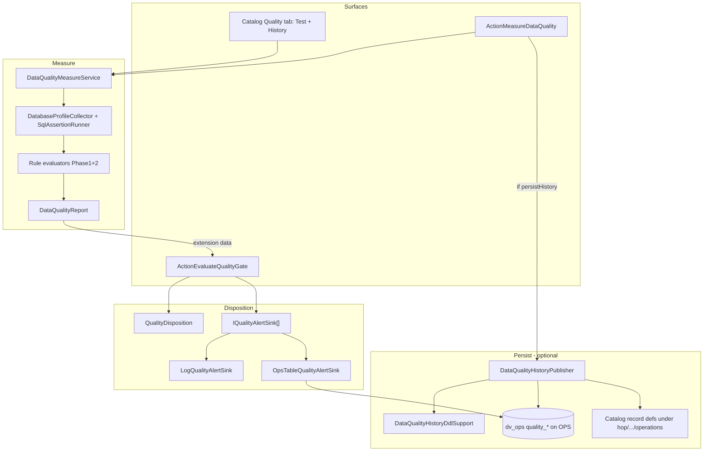
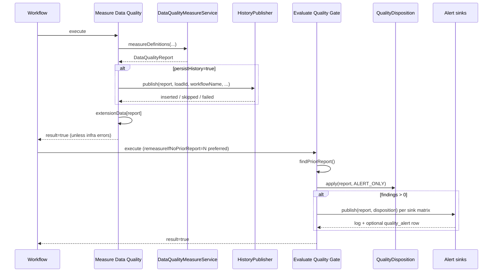
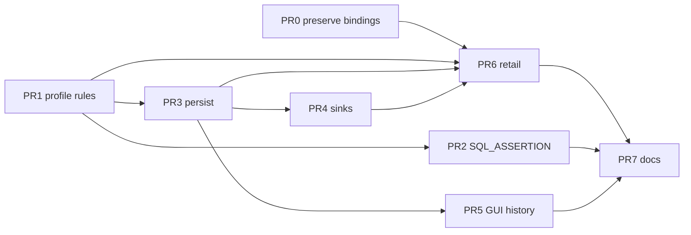

# Phase 2 — Data Quality: Richer Measure + Persist

| Field | Value |
|-------|--------|
| **Document** | Data Quality Phase 2 Design |
| **Author** | _TBD_ |
| **Date** | 2026-07-10 |
| **Status** | Delivered (Phase 2 implemented; user docs in `docs/data-quality.adoc`) |
| **Related** | Issue #66; [data-quality-architecture-plan.md](docs/plans/data-quality-architecture-plan.md); Phase 1 under `org.apache.hop.quality` |
| **Audience** | Senior engineers implementing hop-data-vault quality features |

---

## Overview

Phase 1 shipped a complete **measure ≠ disposition** stack: declarative rules, catalog bindings, SQL-pushdown profiling, two workflow actions (`MEASURE_DATA_QUALITY` / `EVALUATE_QUALITY_GATE`), and retail pre-gate wiring on CRM sources. Reports and profiles are **ephemeral** (in-memory + log + workflow extension data only).

Phase 2 extends that foundation in four complementary tracks:

1. **Richer rule types** — `NULL_RATIO_MAX`, distinct bounds, `REGEX`, `SQL_ASSERTION`, value length — evaluated against extended profile metrics or dedicated SQL paths.
2. **Persist** profile snapshots and findings into catalog-backed ops tables (same pattern as `LoadRunMetricsCatalogPublisher`), keyed by subject + lifecycle (`PRE`/`POST`/`AD_HOC`) + optional load/workflow execution id, so Phase 3 historical rules can join prior runs without schema redesign.
3. **Ops-friendly alerts** — minimal `IQualityAlertSink` SPI with log + ops-table sinks, used by Evaluate Quality Gate in `ALERT_ONLY` (and optionally when a gate fails).
4. **Retail first-class post-update targets** — bindings on published vault/BV tables and workflow steps that measure targets after load with `POST_UPDATE` + `ALERT_ONLY`.

**Prerequisite for durable target bindings:** DV/BV/DM catalog publishers must **preserve** existing `qualityRules` (and ideally `validationAcknowledgements`) on upsert. Without that merge, republish (common in retail workflows) wipes Phase 2 bindings (see §5.2.1 and PR 0).

GUI history browse on the catalog Quality tab completes the ops loop for humans.

> **Status:** Phase 2 code, retail target post-update path, persist, alert sinks, and Quality tab History browser are delivered. User-facing reference: [data-quality.adoc](../data-quality.adoc).

---

## Background & Motivation

### Current state (Phase 1)

| Layer | Location | Behavior |
|-------|----------|----------|
| Model | `org.apache.hop.quality.model.*` | `DataQualityRule`, `DataQualityRuleType` (6 types), `DataQualityReport`, `DataQualityFinding`, bindings, severity, lifecycle, mode |
| Measure | `DataQualityMeasureService` | Resolve bindings → collect `DataProfileSnapshot` → evaluate via registry |
| Profile | `DatabaseProfileCollector`, `RowProfileCollector`, `FieldProfile` | Row count, null/empty counts, min/max, value distribution (max 200 distinct) |
| Disposition | `QualityDisposition` | `FAIL_ON_BLOCKING` \| `FAIL_ON_WARNINGS` \| `ALERT_ONLY` |
| Actions | `ActionMeasureDataQuality`, `ActionEvaluateQualityGate` | Extension-data hand-off via `RESULT_ATTR_REPORT` (`"dataQualityReportText"`) |
| Metadata | `DataQualityRuleSetMeta` + editor + register XP | Central libraries |
| Catalog GUI | `RecordDefinitionDetailsPanel` Quality tab | Binding list + **Test measure…** |
| Retail | `retail-source-quality`, `E2E-*` bindings | Pre-gate + **source** post ALERT_ONLY only — **no published target bindings** |

Key invariant already enforced and **must remain absolute**:

```text
Measure → DataQualityReport   (never fails on rule findings; infra errors only)
Gate    → DispositionResult   (policy owns fail vs alert)
```

Evidence:

- `ActionMeasureDataQuality.execute` always succeeds when `!report.hasInfraErrors()`.
- `QualityDisposition.apply(..., ALERT_ONLY)` always passes when there are no infra errors.
- Report hand-off: `getExtensionDataMap().put(RESULT_ATTR_REPORT, report)` on action and parent workflow.

### Pain points Phase 2 addresses

1. **Rule expressiveness** — Null *ratio*, cardinality bounds, pattern checks, free-form SQL asserts, and string length are common production checks not covered by Phase 1.
2. **No history** — `DataProfileSnapshot` dies with the process; Phase 3 delta rules (`ROW_COUNT_DELTA`, `DISTINCT_DELTA`) cannot be built without a durable store designed now.
3. **Post-update is source-only in retail** — Architecture plan and docs describe target post-alert; workflows re-measure CRM sources after vault update instead of published hubs/sats (`qualityRules: []` on model records).
4. **Alerts are unstructured** — Gate logs formatted text only; ops tables and queryable finding history do not exist.
5. **Target binding durability** — `DvCatalogPublisher.toTableRecordDefinition` (and BV/DM equivalents) builds a **new** `RecordDefinition` without copying `qualityRules` / `validationAcknowledgements`; `upsertDefinition` only preserves `origin.createdAt` before full catalog replace. Republish erases hand-edited target bindings.

### Existing patterns to reuse

| Pattern | Source | Reuse in Phase 2 |
|---------|--------|------------------|
| Catalog ops defs + DB insert | `LoadRunMetricsCatalogPublisher` | `DataQualityHistoryPublisher` |
| DDL auto-create (Postgres/MySQL) | `LoadRunMetricsDdlSupport` | `DataQualityHistoryDdlSupport` |
| Ops namespace | `hop/{project}/operations` | Same namespace; new table names |
| Ops DB connection (retail) | `load_run.json` → `OPS` / `dv_ops` | Quality history uses **same** connection |
| Workflow execution id | `DvUpdateMetricsConstants.VAR_WORKFLOW_EXECUTION_ID` = `DV_WORKFLOW_EXECUTION_ID` | Action `loadId` default + resolve |
| Evaluator registration | `DataQualityRuleEvaluatorRegistry` | Register new evaluators |
| Finding builder | `EvaluatorSupport.finding(...)` | Unchanged |
| Subject resolution | `CatalogQualitySubjectSupport.subjectKey` | Persist/GUI/query use identical `namespace/name` |

---

## Goals & Non-Goals

### Goals

1. Add Phase 2 rule types with clear parameters, profile requirements, and unit-tested evaluators.
2. Persist quality runs: report header + findings + profile snapshots (subject + field grain) with `lifecycle` and optional load correlation ids.
3. Keep measure/disposition split; persistence is a **side effect of measure** (optional flag), not a gate responsibility.
4. Introduce `IQualityAlertSink` (log + ops table) invoked from Evaluate Quality Gate per the sink matrix in §3.3.
5. Ship retail **published-target** post-update measure → ALERT_ONLY examples on durable catalog bindings (publisher merge prerequisite).
6. MVP history browse on catalog Quality tab (recent snapshots for current subject) with a concrete connection-resolution algorithm.
7. Extend action UI for persist, loadId variable, and sink selection.
8. Document, test, and land as incremental PRs (including PR 0 for catalog preserve-on-publish).

### Non-Goals

- Phase 3 historical rule evaluation (`ROW_COUNT_DELTA`, etc.) — only **schema readiness**.
- Automatic rollback / compensating unload after post-update findings.
- Full dashboard / charting UI for quality trends.
- Quality finding acknowledgements (schema acks pattern exists; defer unless trivial).
- File/Iceberg SAMPLE scanners (still deferred; DB SQL pushdown remains primary).
- Dedicated third workflow action `ALERT_ON_QUALITY_REPORT` (ALERT_ONLY + sinks on Evaluate Quality Gate is sufficient for Phase 2).
- Mail/Slack/webhook plugins beyond the SPI (SPI only).
- Upstream of `org.apache.hop.quality` into Apache Hop core (Phase 4).
- Current-row / multi-version satellite filters (`sqlFilter`) — Phase 2 measures the physical table as-is.

---

## Key Decisions

| # | Decision | Rationale |
|---|----------|-----------|
| K1 | **Persist on Measure, not Gate** | Measure owns observation artifacts; gate remains pure policy. Extension-data hand-off unchanged. Gate remeasure does **not** persist (default). Prefer prior report; retail gates after Measure set `remeasureIfNoPriorReport=N`. |
| K2 | **Persist is opt-in** (`persistHistory` checkbox, default **false**) | Avoids unexpected writes / schema creation in projects that only need ephemeral gates. Retail post-update (and optionally pre-gate) enable explicitly. |
| K3 | **Ops schema + connection shared with load-run metrics** | Default schema `dv_ops`, namespace `hop/{project}/operations`. **Retail:** `historyDatabase=OPS` (same as `load_run.json`). Fallback to subject physical DB only when OPS is absent. Quality tables are siblings of `load_run`. |
| K4 | **Four data tables + `quality_alert` DDL always** | **Data MVP:** `quality_run`, `quality_profile_subject`, `quality_profile_field`, `quality_finding`. **`quality_alert`:** always included in `ensureTables` when `autoCreateTables=true` (same path as the four). “Optional” means the table may be empty / unused if no `ops_table` sink runs—not that DDL is deferred. Subject-level `row_count` lives **only** on `quality_profile_subject`. |
| K5 | **Phase 2 rule set** as listed below; **no** `MAX_NULL_RATIO` synonym — use `NULL_RATIO_MAX` only | Matches architecture plan naming. |
| K6 | **REGEX:** dialect pushdown preferred; **SQL_ASSERTION** separate path | Postgres mismatch-count pushdown first with **escaped** pattern literals; else limited client path with explicit weak-coverage semantics. Pushdown uses **DB** regex engine (not `java.util.regex`). Length uses dialect-aware char-length SQL. |
| K7 | **Alert sinks on Gate with explicit matrix** | See §3.3. Blank `alertSinks` → `log`. No publish when findings==0 on ALERT_ONLY. Fail modes: log when **any** findings > 0 if `log` listed; `ops_table` only if listed + `alertOnGateFailure`. |
| K8 | **Retail targets**: `hub_customer`, `sat_customer_demo`, `hub_order` (minimum set) | High-signal tables; physical tables on Vault. Measure grain = full physical table (all sat versions). |
| K9 | **GUI history**: button **History…** on Quality tab | Concrete resolution order in §6; subject key via `CatalogQualitySubjectSupport.subjectKey`. |
| K10 | **Layered dependencies** | `org.apache.hop.quality.history` stays free of `datavault.metrics` (duplicate small DDL dialect switch). **Workflow actions** already depend on datavault for resource groups and **may** call `VaultUpdateExecutionSupport` / `DvUpdateMetricsConstants` for load-id resolution — no extra adapter required. Shared string `"dv_ops"` may be duplicated. |
| K11 | **Acknowledgements for quality findings**: **out of scope** for Phase 2 MVP | Schema acks exist; quality acks add UX without blocking persist/rules. |
| K12 | **Preserve `qualityRules` on DV/BV/DM catalog republish** | Phase 2 prerequisite (PR 0). Without merge, target bindings are not durable. Also preserve `validationAcknowledgements` while touching upsert. |
| K13 | **Immutable quality runs** | If `quality_run_id` PK already exists, publisher **skips** (no replace). Gate ops_table sink must not re-insert full findings for an existing run. |

---

## Proposed Design

### Architecture (Phase 2)



### Sequence: measure with persist + ALERT_ONLY gate



---

## 1. New rule types

Extend `DataQualityRuleType`:

```java
// Phase 1
MIN_ROW_COUNT, MAX_ROW_COUNT, NOT_NULL, ALLOWED_VALUES, RANGE, NOT_EMPTY_STRING,
// Phase 2 (PR1 profile-based; SQL_ASSERTION enum lands in PR2 only — see PR plan)
NULL_RATIO_MAX,
MIN_DISTINCT, MAX_DISTINCT,
REGEX,
MIN_LENGTH, MAX_LENGTH,
// PR2:
SQL_ASSERTION
```

Parameter constants on `DataQualityRule` (add):

| Constant | Key | Used by |
|----------|-----|---------|
| `PARAM_MAX_RATIO` | `maxRatio` | `NULL_RATIO_MAX` |
| `PARAM_PATTERN` | `pattern` | `REGEX` |
| `PARAM_CASE_SENSITIVE` | `caseSensitive` | `REGEX` (default true) |
| `PARAM_MATCH_MODE` | `matchMode` | `REGEX`: `FULL` (default) \| `FIND` |
| `PARAM_SQL` | `sql` | `SQL_ASSERTION` |
| `PARAM_EXPECT` | `expect` | `SQL_ASSERTION`: `ZERO_ROWS` (default) \| `ONE_ROW_TRUE` \| `SCALAR_EQ` |
| `PARAM_EXPECT_VALUE` | `expectValue` | `SQL_ASSERTION` when `SCALAR_EQ` |
| `PARAM_QUERY_TIMEOUT` | `queryTimeoutSeconds` | `SQL_ASSERTION` (default `60`) |

Existing `PARAM_MIN` / `PARAM_MAX` reused for distinct bounds and lengths.

`NULL_RATIO_MAX.maxRatio`: **strict 0.0–1.0 only** (document `0.05` for 5%; reject or fail infra-style config error if `> 1`).

### 1.1 `NULL_RATIO_MAX` (field)

| Item | Spec |
|------|------|
| **Meaning** | Fail when `nullCount / rowCount > maxRatio` (rowCount from snapshot; if rowCount=0, ratio=0 — no finding unless combined with MIN_ROW_COUNT). |
| **Parameters** | `maxRatio` (required): `0.0`–`1.0` only. |
| **Profile needs** | `rowCount`, field `nullCount` (already collected). |
| **Finding** | `actual=ratio=0.12 nullCount=12 rowCount=100`, `expected=maxRatio=0.05`. |
| **Evaluator** | `NullRatioMaxEvaluator`. |

### 1.2 `MIN_DISTINCT` / `MAX_DISTINCT` (field)

**Collector (SQL pushdown):** For fields with MIN/MAX_DISTINCT rules, always run `SELECT COUNT(DISTINCT col) FROM table` and set `FieldProfile.exactDistinctCount`. This is the primary path for DB subjects.

**Evaluation decision table (fixed — no severity-dependent soft behavior):**

| Condition | MIN_DISTINCT | MAX_DISTINCT |
|-----------|--------------|--------------|
| `exactDistinctCount != null` | Fail iff `exact < min`; else pass. **Ignore** `distinctValues` / `distinctTruncated`. | Fail iff `exact > max`; else pass. |
| Exact unavailable (SAMPLE / non-SQL path) and `distinctValues.size() < min` | Fail (size is lower bound; still proves violation). | — |
| Exact unavailable and `distinctValues.size() > max` | — | Fail (size proves violation even if truncated). |
| Exact unavailable, truncated, and `size <= max` | Pass if `size >= min`. | **Emit one INFO finding** (fixed severity INFO, not rule severity): message “distinct truncated; MAX_DISTINCT not fully verified”, metrics `distinctTruncated=true`, `observedDistinct=size`. Do **not** fail. |
| Exact unavailable, not truncated | Compare size to min/max as exact. | Same. |

| Item | Spec |
|------|------|
| **Parameters** | `min` or `max` (long). |
| **Profile needs** | `exactDistinctCount` preferred; fallback `distinctValues` + `distinctTruncated`. |
| **Evaluator** | `MinDistinctEvaluator`, `MaxDistinctEvaluator`. |

Add to `FieldProfile`:

```java
private Long exactDistinctCount; // null = unknown
private Integer minStringLength;
private Integer maxStringLength;
```

### 1.3 `REGEX` (field)

| Item | Spec |
|------|------|
| **Meaning** | Non-null values must match regex. |
| **Parameters** | `pattern` (required); `matchMode`=`FULL`\|`FIND` (default FULL); `caseSensitive` default true; `nullAllowed` default true. |

**Collector / evaluation strategy (ordered):**

1. **Preferred (Postgres / plugins that support it):** SQL pushdown mismatch count. **Does not require full GROUP BY.**
2. **MySQL / other without portable regex:** Prefer documenting `SQL_ASSERTION` for high-cardinality free-text. For low-cardinality coded fields, optional client-side eval on existing valueCounts **only if** the field is already being GROUP BY'd for other rules (ALLOWED_VALUES, etc.).
3. **Do not** force a full-table `GROUP BY` solely for REGEX. If no pushdown and no existing value distribution:
   - **Chosen MVP fallback (3B):** bounded `SELECT DISTINCT col … LIMIT 500` + client-side `java.util.regex.Pattern`; never unbounded GROUP BY for REGEX alone.
4. High-cardinality free-text: **document** `SQL_ASSERTION` as the supported production path.

**Pushdown safety (mandatory when using path 1):**

| Rule | Behavior |
|------|----------|
| **Engine** | Pushdown uses the **database** regex engine (`~` / `~*`), **not** `java.util.regex`. Document dialect differences (POSIX vs Java, Unicode). |
| **Literal escaping** | Never concatenate the raw pattern into SQL. Escape as a SQL string literal for the dialect (double single-quotes for Postgres/MySQL standard string literals; prefer bind parameters if/when the Hop `Database` API path allows prepared statements for this collector). |
| **FULL vs FIND** | Postgres `~` is substring/partial. For `matchMode=FULL`, wrap the escaped pattern so the DB predicate is equivalent to full-string match (e.g. embed `\A(?:…)\z` / `^(?:…)$` only after validating the author pattern does not already rely on conflicting anchors—or document that FULL means “match entire value” and construct `col ~ ('^(' \|\| pattern \|\| ')$')` with proper escaping of the author pattern **inside** the group). Prefer: build predicate as `col ~ ('^(?:' \|\| escaped_pattern_body \|\| ')$')` where `escaped_pattern_body` is the author pattern after SQL-literal escaping of the whole string constant. For `FIND`, use `col ~ pattern_literal` without anchors. |
| **Reject / fall through** | If pattern is null/blank, contains `\u0000`, or exceeds length limit (**512** chars default), **do not push down** — fall through to 3B (or emit config INFO + skip). If escaping/build fails, fall through to 3B and logDetailed. |
| **caseSensitive** | Postgres: `~` vs `~*` (or `(?i)` only if documented for that dialect). |
| **Timeout** | Apply same query timeout pattern as SQL_ASSERTION where possible (`Database.setStatementQueryTimeoutSeconds`). |

Example shape (Postgres, FULL, pattern already SQL-literal-escaped as `P`):

```sql
SELECT COUNT(*) FROM t
WHERE col IS NOT NULL
  AND col !~ ('^(?:' || P || ')$')   -- P is a bound/escaped literal, not raw author text
```

Store result as field-level `regexMismatchCount` (or pass via context metrics) for the evaluator.

**Evaluation decision table (all paths):**

| Path / condition | Outcome |
|------------------|---------|
| Pushdown: `regexMismatchCount > 0` | **One finding at rule severity**; metrics include `mismatchCount`, `path=pushdown`. |
| Pushdown: `regexMismatchCount == 0` | Pass (no finding). |
| Sample/client: any non-null sample value fails match (`FULL` → `matcher.matches()`; `FIND` → `matcher.find()`) | **Finding at rule severity**; metrics `path=sample`, `sampleSize`, invalid counts. |
| Sample/client: all non-null samples match, and distinct result size **&lt; N** (limit not hit) | Pass. |
| Sample/client: all non-null samples match, and distinct result size **== N** (limit hit) | **Pass the REGEX rule** + emit **one fixed-severity INFO** finding (not rule severity): message “REGEX coverage incomplete (sample limit N)”; metrics `coverageIncomplete=true`, `sampleLimit=N`. |
| `nullAllowed=true` | Nulls never count as mismatches (SQL: only `IS NOT NULL` rows; client: skip nulls). |
| `nullAllowed=false` and nullCount &gt; 0 | Finding at rule severity (nulls forbidden), independent of pattern. |
| No pushdown and sample path unavailable | One WARNING with `regexSkipped=true` (use SQL_ASSERTION). |

| **Evaluator** | `RegexEvaluator` consumes `regexMismatchCount` and/or sampled value list. |
| **Cost** | User docs: pushdown is O(table scan) once; GROUP BY-only path intentionally avoided; DB regex ≠ Java regex. |

### 1.4 `MIN_LENGTH` / `MAX_LENGTH` (field)

| Item | Spec |
|------|------|
| **Meaning** | Character length bounds on non-null string values. Empty string length 0. Binary/blob fields **out of scope**. |
| **Parameters** | `min` and/or `max` (integer). |
| **Collector** | `MIN`/`MAX` of dialect-aware length expression on non-null values. |
| **Dialect** | Same plugin-id switch as `LoadRunMetricsDdlSupport` / `DvBulkLoadPluginSupport`: **MySQL / SingleStore → `CHAR_LENGTH(col)`** (characters); **default/Postgres → `LENGTH(col)`** (characters on text). |
| **Evaluator** | Fail if observed `minStringLength < ruleMin` or `maxStringLength > ruleMax`. Message reports observed min/max length (no per-row violation count required for MVP). |

### 1.5 `SQL_ASSERTION` (dataset; optional fieldName for messaging only)

| Item | Spec |
|------|------|
| **Meaning** | Author supplies SQL that must satisfy an expectation. Escape hatch for complex predicates. |
| **Parameters** | `sql` (required); `expect` = `ZERO_ROWS` \| `ONE_ROW_TRUE` \| `SCALAR_EQ`; `expectValue` for SCALAR_EQ; `queryTimeoutSeconds` default **60**. |

**Security controls (product policy: not a sandbox — DB grants are the real boundary; only trusted metadata authors may define rules):**

1. Variable-resolve SQL (`IVariables`) then expand `${schemaTable}` to quoted schema.table of the subject.
2. Trim; reject if empty.
3. **Reject any `;` not solely a single trailing terminator** (no multi-statement).
4. **Allowlist start:** `(?is)^\s*(with|select)\b` after strip of leading SQL comments is best-effort; also reject if statement contains denylisted **whole tokens** (case-insensitive word boundary):  
   `insert`, `update`, `delete`, `merge`, `drop`, `alter`, `truncate`, `create`, `grant`, `revoke`, `call`, `execute`, `exec`, `copy`, `do`, `replace`, `attach`, `detach`, `vacuum`, `analyze`, `security`, `into` (catches `SELECT … INTO`), `outfile`, `dumpfile`.
5. Comment-stripping is best-effort only — **document residual risk** of comment-wrapped keywords and side-effecting functions (`pg_sleep`, `xp_cmdshell`, etc.). DB grants remain the control plane.
6. Set query timeout from `queryTimeoutSeconds` on the JDBC statement when the driver supports it.
7. **`ZERO_ROWS`:** open cursor and stop after **first** row (do not fetch unbounded result sets). Any row → finding.
8. **`ONE_ROW_TRUE` / `SCALAR_EQ`:** fetch at most one row.

| **Collector** | `SqlAssertionRunner` from measure service (not via profile registry). |
| **Infra vs finding** | Parse/security rejection, timeout, SQL errors → **infra error**. Expectation failure → finding. |

### Profile metrics matrix

| Rule type | rowCount | nullCount | valueCounts | exactDistinct | min/max value | min/max length | Custom SQL / pushdown |
|-----------|----------|-----------|-------------|---------------|---------------|----------------|------------------------|
| Phase 1 types | ✓ | ✓ as needed | ALLOWED_VALUES | | RANGE | | |
| NULL_RATIO_MAX | ✓ | ✓ | | | | | |
| MIN/MAX_DISTINCT | | | SAMPLE fallback | ✓ SQL | | | |
| REGEX | | null policy | bounded sample only | | | | dialect mismatch COUNT preferred |
| MIN/MAX_LENGTH | | | | | | ✓ CHAR_LENGTH/LENGTH | |
| SQL_ASSERTION | | | | | | | ✓ |

### Registry registration

`DataQualityRuleEvaluatorRegistry`: register profile-based Phase 2 evaluators in PR1. SQL_ASSERTION is **not** registered as a silent empty evaluator — measure service branches to `SqlAssertionRunner` (PR2).

`DatabaseProfileCollector.collectFieldNames`: include field-scoped Phase 2 types; skip SQL_ASSERTION for field set unless fieldName used for messages only.

Extend collector:

```text
if rules need exact distinct → COUNT(DISTINCT col)
if rules need length stats → MIN/MAX(charLengthExpr(col))
if REGEX + dialect support → mismatch COUNT (no GROUP BY solely for REGEX)
```

---

## 2. Persistence

### 2.1 When measure writes

| Trigger | Behavior |
|---------|----------|
| `ActionMeasureDataQuality.persistHistory == true` | After measure completes, call `DataQualityHistoryPublisher.publish(...)`. Persist even when findings empty (baseline for Phase 3). |
| Infra errors (partial subjects) | Persist profiles/findings for successful subjects; mark run `success=false` if any infra error. |
| GUI Test measure | **Do not persist** (AD_HOC interactive). |
| Gate remeasure | **Do not persist**. Prefer enabling persist on the explicit Measure step. |

**Persist failure policy:** log error; **do not** fail measure by default (`failOnPersistError` default false).

### 2.2 Correlation ids

| Field | Source |
|-------|--------|
| `quality_run_id` | `DataQualityReport.runId` (UUID already generated) |
| `load_id` | Action field `loadId` (variable-enabled). **Default text:** `${DV_WORKFLOW_EXECUTION_ID}` (see `DvUpdateMetricsConstants.VAR_WORKFLOW_EXECUTION_ID`). Resolve with `variables.resolve`. If still empty after resolve: `VaultUpdateExecutionSupport.resolveExecutionId(variables, VaultUpdateExecutionSupport.defaultExecutionIdVariableName(), true, parentWorkflowLogChannelId)` from the **action** layer (existing datavault dependency — K10). |
| `workflow_name` | Parent workflow meta name |
| `workflow_execution_id` | Same resolution as load_id, or parent log channel id |
| `lifecycle` | From measure action / report |
| `measured_at` | `report.getMeasuredAt()` |

### 2.3 Schema (default schema `dv_ops`)

**MVP inventory (locked):** four **data** tables plus `quality_alert` **DDL**. “Optional” for `quality_alert` means the table may stay empty when no gate uses `ops_table`—not that creation is skipped.

**DDL lifecycle (prefer option A):** `DataQualityHistoryDdlSupport.ensureTables(...)` **always** creates all **five** tables (`quality_run`, `quality_profile_subject`, `quality_profile_field`, `quality_finding`, `quality_alert`) whenever `autoCreateTables=true`, whether invoked from Measure persist or from `OpsTableQualityAlertSink` / publisher. Gate `ops_table` must call the same ensure path before insert so the first alert never depends on a prior Measure persist. Catalog definition upsert includes `quality_alert` when publishing ops defs.

Align naming with `LoadRunMetricsCatalogPublisher.DEFAULT_SCHEMA_NAME = "dv_ops"`.

#### Table `quality_run` (run header + aggregate counters only)

| Column | Type | Notes |
|--------|------|-------|
| quality_run_id | VARCHAR(64) PK | report.runId |
| measured_at | TIMESTAMP | |
| lifecycle | VARCHAR(16) | PRE_UPDATE / POST_UPDATE / AD_HOC |
| evaluation_mode | VARCHAR(32) | from action / primary mode |
| load_id | VARCHAR(64) NULL | |
| workflow_name | VARCHAR(255) NULL | |
| workflow_execution_id | VARCHAR(64) NULL | |
| subject_count | BIGINT | |
| finding_count | BIGINT | |
| blocking_count | BIGINT | |
| warning_count | BIGINT | |
| info_count | BIGINT | |
| infra_error_count | BIGINT | |
| success | BOOLEAN | no infra errors |
| subjects_json | VARCHAR(4000) | JSON array of subject keys (truncate if huge) |
| infra_errors_json | VARCHAR(4000) NULL | |

**No per-subject `row_count` on this table** — subject metrics live only on `quality_profile_subject`.

#### Table `quality_profile_subject` (required MVP — Phase 3 join grain)

| Column | Type |
|--------|------|
| quality_run_id | VARCHAR(64) |
| subject_key | VARCHAR(512) | same as `CatalogQualitySubjectSupport.subjectKey` = `namespace/name` |
| row_count | BIGINT |
| row_count_exact | BOOLEAN |
| evaluation_mode | VARCHAR(32) |
| lifecycle | VARCHAR(16) |
| captured_at | TIMESTAMP |
| PRIMARY KEY (quality_run_id, subject_key) | |

#### Table `quality_profile_field` (required MVP)

| Column | Type | Notes |
|--------|------|-------|
| quality_run_id | VARCHAR(64) | |
| subject_key | VARCHAR(512) | |
| field_name | VARCHAR(255) | |
| null_count | BIGINT NULL | |
| empty_string_count | BIGINT NULL | |
| non_null_count | BIGINT NULL | |
| exact_distinct_count | BIGINT NULL | |
| distinct_truncated | BOOLEAN NULL | |
| min_value | VARCHAR(500) NULL | stringified |
| max_value | VARCHAR(500) NULL | stringified |
| min_string_length | BIGINT NULL | |
| max_string_length | BIGINT NULL | |
| top_values_json | VARCHAR(4000) NULL | optional top-N from valueCounts |
| PRIMARY KEY (quality_run_id, subject_key, field_name) | | |

#### Table `quality_finding` (required MVP)

| Column | Type | Notes |
|--------|------|-------|
| quality_run_id | VARCHAR(64) | |
| finding_seq | BIGINT | 0..n-1 |
| subject_key | VARCHAR(512) | |
| rule_id | VARCHAR(128) | |
| rule_name | VARCHAR(255) | |
| rule_type | VARCHAR(64) | |
| severity | VARCHAR(16) | |
| field_name | VARCHAR(255) NULL | |
| message | VARCHAR(2000) | |
| actual_summary | VARCHAR(1000) NULL | |
| expected_summary | VARCHAR(1000) NULL | |
| metrics_json | VARCHAR(4000) NULL | |
| PRIMARY KEY (quality_run_id, finding_seq) | | |

#### Table `quality_alert` (always in DDL; rows only when `ops_table` sink runs)

| Column | Type |
|--------|------|
| quality_run_id | VARCHAR(64) PK |
| alerted_at | TIMESTAMP |
| disposition_mode | VARCHAR(32) |
| disposition_failed | BOOLEAN |
| summary | VARCHAR(2000) |

**Phase 3 join guidance** (no implementation now):

Prefer correlating PRE vs POST for the **same `load_id`** when present:

```sql
-- Preferred: pair by load_id + subject + lifecycle
SELECT pre.subject_key, pre.row_count AS pre_rows, post.row_count AS post_rows
FROM quality_profile_subject pre
JOIN quality_run pr ON pr.quality_run_id = pre.quality_run_id
JOIN quality_profile_subject post
  ON post.subject_key = pre.subject_key
JOIN quality_run po ON po.quality_run_id = post.quality_run_id
WHERE pr.load_id = po.load_id
  AND pr.load_id = ?
  AND pre.lifecycle = 'PRE_UPDATE'
  AND post.lifecycle = 'POST_UPDATE';
```

Time-based “previous snapshot” (subject + lifecycle + `MAX(captured_at) < cur`) is a **secondary fallback** when `load_id` is null (AD_HOC / concurrent runs may pick the wrong prior — document that limitation).

Indexes (DDL):

- `quality_profile_subject (subject_key, lifecycle, captured_at DESC)`
- `quality_run (load_id)`, `quality_run (measured_at DESC)`
- `quality_finding (subject_key, rule_id)`

### 2.4 Publisher API

Package: `org.apache.hop.quality.history`

```java
public final class DataQualityHistoryPublisher {
  public static final String DEFAULT_SCHEMA_NAME = "dv_ops";
  public static final String TABLE_QUALITY_RUN = "quality_run";
  public static final String TABLE_QUALITY_FINDING = "quality_finding";
  public static final String TABLE_QUALITY_PROFILE_SUBJECT = "quality_profile_subject";
  public static final String TABLE_QUALITY_PROFILE_FIELD = "quality_profile_field";
  public static final String TABLE_QUALITY_ALERT = "quality_alert"; // always created by ensureTables

  public enum PublishStatus { INSERTED, SKIPPED, FAILED }

  public record PublishResult(PublishStatus status, String message) {}

  public record PublishContext(
      String targetDatabaseName,      // retail: OPS
      String operationsSchema,        // default dv_ops
      String catalogConnectionName,
      boolean publishCatalogDefinitions,
      boolean publishDatabaseRows,
      boolean autoCreateTables) {}

  public static PublishResult publish(
      ILogChannel log,
      DataQualityReport report,
      PublishContext context,
      String loadId,
      String workflowName,
      String workflowExecutionId,
      IVariables variables,
      IHopMetadataProvider metadataProvider) throws HopException;
}
```

**Transaction / multi-table write semantics:**

1. Single `Database` connection session.
2. If PK `quality_run_id` already exists → return `SKIPPED` (immutable runs — K13). Do not insert children.
3. Otherwise insert in order: `quality_run` → `quality_profile_subject` → `quality_profile_field` → `quality_finding` (and never partial commit if the driver/session can batch). Prefer one `commit` after all inserts when auto-commit is controllable; if Hop `Database` is auto-commit per statement, on any failure after partial writes perform **best-effort delete** of all rows for that `quality_run_id` from the four tables and return `FAILED`.
4. Log `PublishResult` at Basic/Error.

**Catalog definitions (step 1 of publish):** Generate `RecordDefinition` fields **1:1 from the §2.3 column lists** (same approach as `LoadRunMetricsCatalogPublisher.buildLoadRunDefinition`), namespace `hop/{project}/operations`, tags `operations` + `data-quality`, physical table on `historyDatabase` + `historySchema`. Static retail JSON stubs (§5.4) must match this contract (DDL is source of truth; JSON mirrors DDL).

**Resolving PublishContext from action fields:**

- `historyDatabase` — ops connection. **Retail default:** `OPS`. Action empty → try variable `QUALITY_HISTORY_DATABASE`; else physical DB of the **first successfully profiled subject** in measure order. Log Basic: `Quality history database resolved to '{name}'`. If subjects span multiple DBs, **recommend setting `historyDatabase` explicitly** (history is a single sink; multi-DB measure still writes one ops connection).
- `historySchema` — default `dv_ops` (or `QUALITY_HISTORY_SCHEMA`).
- `catalogConnection` — reuse measure action catalog field.
- Flags: `publishCatalogDefinitions` default true when catalog set; `autoCreateTables` default true (creates all five tables including `quality_alert`).

**Dependency:** `org.apache.hop.quality.history` does **not** import `datavault.metrics`. Duplicate Postgres/MySQL DDL switch. Actions may use datavault helpers for load id only.

### 2.5 Report hand-off Measure ↔ Gate (persist on)

| Channel | Phase 1 | Phase 2 |
|---------|---------|---------|
| Parent workflow `extensionDataMap` | Yes | Yes (unchanged primary) |
| Result log text | Yes | Yes |
| DB history | No | Optional via persist |
| File path variable | No | Not required for MVP |

Gate prefers in-process report; **no requirement** that gate read from DB for disposition.

**Gate remeasure limitation (pre-existing):** `ActionEvaluateQualityGate.remeasure()` hardcodes `QualityLifecycle.AD_HOC`, mode AUTO, sampleLimit 1000. If extension-data handoff fails and remeasure runs, lifecycle labels in logs/sinks will be wrong. Phase 2 retail: set **`remeasureIfNoPriorReport=N`** on gates that immediately follow Measure. Stretch (not MVP): add lifecycle/mode/sample fields to gate remeasure.

---

## 3. Alert sink SPI

### 3.1 Interface

Package: `org.apache.hop.quality.alert`

```java
public interface IQualityAlertSink {
  String id();
  void publish(QualityAlertContext context) throws HopException;
}

public final class QualityAlertContext {
  private final DataQualityReport report;
  private final DispositionResult disposition;
  private final QualityDispositionMode mode;
  private final ILogChannel log;
  private final IVariables variables;
  private final IHopMetadataProvider metadataProvider;
  // optional: PublishContext for ops_table
}
```

### 3.2 Built-in sinks

| Sink | id | Behavior |
|------|-----|----------|
| `LogQualityAlertSink` | `log` | Structured lines: `QUALITY_ALERT runId=… lifecycle=… blocking=…` + findings. |
| `OpsTableQualityAlertSink` | `ops_table` | If measure already persisted run → insert **only** `quality_alert` header (disposition summary). If run not stored → call `DataQualityHistoryPublisher.publish` first (`INSERTED` or `SKIPPED`), then `quality_alert`. Never duplicate findings for an existing `quality_run_id`. |

### 3.3 Wiring matrix (Evaluate Quality Gate)

Parse `alertSinks` (comma-separated). **If blank/null → treat as `log`.**

| Mode | Condition | Sinks invoked |
|------|-----------|---------------|
| `ALERT_ONLY` | `findingCount == 0` | **None** (no noise) |
| `ALERT_ONLY` | `findingCount > 0` | Every sink listed in `alertSinks` |
| `FAIL_ON_BLOCKING` / `FAIL_ON_WARNINGS` | `findingCount == 0` | **None** |
| `FAIL_ON_BLOCKING` / `FAIL_ON_WARNINGS` | `findingCount > 0` (any severity) | **`log`** if listed (or default blank→log)—**even when** disposition failed only on BLOCKING and findings are only WARNINGs (ops visibility). **`ops_table`** only if listed **and** `alertOnGateFailure=true` (default **false**). |

Note: disposition fail/pass still uses severity policy (`QualityDisposition`); the alert matrix is **orthogonal**—log sinks care about `findingCount > 0` under fail modes, not only `disposition.failed`.

```java
// ActionEvaluateQualityGate.execute after disposition:
QualityAlertSupport.publish(report, disposition, mode, configuredSinks, alertOnGateFailure, ...);
```

Static registry map Phase 2 (no ServiceLoader yet).

---

## 4. Action UI / metadata changes

### 4.1 `ActionMeasureDataQuality`

| Field | UI | Default | Notes |
|-------|-----|---------|-------|
| `persistHistory` | Checkbox | false | Persist profile & report to ops tables |
| `historyDatabase` | Text | empty → resolve | Retail workflows set **`OPS`** |
| `historySchema` | Text | `dv_ops` | |
| `autoCreateHistoryTables` | Checkbox | true | |
| `loadId` | Text (variables) | `${DV_WORKFLOW_EXECUTION_ID}` | Aligns with Begin Vault Update / `DvUpdateMetricsConstants` |
| Existing | catalog, group, keys, namespace, mode, lifecycle, sampleLimit | | unchanged |

Dialog: widgets after lifecycle/sample.

### 4.2 `ActionEvaluateQualityGate`

| Field | UI | Default |
|-------|-----|---------|
| `alertSinks` | Text | `log` (blank → log) |
| `alertOnGateFailure` | Checkbox | false |
| `historyDatabase` / `historySchema` | when ops_table used | same resolution as measure |
| Existing disposition + remeasure + scope | | Retail post: **`remeasureIfNoPriorReport=N`** |

### 4.3 Constants

Keep `RESULT_ATTR_REPORT = "dataQualityReportText"` (do not rename). Optional `RESULT_ATTR_QUALITY_RUN_ID`.

---

## 5. Retail example

### 5.1 New rule set

`retail-example/metadata/data-quality-rule-set/retail-target-quality.json`

| id | type | field / scope | severity | params | Notes |
|----|------|---------------|----------|--------|-------|
| target-not-empty | MIN_ROW_COUNT | dataset | BLOCKING | min=1 | |
| hub-customer-bk-not-null | NOT_NULL | customer_id | BLOCKING | | |
| sat-demo-segment-domain | ALLOWED_VALUES | segment | WARNING | ONLINE,RETAIL,WHOLESALE | All sat versions |
| sat-demo-loyalty-domain | ALLOWED_VALUES | loyalty_tier | WARNING | BRONZE,SILVER,GOLD,PLATINUM | All sat versions |
| sat-demo-null-ratio-segment | NULL_RATIO_MAX | segment | WARNING | maxRatio=0.01 | Over full sat table |
| hub-customer-min-distinct-bk | MIN_DISTINCT | customer_id | WARNING | min=1 | **Exercises MIN_DISTINCT evaluator** (near-redundant with MIN_ROW_COUNT + NOT_NULL; intentional smoke, not high-signal cardinality guard) |

Domains match `retail-source-quality`.

### 5.2 Catalog bindings on published targets

| Record key | Bindings |
|------------|----------|
| `hop/retail-example/models/retail-360/hub_customer` | target-not-empty, hub-customer-bk-not-null, hub-customer-min-distinct-bk |
| `hop/retail-example/models/retail-360/sat_customer_demo` | target-not-empty, segment/loyalty domains, null ratio |
| `hop/retail-example/models/retail-360/hub_order` | target-not-empty, order_id NOT_NULL if present |

Physical tables already on `Vault`. Measure subjects = **physical tables as-is** (satellite includes all historical versions / multi-day simulation rows). Domain rules should still pass if domains are stable over time; null-ratio and row-count are over the full table, not a “current image.” Optional `sqlFilter` / current-row predicate is **out of scope** for Phase 2.

Keep source bindings. **Replace** post path source measure with target measure.

### 5.2.1 Prerequisite: preserve bindings on catalog republish (critical)

**Hazard:** `DvCatalogPublisher.toTableRecordDefinition` constructs a fresh `RecordDefinition` without `qualityRules` / `validationAcknowledgements`. `upsertDefinition` only merges `origin.createdAt`, then full-replaces the catalog document. Same pattern in `BvCatalogPublisher` / `DmCatalogPublisher`. Committed catalog JSON under `retail-example/catalog-data/.../models/` is **not durable** across a vault catalog publish workflow step.

**Required fix (PR 0):** On upsert of model-published record definitions, after building the new definition and loading `existing`:

```java
if (existing != null) {
  if (existing.getQualityRules() != null && !existing.getQualityRules().isEmpty()) {
    definition.setQualityRules(new ArrayList<>(existing.getQualityRules()));
  }
  if (existing.getValidationAcknowledgements() != null
      && !existing.getValidationAcknowledgements().isEmpty()) {
    definition.setValidationAcknowledgements(
        new ArrayList<>(existing.getValidationAcknowledgements()));
  }
  // existing origin.createdAt merge already present
}
```

Document: committed JSON is the seed; runtime durability depends on this merge. Do **not** rely on “edit JSON only” without PR 0.

### 5.3 Workflow wiring (`run-retail-update.hwf`, `run-retail-initial.hwf`)

```text
… after vault update …
  → Measure target data quality (post)
       catalogConnection=local-catalog
       recordDefinitionKeys=
         hop/retail-example/models/retail-360/hub_customer,
         hop/retail-example/models/retail-360/sat_customer_demo,
         hop/retail-example/models/retail-360/hub_order
       lifecycle=POST_UPDATE
       persistHistory=Y
       historyDatabase=OPS
       historySchema=dv_ops
       loadId=${DV_WORKFLOW_EXECUTION_ID}
  → Alert on target quality (post)
       dispositionMode=ALERT_ONLY
       alertSinks=log,ops_table
       remeasureIfNoPriorReport=N
       historyDatabase=OPS
       historySchema=dv_ops
```

Retain pre-gate on sources. Prefer enabling `persistHistory` on pre-measure too for PRE/POST pairs under the same load id.

### 5.4 Catalog ops sample defs

Commit static JSON under `retail-example/catalog-data/hop/retail-example/operations/` for all **five** tables (`quality_run`, `quality_profile_subject`, `quality_profile_field`, `quality_finding`, `quality_alert`), physicalTable `databaseMetaName=OPS`, `schemaName=dv_ops`, fields **matching §2.3**. Tags: `operations`, `data-quality`. Mirror `load_run.json` style.

---

## 6. GUI history browse (MVP)

In `RecordDefinitionDetailsPanel` Quality tab:

1. Button **History…** next to **Test measure…**.
2. **Connection resolution order** (implement exactly):
   1. Project/hop variables `QUALITY_HISTORY_DATABASE` and `QUALITY_HISTORY_SCHEMA` (if database set; schema default `dv_ops` if only DB set).
   2. Resolve **`projectKey`** for catalog ops namespace:
      - **Preferred:** call `DvCatalogNamespaces.resolveProjectKey(variables)` from the GUI layer (panel already has Hop variables and `catalogConnectionName`). Same helper used by load-run metrics / ops publishers.
      - **Actual algorithm** (must match `DvCatalogNamespaces.resolveProjectKey` — do **not** invent `HOP_PROJECT_NAME` or “active project name”):
        1. `variables.resolve("${PROJECT_HOME}")`
        2. If the result is non-empty and does **not** still contain `${`, take `Path.of(projectHome).getFileName()` as the key (e.g. `/path/to/retail-example` → `retail-example`).
        3. Otherwise return the literal `"project"`.
      - If `DataQualityHistoryReader` must stay free of `datavault` packages, **copy that exact algorithm** (PROJECT_HOME basename → else `"project"`). Do not invent a third scheme.
      - Ops namespace = `"hop/" + projectKey + "/operations"` (e.g. `hop/retail-example/operations`).
   3. Catalog read: key `{opsNamespace}/quality_run` (i.e. `hop/{projectKey}/operations/quality_run`) via `RecordDefinitionRegistry` using the panel’s **`catalogConnectionName`** → `physicalTable.databaseMetaName` + `schemaName` (default `dv_ops` if null).
   4. Fallback: same for `{opsNamespace}/load_run` (retail already has this on **OPS**).
   5. If still unresolved → dialog: “No quality history connection configured. Set QUALITY_HISTORY_DATABASE or publish operations quality_run / load_run catalog definitions.”
3. **Subject key:** `CatalogQualitySubjectSupport.subjectKey(definition)` → e.g. `hop/retail-example/models/retail-360/sat_customer_demo`. Persist and query **must** use this helper (never hand-build a divergent format).
4. Query (schema/table quoted via `DatabaseMeta`):

```sql
SELECT s.quality_run_id, s.captured_at, s.lifecycle, s.row_count,
       r.finding_count, r.blocking_count, r.load_id
FROM {schema}.quality_profile_subject s
JOIN {schema}.quality_run r ON r.quality_run_id = s.quality_run_id
WHERE s.subject_key = ?
ORDER BY s.captured_at DESC
LIMIT 50
```

5. UI: `TableView` dialog; double-click → findings for that run.

**Failure modes:**

| Condition | UX |
|-----------|-----|
| Connection missing / not loadable | ErrorDialog with connection name |
| Tables missing | “No quality history tables (enable persistHistory on Measure Data Quality).” |
| Permission / SQL error | ErrorDialog with message |
| Zero rows | “No history for this subject yet.” |

Helper: `DataQualityHistoryReader` in `org.apache.hop.quality.history`.

---

## 7. Tests and docs

### 7.1 Unit tests

| Area | Tests |
|------|-------|
| New evaluators | Synthetic profiles like `DataQualityEvaluatorsTest` |
| NULL_RATIO_MAX | 0 rows, boundary ratio |
| MIN/MAX_DISTINCT | exactDistinctCount path; SAMPLE truncated INFO for MAX |
| REGEX | pushdown mismatch at rule severity; sample mismatch at rule severity; coverageIncomplete INFO; nullAllowed; pattern escape / reject fall-through |
| LENGTH | min/max length |
| SQL_ASSERTION | reject multi-statement / DML tokens; ZERO_ROWS stops at 1 row |
| Publisher | SKIPPED on duplicate PK; FAILED cleanup path smoke; DDL statements |
| Sinks | ALERT_ONLY + 0 findings → no sink; + findings → log |
| Catalog merge | unit test that DV/BV/DM upsert preserves qualityRules (PR 0) |

### 7.2 Docs

Update `docs/data-quality.adoc`:

- Phase 2 rule types + parameters
- Persist flag, four MVP tables, OPS alignment
- Alert sink matrix
- Pre vs post with **targets**
- Explicit note: Phase 1 doc target diagram was aspirational until retail workflows switched sources → targets
- Satellite full-table measurement grain
- SQL_ASSERTION threat model (trusted authors; DB grants)
- REGEX cost / SQL_ASSERTION guidance
- Cross-link architecture plan

Update `retail-example/README.md` quality section.

### 7.3 Manual verification checklist

1. Pre-gate still fails on empty CRM source.
2. Republish DV catalog **does not** wipe target `qualityRules` (PR 0).
3. Post target measure runs against Vault tables; history rows land on **OPS.dv_ops**.
4. ALERT_ONLY with findings → workflow green; `QUALITY_ALERT` in log; `quality_alert` when sinks include ops_table.
5. ALERT_ONLY with zero findings → no QUALITY_ALERT spam.
6. History dialog shows last run for `sat_customer_demo` via OPS resolution.
7. SQL_ASSERTION bad/non-SELECT → infra error fails measure.
8. Gate after Measure has remeasure off; lifecycle stays POST_UPDATE.

---

## API / Interface Changes

### Enum expansion

- **PR1:** `NULL_RATIO_MAX`, `MIN_DISTINCT`, `MAX_DISTINCT`, `REGEX`, `MIN_LENGTH`, `MAX_LENGTH`
- **PR2:** `SQL_ASSERTION` only

### New packages

```text
org.apache.hop.quality.engine.evaluators.*  (Phase 2 profile evaluators)
org.apache.hop.quality.profile.SqlAssertionRunner
org.apache.hop.quality.history.*
  DataQualityHistoryPublisher
  DataQualityHistoryDdlSupport
  DataQualityHistoryReader
org.apache.hop.quality.alert.*
  IQualityAlertSink, QualityAlertContext
  LogQualityAlertSink, OpsTableQualityAlertSink
  QualityAlertSupport
```

SQL_ASSERTION flow in measure:

```java
if (rule.getType() == DataQualityRuleType.SQL_ASSERTION) {
  findings.addAll(SqlAssertionRunner.evaluate(rule, definition, ...));
} else {
  findings.addAll(registry.evaluate(rule, context));
}
```

### Catalog publisher API change (PR 0)

`DvCatalogPublisher` / `BvCatalogPublisher` / `DmCatalogPublisher` upsert merge of `qualityRules` + `validationAcknowledgements` from existing definition.

---

## Data Model Changes

### In-memory

- `FieldProfile`: `exactDistinctCount`, `minStringLength`, `maxStringLength`.
- `DataQualityReport` unchanged structurally.

### Catalog documents

- `qualityRules` on published model JSONs (retail).
- Operations record definitions for quality_* tables (fields 1:1 with §2.3).
- Publisher merge preserves bindings across republish.

### Database

- Five tables in `dv_ops` on history DB (retail: **OPS**): four data tables + `quality_alert` (DDL always; rows optional).
- Additive `CREATE TABLE IF NOT EXISTS` only.

---

## Alternatives Considered

### A. Persist only findings, not profiles

Rejected — Phase 3 needs profiles.

### B. Single JSON document store per run

Rejected as sole store; JSON only as overflow columns.

### C. Third action `ALERT_ON_DATA_QUALITY`

Deferred — sinks on Evaluate Quality Gate sufficient.

### D. Persist inside disposition

Rejected — breaks measure≠disposition (K1).

### E. Client-only REGEX via full GROUP BY

Rejected as default — unbounded aggregation cost; pushdown + bounded sample instead.

### F. Depend on LoadRunMetricsCatalogPublisher for quality tables

Rejected for quality.history core — parallel publisher (K10).

### G. Bind targets only in workflow-inline rules (no catalog qualityRules)

Rejected as primary approach — fights catalog-centric goal; still useful as emergency workaround if PR 0 slips, but not the product path.

---

## Security & Privacy Considerations

| Threat | Severity | Mitigation |
|--------|----------|------------|
| `SQL_ASSERTION` arbitrary SQL | **High** | SELECT/WITH allowlist; reject `;` multi-statement; token denylist; timeout; ZERO_ROWS max 1 row fetch. **Not a sandbox** — DB grants + trusted metadata authors are the real boundary. |
| Regex ReDoS | Medium | Trusted authors; timeout on pushdown query |
| PII in top_values_json | Medium | Truncate values; ops ACL same as warehouse/ops |
| History GUI reads ops DB | Low | Same permissions as load-run ops tables |

---

## Observability

| Signal | Mechanism |
|--------|-----------|
| Measure complete | `DataQualityReportFormatter` |
| Persist | Log `PublishResult` (INSERTED/SKIPPED/FAILED) + runId |
| Alerts | `QUALITY_ALERT` prefix only when findings > 0 per matrix |
| Ops monitors | SQL on `blocking_count > 0 AND lifecycle='POST_UPDATE'` |

---

## Rollout Plan

0. PR 0: catalog preserve qualityRules on republish.
1. Profile-based rule types + tests.
2. SQL_ASSERTION.
3. History publisher + DDL (`persistHistory=false` default).
4. Alert sinks.
5. GUI history.
6. Retail targets + workflows (OPS, remeasure=N).
7. Docs (fix aspirational target path; sources → targets).

**Rollback:** disable persist/sinks; empty tables; additive enums.

**Risk register**

| Risk | Sev | Mitigation |
|------|-----|------------|
| Target bindings wiped on publish | **Crit** | PR 0 merge |
| GROUP BY cost | Med | REGEX avoids forced full GROUP BY |
| Sat multi-version ratios | Low | Document full-table grain |
| Gate remeasure AD_HOC | Low | remeasure=N when Measure precedes |
| Partial persist orphans | Med | delete-on-failure / single commit; immutable skip |

---

## Open Questions

1. ~~Default history database for retail~~ **Resolved: OPS / dv_ops.**
2. ~~Should pre-gate measure persist by default in retail?~~ **Resolved: yes** once tables exist (PRE/POST under same `DV_WORKFLOW_EXECUTION_ID`).
3. ~~Idempotent re-publish~~ **Resolved: skip if PK exists (immutable).**
4. ~~ServiceLoader for alert sinks in Phase 2?~~ **Resolved: static registry only**; ServiceLoader/discovery deferred to Phase 4.
5. ~~Percent vs ratio for NULL_RATIO_MAX~~ **Resolved: 0.0–1.0 only.**

---

## References

- [docs/plans/data-quality-architecture-plan.md](docs/plans/data-quality-architecture-plan.md)
- [docs/plans/load-run-metrics-plan.md](docs/plans/load-run-metrics-plan.md)
- [docs/data-quality.adoc](docs/data-quality.adoc) — Phase 1; target post path aspirational until PR 6/7
- `src/main/java/org/apache/hop/quality/**`
- `src/main/java/org/apache/hop/datavault/metrics/LoadRunMetricsCatalogPublisher.java`
- `src/main/java/org/apache/hop/datavault/metrics/LoadRunMetricsDdlSupport.java`
- `src/main/java/org/apache/hop/datavault/metrics/VaultUpdateExecutionSupport.java`
- `src/main/java/org/apache/hop/datavault/metrics/DvUpdateMetricsConstants.java` — `DV_WORKFLOW_EXECUTION_ID`
- `src/main/java/org/apache/hop/datavault/catalog/DvCatalogPublisher.java` — preserve-on-publish gap
- `src/main/java/org/apache/hop/catalog/hopgui/perspective/RecordDefinitionDetailsPanel.java`
- `retail-example/catalog-data/hop/retail-example/operations/load_run.json` — OPS / dv_ops
- `retail-example/workflows/run-retail-update.hwf` — source-only post path today
- Issue https://github.com/mattcasters/hop-data-vault/issues/66

---

## PR Plan

### PR 0 — Preserve qualityRules on DV/BV/DM catalog republish

- **Title:** `catalog: preserve qualityRules and validation acks on model publish upsert`
- **Files/components:**
  - `DvCatalogPublisher.java`, `BvCatalogPublisher.java`, `DmCatalogPublisher.java` (merge from existing on upsert)
  - Unit tests asserting bindings survive republish
- **Dependencies:** none (blocks durable PR 6)
- **Description:** Critical prerequisite so Phase 2 target bindings are not wiped by routine catalog publish.

### PR 1 — Phase 2 profile-based rule types only

- **Title:** `quality: add NULL_RATIO_MAX, distinct bounds, REGEX, and value length rules`
- **Files/components:**
  - `DataQualityRuleType` — **only** profile-based Phase 2 enums (no SQL_ASSERTION)
  - Evaluators, `FieldProfile`, `DatabaseProfileCollector` (COUNT DISTINCT, CHAR_LENGTH/LENGTH, REGEX pushdown with SQL-literal escape + bounded sample fall-through)
  - Registry, tests (including REGEX escape / decision table), rule-set editor combo
- **Dependencies:** none
- **Description:** Profile-driven Phase 2 rules. **Mandatory split:** SQL_ASSERTION enum is **not** in this PR.

### PR 2 — SQL_ASSERTION

- **Title:** `quality: add SQL_ASSERTION rule with SELECT-only runner`
- **Files/components:**
  - `DataQualityRuleType.SQL_ASSERTION` enum constant
  - `SqlAssertionRunner` (security controls, timeout, ZERO_ROWS cap)
  - `DataQualityMeasureService` branch
  - Tests
- **Dependencies:** can merge after or parallel to PR1 if enum conflicts managed; **SQL_ASSERTION constant only in this PR**
- **Description:** Escape-hatch assertions with hardened allowlist/denylist.

### PR 3 — History persistence

- **Title:** `quality: persist quality runs, findings, and profile snapshots to dv_ops`
- **Files/components:**
  - `org.apache.hop.quality.history.*` (publisher with PublishResult; `ensureTables` creates **five** tables including `quality_alert`)
  - Catalog def generation 1:1 with §2.3 columns (including `quality_alert`)
  - `ActionMeasureDataQuality` + dialog + i18n (`persistHistory`, OPS-oriented fields, `${DV_WORKFLOW_EXECUTION_ID}`)
  - DDL/transaction/skip tests; REGEX pattern-escape unit tests if collector helpers land here
- **Dependencies:** Prefer after PR1 for field metrics columns
- **Description:** Opt-in persist; immutable skip; partial-failure cleanup; always auto-create `quality_alert` DDL with the four data tables.

### PR 4 — Alert sink SPI

- **Title:** `quality: alert sinks for ALERT_ONLY (log + ops table)`
- **Files/components:**
  - `org.apache.hop.quality.alert.*`
  - `ActionEvaluateQualityGate` + dialog (sink matrix, `alertOnGateFailure`)
  - Tests for zero-findings no-op and ALERT_ONLY path
- **Dependencies:** PR 3 for ops_table; log sink can land with PR 3
- **Description:** Structured alerts per §3.3 matrix.

### PR 5 — Catalog GUI history browse

- **Title:** `catalog: Quality tab history browser for profile snapshots`
- **Files/components:**
  - `RecordDefinitionDetailsPanel` History button
  - `DataQualityHistoryReader` with §6 resolution order
  - i18n
- **Dependencies:** PR 3
- **Description:** MVP recent runs for current subject_key; graceful failure modes.

### PR 6 — Retail target post-update examples

- **Title:** `retail-example: post-update quality on published vault targets + persist`
- **Files/components:**
  - `retail-target-quality.json`
  - `qualityRules` on hub_customer, sat_customer_demo, hub_order
  - `run-retail-update.hwf`, `run-retail-initial.hwf` (target measure, OPS, remeasure=N, loadId)
  - Operations catalog JSON stubs matching §2.3
  - README
- **Dependencies:** PR 0 (required), PR 1–4 for full value
- **Description:** First-class POST_UPDATE + ALERT_ONLY on published targets; history on OPS.

### PR 7 — Documentation

- **Title:** `docs: data quality Phase 2 (rules, persist, alerts, retail targets)`
- **Files/components:**
  - `docs/data-quality.adoc` (sources → targets; remove aspirational-only drift)
  - Architecture plan status notes
- **Dependencies:** after PR 6 ideally
- **Description:** User-facing Phase 2 docs matching shipped workflows.

### Parallelization


