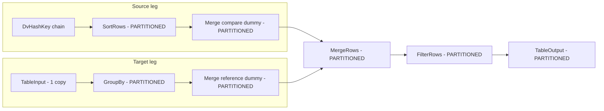

# Hash-key mod partitioning for update pipelines

**Status:** Deferred — implement when load performance becomes critical.

Replace round-robin `Table Output` parallelism with **Hop remainder-of-division (ModPartitioner) partitioning on the hash key**, so rows with the same hash key stay in the same swimlane from the first post-hash sort through MergeRows and all the way to Table Output. Partition count equals existing **`targetTableParallelCopies`** (e.g. 4 in `integration-tests/files/large/syn-large.hdv`).

Reference: [Hop partitioning manual](https://hop.apache.org/manual/latest/pipeline/partitioning.html)

---

## Scope

| Pipeline | In scope | Notes |
|----------|----------|-------|
| Satellite update | Yes | Partition from Sort through merge chain to Table Output (+ load-end-date Update branch) |
| Link update | Yes | Partition from Sort on `linkHashKeyFieldName` through merge chain to Table Output |
| STS (status tracking) | Yes | Partition sort/merge paths when enabled |
| Hub update | **No (phase 2)** | Hash is computed after MergeRows; partitioning by hash key would require pipeline redesign |
| File-source pre-hash sorts (`DvFileSourcePipelineBuilder`) | No | Hash key not present yet |

---

## Current vs target parallelism

**Today:** only `addTableOutput` in `DvSatellite`, `DvLink`, and `DvHub` call `tm.setCopiesString(resolveTargetTableParallelCopies())` — round-robin fan-out with no key affinity.

**Target:** when partitioning is enabled and copies > 1:

- Create one inline `PartitionSchema` per pipeline (`dynamicallyDefined=true`, `numberOfPartitions` = resolved copies)
- Apply `TransformPartitioningMeta` with method **`ModPartitioner`** and `fieldName` = entity hash key
- **Remove** `setCopiesString` on Table Output (Hop starts N copies automatically from the partition schema)
- Set `setDistributes(false)` on partitioned transforms (avoid round-robin overriding partition routing)



---

## Configuration

Add to **Target Loading** tab in `DataVaultConfiguration` (after `sortRowsSize`, order ~0517):

- **`enableHashKeyPartitioning`** (checkbox, default `false`)
- Helper: `boolean isHashKeyPartitioningEnabled(IVariables variables)` — true only when checkbox is on **and** resolved `targetTableParallelCopies` > 1
- Reuse **`targetTableParallelCopies`** as partition count (no second setting)
- i18n in `messages_en_US.properties`

When disabled or copies = 1, behavior stays exactly as today.

---

## New support class: `DvPartitioningSupport`

Mirror pattern of `DvSortRowsSupport`:

```java
// Sketch — actual API from hop-engine 2.18.1
PartitionSchema schema = new PartitionSchema(schemaName, null);
schema.setDynamicallyDefined(true);
schema.setNumberOfPartitions(copies);

TransformPartitioningMeta pm = new TransformPartitioningMeta("ModPartitioner", schema);
pm.createPartitioner("ModPartitioner");
((ModPartitioner) pm.getPartitioner()).setFieldName(hashKeyField);

transformMeta.setTransformPartitioningMeta(pm);
transformMeta.setDistributes(false);
```

Public API (proposed):

- `createHashKeyPartitionSchema(String name, DataVaultConfiguration config, IVariables variables)`
- `applyHashKeyPartitioning(TransformMeta tm, PartitionSchema schema, String hashKeyField)`
- `applyToTransforms(PartitionSchema schema, String hashKeyField, TransformMeta... transforms)`

Partition schema name: deterministic per pipeline, e.g. `dv_hk_<tableName>` (unique within generated pipeline).

---

## Pipeline wiring

### Satellite (`DvSatellite.generateUpdatePipelines`)

**Partition field:** `ctx.hashKeyFieldName`

**Source leg** (first point hash key is sorted):

| Transform | Partition? |
|-----------|-------------|
| Source input, hash chain, SelectValues | No |
| SortRows | **Yes** (entry point) |
| Constant (load date, if end-dating) | Yes |
| Merge compare dummy | Yes |
| MergeRows | Yes |
| FilterRows | Yes |
| Constant (load date / open end date) | Yes |
| TableOutput | Yes |
| Filter `has_previous_load_date` | Yes (end-dating branch) |
| Update `close_*` | Yes (end-dating branch) |

**Target leg:**

| Transform | Partition? |
|-----------|-------------|
| TableInput | No (single DB reader; repartition at next step) |
| GroupBy `group_last_*` | **Yes** (entry point) |
| `ref_load_date_as_date` (if end-dating) | Yes |
| Merge reference dummy | Yes |

Implementation approach: after pipeline is built, if `ctx.config.isHashKeyPartitioningEnabled(ctx.variables)`, create schema once and call a package-private `applyHashKeyPartitioning(ctx, pipelineMeta, schema, transforms...)`.

### Link (`DvLink.generateUpdatePipelines`)

**Partition field:** `linkHashKeyFieldName`

**Source leg:** Sort → merge dummies → MergeRows → Filter → Constant → TableOutput

**Target leg:** partition starting at merge reference dummy so TableInput stays a single copy (same pattern as satellite).

### STS (`DvSatellite.generateStatusTrackingPipeline`)

Apply same schema + hash field to STS transforms that participate in merge/sort:

- `sts_sort_source_*`, active-status sort/merge chain, deletion merge compare/reference dummies, MergeRows, downstream filters/outputs on those swimlanes
- Reuse `sortedSourceKeys.setDistributes(false)` pattern already present in STS generation

---

## Interaction with existing settings

- **`targetTableParallelCopies`**: drives both partition count and (today) Table Output copies; when partitioning on, only partition schema drives copy count
- **`sortRowsSize`**: unchanged; each partition runs its own Sort Rows with the configured in-memory buffer (lower per-partition memory, same total sort capacity in aggregate)
- **Orchestrator** (`DvPipelineOrchestratorSupport`): no change — it parallelizes *pipelines*, not transforms within a pipeline

---

## Tests

1. **`DvPartitioningSupportTest`** — unit test:
   - Schema has `dynamicallyDefined=true` and correct `numberOfPartitions`
   - Applied transform has `ModPartitioner`, correct `fieldName`, `distributes=false`
   - Disabled when copies=1 or checkbox off

2. **Pipeline generation test** (new or extend existing metadata test):
   - Generate a minimal link/satellite pipeline with `enableHashKeyPartitioning=true`, `targetTableParallelCopies=4`
   - Serialize pipeline to XML (or inspect `TransformMeta.getTransformPartitioningMeta()`)
   - Assert Sort, MergeRows, TableOutput share same partition schema name and ModPartitioner field

3. **Manual validation** on `syn-large`: regenerate pipelines, run link load, confirm 4 partition swimlanes in Hop GUI and comparable/improved throughput vs round-robin copies

---

## Files to touch

| File | Change |
|------|--------|
| **New** `DvPartitioningSupport.java` | Partition schema + ModPartitioner application |
| `DataVaultConfiguration.java` | Checkbox + `isHashKeyPartitioningEnabled()` |
| `messages_en_US.properties` | Labels/tooltips |
| `DvSatellite.java` | Apply partitioning in update + STS pipelines; stop `setCopiesString` when partitioned |
| `DvLink.java` | Same for link pipelines |
| **New** `DvPartitioningSupportTest.java` | Unit tests |
| **New/extend** pipeline generation test | Integration assertion on generated meta |

---

## Risks and mitigations

- **MergeRows correctness** requires both legs partitioned with the **same schema** on the merge transform and all upstream partitioned ancestors — apply schema object consistently (clone per transform via `TransformPartitioningMeta.clone()`)
- **Binary hash keys**: Hop ModPartitioner uses checksum for non-integer fields (per manual) — works for STRING/HEX/BINARY hash key types configured in the model
- **Target TableInput**: intentionally left non-partitioned; one-time repartition cost at GroupBy/dummy is acceptable vs N concurrent full-table scans

---

## Implementation checklist

- [ ] **config-flag** — Add `enableHashKeyPartitioning` to `DataVaultConfiguration` + i18n + `isHashKeyPartitioningEnabled()`
- [ ] **partitioning-support** — Create `DvPartitioningSupport` (PartitionSchema, ModPartitioner, `applyToTransforms`)
- [ ] **wire-satellite** — Apply partitioning in `DvSatellite` update pipeline + load-end-date branch; remove `setCopiesString` when partitioned
- [ ] **wire-link** — Apply partitioning in `DvLink` update pipeline; remove `setCopiesString` when partitioned
- [ ] **wire-sts** — Apply partitioning in `DvSatellite` STS pipeline merge/sort paths
- [ ] **tests** — Add `DvPartitioningSupportTest` + pipeline generation test asserting ModPartitioner and shared schema
- [ ] **validate-syn-large** — Manual run on syn-large (4 partitions) to confirm swimlanes and load behavior