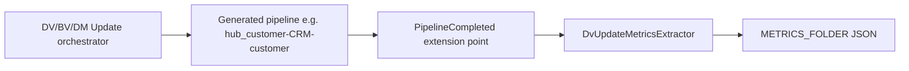
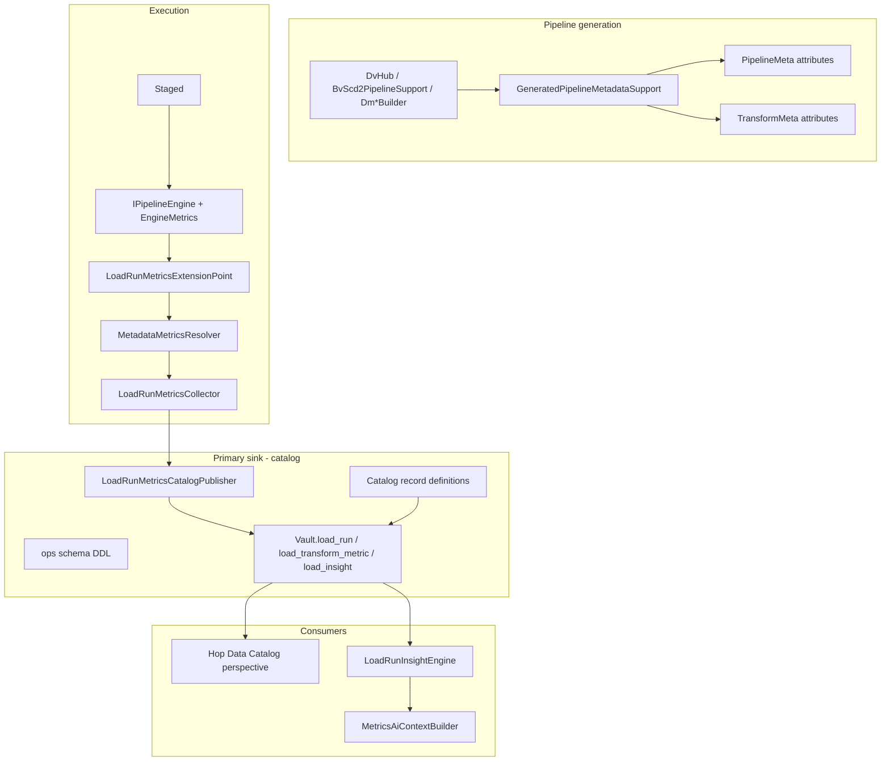

# Load-run metrics, metadata stamping, and catalog-backed insights

Evolve the existing pipeline-completed metrics hook into a **metadata-driven, transform-level** telemetry system. Stamp logical model context onto generated pipelines via Hop `attributesMap`, collect per-transform engine metrics at runtime, persist runs to a **Data Catalog-backed operations schema**, and derive rule-based insights for data engineers and AI advisors.

**Scope:** DV, Business Vault, and Dimensional generated update pipelines — transform-level row counts and tuning insights (e.g. dimension lookup preload candidates). Not a replacement for Hop Execution Information Location or Marquez lineage (see [marquez-lineage-plan.md](marquez-lineage-plan.md)).

**Approach:** `hop-datavault` namespace on `PipelineMeta` / `TransformMeta` at generation time; extend `PipelineCompleted` collector; publish to Vault ops tables registered in the Data Catalog; optional insight rules + AI context.

**Status:** Phase 1 complete. Phase 2 complete. Phase 3 complete. Phase 3.5 (insight engine + AI integration) complete.

**Difficulty:** moderate–large (multi-phase; Phase 1 MVP roughly 1–2 weeks).

---

## Current state

A **table-grain** metrics path already works for DV-style pipeline names when `METRICS_FOLDER` is set:



Key files:

- Collector: `src/main/java/org/apache/hop/datavault/metrics/DvUpdatePipelineCompletedExtensionPoint.java`
- Extraction (name heuristics only): `src/main/java/org/apache/hop/datavault/metrics/DvUpdateMetricsExtractor.java`
- Report shape: `src/main/java/org/apache/hop/datavault/metrics/DvUpdateMetricsReport.java`

**Gaps relative to the goal:**

| Gap | Impact |
|-----|--------|
| No `attributesMap` on generated pipelines/transforms | Cannot reliably map `lookup_d_customer` → dimension `d_customer` in fact `f_orders` |
| Aggregated to 3 counters per pipeline | No Sort Rows / Merge Rows / Dimension Lookup breakdown |
| BV pipelines (`bv-scd2-*`) skipped by parser | BV updates produce no metrics today |
| Alternate write transforms (`bulk_load_to_*`, `stage_to_*`) missed | Under-count inserts on bulk/staging paths |
| JSON-only sink | Hard to query history for AI/trend analysis |
| AI context builders are model-only | `DvAiContextBuilder` has no runtime load stats |

**Good news:** Hop’s `PipelineMeta` (via `AbstractMeta`) and `TransformMeta` both implement `IAttributes` with namespace-scoped `setAttribute(namespace, key, value)`. This matches the proposed design and survives in pipeline XML when generated pipelines are saved.

---

## Target architecture



---

## 1. Metadata contract (`attributesMap`)

Introduce a single namespace constant class, e.g. `GeneratedPipelineMetadataSupport` (new under `src/main/java/org/apache/hop/datavault/metadata/`).

**Namespace:** `hop-datavault`

### Pipeline-level attributes (on `PipelineMeta`)

| Key | Example | Purpose |
|-----|---------|---------|
| `model_type` | `dv` / `bv` / `dm` | Layer |
| `model_name` | `retail-360` | Model identity |
| `model_filename` | `/…/retail-360.hdv` | File path |
| `element_type` | `hub`, `satellite`, `link`, `fact`, `dimension`, `scd2` | Logical entity class |
| `element_name` | `hub_customer` | Model element |
| `target_table` | `hub_customer` | Physical target |
| `source_name` | `CRM-customer` | DV source (empty for DM/BV) |
| `pipeline_name` | same as `PipelineMeta.name` | Stable join key |

### Transform-level attributes (on `TransformMeta`)

| Key | Example | Purpose |
|-----|---------|---------|
| `logical_role` | `source_read`, `target_read`, `cdc_merge`, `hash_key`, `write_target`, `dimension_lookup`, `sort`, `group_by` | What this step does |
| `element_type` / `element_name` | `dimension` / `d_customer` | Entity this transform serves |
| `parent_element_name` | `f_orders` | Fact context for lookups |
| `physical_table` | `d_customer` | From `TableOutputMeta` / `DimensionLookupMeta` |
| `connection` | `Vault` | DB connection name |
| `lookup_cache_mode` | `preload` / `database` | From `DmFactDimensionRole.preloadLookupCache` |

**Stamping strategy:** wrap transform creation in builders rather than post-hoc name guessing.

Priority injection points (highest value first):

1. `DmDimensionLookupBuilder.addFactDimensionLookup` — “5M lookups vs 1k dimension rows” case
2. `DvTargetLoadSupport.addTargetLoad` — write/stage/bulk variants
3. `DvHub` / `DvSatellite` / `DvLink` — source/target/merge/hash chain
4. `BvScd2PipelineSupport` — analytic/collapse/output legs

Central helper API:

```java
GeneratedPipelineMetadataSupport.stampPipeline(pipeline, ctx);
GeneratedPipelineMetadataSupport.stampTransform(tm, role, ctx);
```

`BuildContext` / `HubUpdateContext` already carry model + table; extend with `elementType` once.

---

## 2. Metrics collection (evolve existing package)

Extend “DV update metrics” → **load-run metrics** (keep `DV_UPDATE_METRICS_RUN_ID` for backward compatibility).

### Per-transform extraction

New `TransformRunMetrics` nested under each pipeline record:

- `transformName`, `pluginId`
- Metadata copy: `logical_role`, `element_type`, `element_name`, `parent_element_name`
- Engine counters: `rowsRead`, `rowsWritten`, `rowsUpdated`, `rowsRejected`, `errors` (use `Pipeline.METRIC_READ`, `METRIC_WRITTEN`, `METRIC_OUTPUT`, `METRIC_UPDATED`, `METRIC_REJECTED`, `METRIC_ERROR`)
- Optional: `durationMs` if `capture_transform_performance=Y` on generated pipelines (phase 2b)

`MetadataMetricsResolver` (new):

1. Read `hop-datavault` attrs from each `TransformMeta` in completed `PipelineMeta`
2. Match `EngineMetrics` components by transform name
3. Fall back to `DvUpdateMetricsExtractor` heuristics when attrs absent (custom pipelines)

### Parser fixes (same PR series)

Extend `DvUpdateMetricsParser`:

- BV prefixes: `bv-scd2-`, `bv-pit-`, `bv-biz-`
- Write transforms: `bulk_load_to_*`, `stage_to_*`
- STS reads: `sts_target_*`

### Orchestrator correlation

At end of `DvPipelineOrchestratorSupport` run, publish **one run** with many pipelines + transforms. Cross-pipeline joins (for insights) use `runId` + `element_name`.

---

## 3. Primary sink: Data Catalog + database tables

**Catalog is the source of truth** (JSON export optional later for CI).

### Schema (Vault DB, `ops` or `dv_ops` schema)

**`load_run`**

- `run_id`, `started_at`, `finished_at`, `model_type`, `model_name`, `workflow_name`, `log_channel_id`, `success`, `error_count`

**`load_pipeline_metric`**

- FK `run_id`, `pipeline_name`, `element_type`, `element_name`, `source_name`, `source_rows_read`, `target_rows_read`, `target_rows_inserted`, `errors`

**`load_transform_metric`**

- FK `run_id`, `pipeline_name`, `transform_name`, `logical_role`, `element_type`, `element_name`, `parent_element_name`, `rows_read`, `rows_written`, `rows_updated`, `rows_rejected`, `errors`, `duration_ms`

**`load_insight`** (derived, rule engine output)

- FK `run_id`, `severity`, `code`, `message`, `element_name`, `related_element_name`, `metric_json`

### Catalog integration

Follow the pattern in `DvCatalogPublisher`:

1. Catalog JSON under `catalog-data/hop/<project>/operations/` for the four tables (`RecordDefinition` + `physicalTable` on Vault)
2. SQL DDL in `retail-example/sql/` (and integration-tests) — `create-load-metrics-tables.sql`
3. New `LoadRunMetricsCatalogPublisher` — upsert at end of orchestrator when metrics enabled

### Workflow wiring

Configuration lives in **Execution Metrics Profile** Hop metadata (`execution-metrics-profile`), referenced from DV/BV/DM Update actions via `executionMetricsProfile`.

| Setting | Where |
|---------|--------|
| Enable + JSON folder | Profile `enabled`, `metricsOutputFolder` |
| Ops DB connection | Profile `targetDatabaseConnection` (retail: `OPS` → `test_ops`) |
| Ops schema | Profile `operationsSchema` (default `dv_ops`) |
| Catalog record defs | Profile `dataCatalogConnection`, `publishCatalogDefinitions` |
| Model catalog publish | Action `publishToCatalog`, `dataCatalogConnection` (unchanged) |

Legacy: action `metricsOutputFolder` still enables metrics when no profile is set (backward compatible with integration-tests).

---

## 4. Insight engine (engineers + AI)

`LoadRunInsightEngine` — deterministic rules over catalog data:

| Rule code | Condition | Example message |
|-----------|-----------|-----------------|
| `DIM_LOOKUP_PRELOAD_CANDIDATE` | `fact_rows / dim_rows > threshold` AND `lookup_cache_mode=database` | “Dimension d_customer has ~1k rows; fact f_orders performed ~5M lookups. Enable preloadLookupCache on role …” |
| `HIGH_TARGET_READ_RATIO` | `target_rows_read >> source_rows_read` on hub/sat | “Satellite re-read entire target — check CDC/filter path” |
| `SORT_MEMORY_RISK` | Sort transform `rows_read` large + rejected/buffer metrics | Point to [performance-tuning.md](../performance-tuning.md) |
| `BULK_LOAD_USED` | `logical_role=write_target` + bulk plugin | Note bulk path for capacity planning |

Persist insights to `load_insight`; expose in Hop GUI (catalog record preview or simple viewer).

### AI consumption

`MetricsAiContextBuilder`:

- Query latest `load_run` + insights for the active model (by `run_id` or last N runs)
- Append compact JSON to `DvAiContextBuilder` / `DmAiContextBuilder` when user asks performance/tuning questions

---

## 5. Phased delivery

### Phase 1 — Metadata + transform metrics (MVP) ✅

- `GeneratedPipelineMetadataSupport` + stamp **DM fact pipelines** (lookups + write) and **DV hub**
- `TransformRunMetrics` + metadata-first resolver
- Catalog DDL + definitions + publisher for `load_run`, `load_pipeline_metric`, `load_transform_metric`
- **Execution Metrics Profile** metadata type + GUI editor; wired on DV/BV/DM Update actions
- Retail: `OPS` / `test_ops` database, `retail-execution-metrics` profile on all update actions
- Insight rule `DIM_LOOKUP_PRELOAD_CANDIDATE` (log + JSON; `load_insight` table deferred to Phase 3)
- Unit tests: stamper, resolver, parser BV prefixes, insight engine, catalog publisher, profile resolver

### Phase 2 — Full generator coverage ✅

- Stamp all DV/BV/DM builders (hub, satellite, link, STS, SCD2/PIT, dimensions, facts, bridge, junk, accumulating snapshot)
- Fix bulk/staging/STS transform matching (heuristic constants + dimensional `target_` reads)
- Enable `capture_transform_performance` via `LoadRunMetricsPipelineSupport` when metrics enabled (`duration_ms` from engine components)

### Phase 3 — Insights + AI + GUI ✅

- `LoadRunInsightEngine` expanded rules + `load_insight` table persistence
- `MetricsAiContextBuilder` wired into `DvAiContextBuilder` / `DmAiContextBuilder`
- Metrics summary on update action `Result` (`LoadRunPublishSummary` log text + line counts)
- Data Catalog “Operations” / “Load metrics” record tree filters
- `LoadRunMetricsDatabasePublishTest` asserts `load_run`, `load_transform_metric`, and `load_insight` rows when OPS PostgreSQL is reachable

### Phase 3.5 — Insight engine + deep AI integration ✅

- `PERFORMANCE_TUNING` scenario on DV/DM/BV AI advisors with dedicated prompt templates
- `HIGH_TRANSFORM_DURATION` insight rule (default 60s threshold)
- `LoadRunInsightRuleCatalog.toJson()` embedded in AI metrics context
- `MetricsAiContextBuilder.buildMetricsContext()` — explicit flag, scenario, or keyword detection
- Enriched metrics JSON: `insightRuleCatalog`, per-run `pipelines`, `topTransforms`
- `includeLoadRunMetrics` on `DvAiRequest` / `DmAiRequest` / `BvAiRequest`; wired in all three modeler AI dialogs
- GUI checkbox auto-enables when Performance tuning scenario is selected
- `BvAiContextBuilder` + `BvAiAdvisorService` load-run metrics prompt section

### Phase 4 — GUI duration overview

- Horizontal `SashForm` on DV/BV/DM model graphs: model canvas left (~65%), duration bars right (~35%)
- `LoadRunDurationMetricsLoader` queries `load_transform_metric` (sum `duration_ms` per `element_name` per run)
- `LoadRunDurationOverviewPainter` — Airflow-style vertical bars, one row per model table, one column per recent run
- `ModelLoadDurationPane` — scrollable metrics canvas with refresh and hover tooltips
- Toolbar toggle + refresh on DV/BV/DM graphs

### Phase 5 — Optional exports

- Thin JSON mirror for CI (`collect-metrics-results.hpl`)
- OpenLineage correlation with [marquez-lineage-plan.md](marquez-lineage-plan.md) using same `run_id`

### Phase 5b — Workflow load overview report ✅

- **Begin Vault Update** / **End Vault Update** workflow actions bracket a correlated update wave via `DV_WORKFLOW_EXECUTION_ID`
- `workflow_load_overview` + `workflow_load_overview_model` OPS tables and catalog definitions
- End action publishes DB rows and optional Markdown/HTML reports + workflow log output
- Retail wiring in `run-retail-update.hwf`

---

## 6. Example: dimension lookup advice flow

For `dm-fact-f_orders` with `lookup_d_customer`:

1. **Generation:** `addFactDimensionLookup` stamps `logical_role=dimension_lookup`, `element_name=d_customer`, `parent_element_name=f_orders`, `lookup_cache_mode=database`
2. **Run:** `DimensionLookup` processes 5M fact rows → `rows_read=5_000_000` on that transform
3. **Same run:** `dm-dim-d_customer` pipeline reports `target_rows_read≈1000`
4. **Insight engine:** ratio 5000:1 → `DIM_LOOKUP_PRELOAD_CANDIDATE`
5. **AI:** context includes insight; suggests `preloadLookupCache` on the fact role

---

## 7. Testing strategy

- **Unit:** metadata stamper, resolver, parser, insight rules
- **Integration:** retail / integration-tests workflow with metrics catalog connection; assert `load_transform_metric` rows after update
- **Regression:** keep `DvUpdateMetricsCollectorTest` pipeline-level totals

---

## 8. Documentation touchpoints (when implementing)

- [operations.adoc](../operations.adoc) — catalog-backed metrics
- [performance-tuning.md](../performance-tuning.md) — link insights to tuning knobs
- [integration-tests/PROJECT.md](../../integration-tests/PROJECT.md) — catalog-first metrics description

---

## Implementation checklist

- [x] **metadata-contract** — `GeneratedPipelineMetadataSupport`; stamp DM fact lookups + DV hub
- [x] **transform-metrics** — `TransformRunMetrics`, `MetadataMetricsResolver`, expanded engine counters
- [x] **catalog-schema** — ops DDL, catalog definitions, `LoadRunMetricsCatalogPublisher`
- [x] **execution-metrics-profile** — metadata type, editor, resolver, retail `OPS` database wiring
- [x] **parser-fixes** — BV prefixes; bulk/staging write transform constants (name heuristics)
- [x] **insight-engine** — `LoadRunInsightEngine` + `DIM_LOOKUP_PRELOAD_CANDIDATE` (log/JSON only)
- [x] **phase1-tests** — stamper, resolver, parser, insight engine, catalog publisher, profile resolver
- [x] **ai-context** — `MetricsAiContextBuilder` for AI advisory (Phase 3)
- [x] **full-stamping** — all DV/BV/DM builders (Phase 2)
- [x] **transform-performance-capture** — `LoadRunMetricsPipelineSupport` + `duration_ms` resolver (Phase 2)
- [x] **load-insight-table** — persist insights to `load_insight` (Phase 3)
- [x] **workflow-db-assertions** — `LoadRunMetricsDatabasePublishTest` + `LoadRunMetricsDatabaseAssertionSupport` (optional OPS PostgreSQL)
- [x] **action-result-metrics** — `LoadRunPublishSummary` on workflow `Result` log text and line counts
- [x] **catalog-operations-filter** — Data Catalog perspective Operations / Load metrics filters
- [x] **performance-tuning-scenario** — PERFORMANCE_TUNING AI scenario + prompts (DV/DM/BV)
- [x] **high-transform-duration** — HIGH_TRANSFORM_DURATION insight rule
- [x] **insight-rule-catalog** — LoadRunInsightRuleCatalog for AI context
- [x] **ai-metrics-gui** — Include load-run metrics checkbox in DV/DM/BV AI advisor dialogs
- [x] **bv-ai-metrics** — BvAiContextBuilder + BvAiAdvisorService metrics integration
- [ ] **gui-duration-overview** — LoadRunDurationOverviewPainter + ModelLoadDurationPane on DV/BV/DM graphs (Phase 4)
- [x] **workflow-load-overview** — Begin/End Vault Update actions + workflow overview tables/reports (Phase 5b)