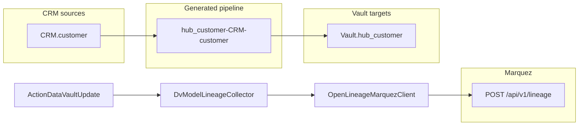

# Marquez / OpenLineage basic lineage integration

Emit **model-derived** OpenLineage events from Data Vault Update to a [Marquez](https://marquezproject.ai/) server. Each generated load pipeline becomes an OpenLineage job with CRM source tables as inputs and vault target tables as outputs.

**Scope:** model-derived table-level lineage on DV Update — not Hop `LineageHub` transform observation, not column-level lineage.

**Approach:** walk `.hdv` model metadata and catalog sources; post `START` / `COMPLETE` `RunEvent` JSON to Marquez. One event per generated pipeline name (e.g. `hub_customer-CRM-customer`).

**Difficulty:** moderate (roughly 1–2 weeks; somewhat easier than the DataHub catalog integration).

---

## Context

Data Vault models already encode source→target relationships:

| DV element | Lineage use |
|------------|-------------|
| `DataVaultSource` + `DvDatabaseSource` | Input dataset: `databaseName` + `schemaName` + `tableName` |
| `DataVaultConfiguration.targetDatabase` + table `tableName` | Output dataset: Vault hub/link/sat table |
| `buildHubPipelineName()` etc. in `DataVaultConfiguration` | OpenLineage job name |
| `ActionDataVaultUpdate` workflow/action name | Parent run context |
| Generated `PipelineMeta` list in `ActionDataVaultUpdate` | Hook point after `generateUpdatePipelines()` |

Sources are resolved via `DvSourceCatalogService` from `local-catalog` — the same path pipeline generation uses.

Pipeline naming (already implemented in `DataVaultConfiguration`):

```
{prefix}{targetTableName}-{sourceName}
```

Examples: `hub_customer-CRM-customer`, `sat_customer-CRM-customer`, `lnk_customer_order-CRM-order`.

Per table type:

- **Hub** — one edge per `recordSources` entry (`DvHub`)
- **Satellite** — one edge from `recordSourceName` (`DvSatellite`)
- **Link** — one edge per link hub/satellite source (`DvLink`)

---

## Architecture



### What Hop provides (and what we skip for MVP)

Apache Hop **2.18.1** ships a **Lineage observation hub** (`org.apache.hop.lineage` in `hop-engine`) with an `ILineageSink` plugin SPI (`HOP_LINEAGE_ENABLED=Y`).

However:

- **No OpenLineage sink** ships with Hop yet ([issue #2946](https://github.com/apache/hop/issues/2946), milestone 3.0)
- Transform-level events are field-schema oriented; they do not reliably produce `CRM.customer → Vault.hub_customer` dataset names for dynamically generated DV pipelines
- A generic `ILineageSink` → Marquez mapper is harder than model-derived emission for DV

**MVP skips `LineageHub`** and posts OpenLineage events directly from the DV plugin.

---

## Marquez integration surface

Marquez accepts standard OpenLineage JSON:

- **Endpoint:** `POST {marquez-url}/api/v1/lineage`
- **Payload:** OpenLineage `RunEvent` with `eventType` `START` / `COMPLETE`, `job`, `inputs`, `outputs`, `run`

Example `COMPLETE` event:

```json
{
  "eventType": "COMPLETE",
  "eventTime": "2026-06-22T20:00:00Z",
  "producer": "https://github.com/mattcasters/hop-data-vault",
  "run": { "runId": "<uuid>" },
  "job": {
    "namespace": "hop-data-vault",
    "name": "vault1/hub_customer-CRM-customer"
  },
  "inputs": [{ "namespace": "CRM", "name": "customer" }],
  "outputs": [{ "namespace": "Vault", "name": "hub_customer" }]
}
```

Dataset `namespace` / `name` mapping can start simple (Hop `DatabaseMeta` connection name + table name) and evolve later (hostname, schema-qualified names, facets).

---

## Recommended implementation path

### 1. Lineage collector (~2 days)

New package: `org.apache.hop.datavault.lineage`

**`DvModelLineageCollector`** — walk `DataVaultModel` tables and produce immutable `DvLineageEdge` records:

- `jobNamespace`, `jobName` (model name + pipeline name)
- `inputDatasetNamespace`, `inputDatasetName` (from `DvDatabaseSource`)
- `outputDatasetNamespace`, `outputDatasetName` (Vault target table)
- `dvTableType`, `sourceRecordName`, `modelFile`

Reuse the same source-resolution rules as pipeline builders. Non-database sources (future file feeds) can be skipped or mapped generically in v1.

### 2. OpenLineage emitter (~2–3 days)

**`OpenLineageMarquezClient`**:

- Config: `marquezUrl`, `producer`, `jobNamespace` (default `hop-data-vault`)
- Dependency: [`io.openlineage:openlineage-java`](https://mvnrepository.com/artifact/io.openlineage/openlineage-java) or Jackson + hand-built JSON
- Methods: `emitStart(runId, edge)`, `emitComplete(runId, edge, success)`

Unit-test dataset naming without a live Marquez instance.

### 3. Hook in Data Vault Update (~1 day)

Extend `ActionDataVaultUpdate` with new fields (GUI tab alongside catalog publish):

- `emitLineage` (checkbox, default `N`)
- `marquezUrl`
- `openLineageNamespace` (default `hop-data-vault`)

**Emit timing** (per generated pipeline):

1. After `table.generateUpdatePipelines()` — collect edges
2. Before orchestrator run — `START` events
3. After orchestrator completes — `COMPLETE` events with success/failure from `Result`

Simpler v1 alternative: emit only `COMPLETE` after a successful run.

### 4. Configuration and docs (~1–2 days)

- i18n labels in `messages_en_US.properties`
- Docker note: [Marquez quickstart](https://github.com/MarquezProject/marquez#quickstart) (`docker-compose up`, port 5000)
- Optional sample in `integration-tests/PROJECT.md`

### 5. Smoke test (~1 day)

Optional `DvOpenLineageSmoke` (pattern: `DvCatalogPublishSmoke`):

- Load `vault1.hdv`
- Collect edges (expect hub/sat/link pipelines with CRM sources)
- POST to Marquez only when `MARQUEZ_URL` env var is set

---

## Coverage for sample project `vault1`

| Generated job (example) | Input | Output |
|-------------------------|-------|--------|
| `hub_customer-CRM-customer` | CRM.customer | Vault.hub_customer |
| `sat_customer-CRM-customer` | CRM.customer | Vault.sat_customer |
| `hub_order-CRM-order` | CRM.order | Vault.hub_order |
| `lnk_customer_order-CRM-order` | CRM.order | Vault.lnk_customer_order |

One OpenLineage job per row; Marquez graph shows CRM staging tables feeding vault entities.

---

## Out of scope (basic MVP)

- Column-level lineage / field mapping
- Hop `ILineageSink` plugin (generic transform observation)
- Link-satellite multi-hop lineage (hub tables as intermediate inputs)
- Workflow-level parent/child run nesting in OpenLineage
- Authentication beyond optional API key header

**Follow-on effort:**

- Hop `ILineageSink` for non-DV pipelines: +1–2 weeks
- Column facets from `IRowMeta`: +3–5 days
- Link lineage (source → link, hub hashes as intermediates): +3–5 days

---

## Risks and mitigations

| Risk | Mitigation |
|------|------------|
| Dataset naming inconsistency in Marquez UI | Document convention; use `schema.table` in `name` when schema is set |
| Marquez not running during tests | Smoke test gated on env var; unit tests for collector only |
| Multiple DB engines (postgres/mysql) | Namespace = Hop connection name (`CRM`, `Vault`) |
| Ephemeral generated pipelines | Model-derived lineage avoids depending on saved `.hpl` paths |

---

## Implementation checklist

- [ ] **lineage-collector** — `DvModelLineageCollector` + `DvLineageEdge`: walk model tables, resolve sources, produce job/input/output triples
- [ ] **openlineage-client** — `OpenLineageMarquezClient` with START/COMPLETE RunEvents; add `openlineage-java` or Jackson dependency
- [ ] **dv-update-hook** — `emitLineage` + `marquezUrl` on `ActionDataVaultUpdate`; emit events around orchestrator run
- [ ] **test-docs** — Unit tests for collector; optional Marquez smoke test behind `MARQUEZ_URL`

---

## Bottom line

Model-derived OpenLineage → Marquez is a solid, moderate-effort starting point. The hard part is OpenLineage/Marquez familiarity and HTTP client wiring — not DV modeling. Most metadata is already computed in `HubUpdateContext` and sibling context classes; the collector formalizes what pipeline generation already knows.

Estimated size: **~300–500 lines** (collector + client + action hooks + tests), plus docs.

### Key classes to extend or reference

| Class | Path |
|-------|------|
| `ActionDataVaultUpdate` | `src/main/java/org/apache/hop/datavault/workflow/actions/datavaultupdate/ActionDataVaultUpdate.java` |
| `DataVaultConfiguration` | `src/main/java/org/apache/hop/datavault/metadata/DataVaultConfiguration.java` |
| `DvSourceCatalogService` | `src/main/java/org/apache/hop/datavault/catalog/DvSourceCatalogService.java` |
| `DvHub` / `DvSatellite` / `DvLink` | `src/main/java/org/apache/hop/datavault/metadata/` |
| `DvCatalogPublishSmoke` (pattern) | `src/main/java/org/apache/hop/datavault/catalog/smoke/DvCatalogPublishSmoke.java` |