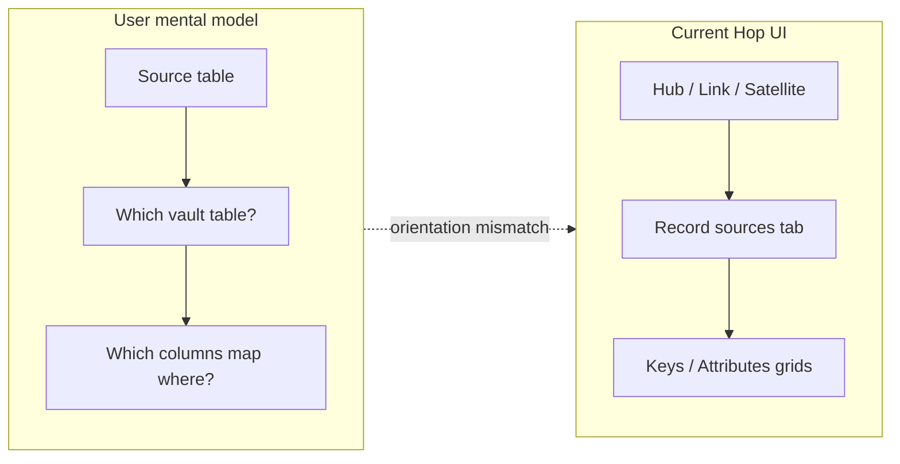
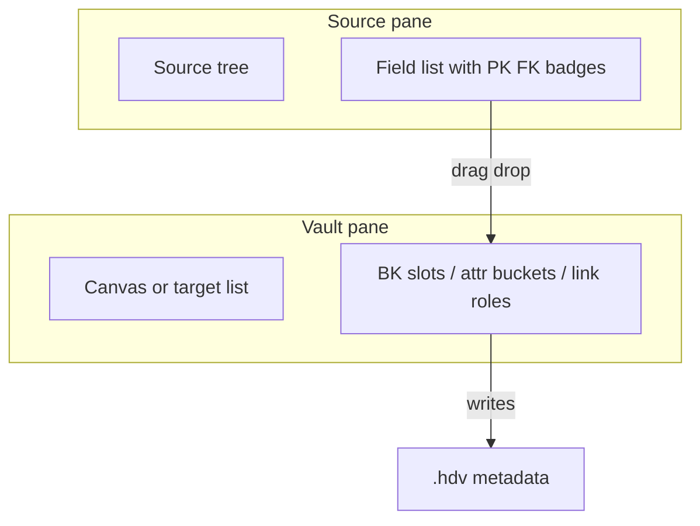
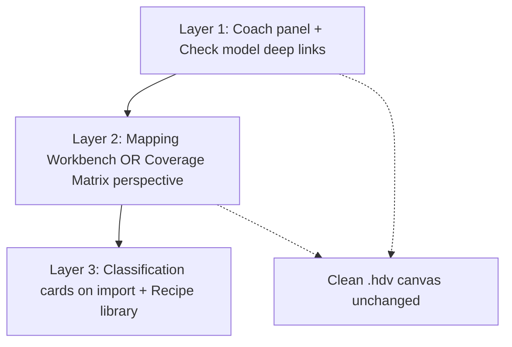

# Source-to-Vault Mapping UI Alternatives (Beyond Wizards)

> A design exploration of non-wizard UI patterns for guiding users through source-to-Data-Vault mapping, grounded in hop-data-vault's current target-first dialogs, catalog layer, and existing suggest/validate infrastructure.

## The core tension

Today, users naturally think **source → vault** ("I have `crm.customers`; where does it land?"), but the product is edited **vault → source** (open a Hub, attach catalog feeds, map columns on the Keys tab). That mismatch is the real UX problem — not a lack of step-by-step flows.



**Design goal:** Provide guidance without a wizard — i.e. no forced linear funnel, no "Next/Back" gatekeeping, no modal stack that hides the whole model. Guidance should be **ambient, reversible, and skippable** for power users.

**Non-negotiable from your brief:** Keep the vault model clean (organizational memory). Any source-first view should be a *lens* or *binding layer*, not a reason to pollute hub/link/satellite definitions with source-system clutter.

---

## What already exists (leverage, don't reinvent)

| Asset | Location | Reuse for |
|-------|----------|-----------|
| Catalog `DV_SOURCE` tree + import | [`DataCatalogPerspective.java`](../../src/main/java/org/apache/hop/catalog/hopgui/perspective/DataCatalogPerspective.java) | Source-first navigation root |
| Reverse usage index | [`SourceUsageIndexBuilder.java`](../../src/main/java/org/apache/hop/datavault/resourcedefinition/SourceUsageIndexBuilder.java) | "This source feeds hub X, sat Y" |
| Source→target validation | [`DvFieldMappingValidationSupport.java`](../../src/main/java/org/apache/hop/datavault/metadata/DvFieldMappingValidationSupport.java) | Coverage / completeness signals |
| Explicit mapping grid + **Suggest mappings** | [`HopGuiBvScd2TableDialog.java`](../../src/main/java/org/apache/hop/datavault/hopgui/file/businessvault/HopGuiBvScd2TableDialog.java) | Proven pattern to port to raw DV |
| AI proposals (batch review, not steps) | [`DvAiAdvisorDialog.java`](../../src/main/java/org/apache/hop/datavault/hopgui/ai/DvAiAdvisorDialog.java) | Advisory overlay, not primary path |
| Load from source | Hub/Sat dialogs | Bulk seeding inside target-first editors |

The BV SCD2 dialog already shows the richer interaction users expect: **Source field | Target field** columns plus one-click suggestions. Raw DV hub/satellite dialogs are asymmetric (target-first, implicit naming).

---

## Alternative UI patterns (12 options)

### A. Orientation fixes — meet users where they start

#### 1. Mapping Workbench (dual-pane, non-linear)

A dedicated **Mapping** perspective (third pane beside Catalog + Model canvas):

- **Left:** Source tree — `Source system → DV_SOURCE → fields` (with PK/FK badges from catalog metadata).
- **Right:** Vault targets — either the `.hdv` canvas or a compact list of hubs/links/sats in the open model.
- **Interaction:** Drag a source field onto a hub BK slot, satellite attribute bucket, or link key role. Drop creates/updates the underlying `businessKeys[]`, `attributes[]`, or `hubSourceKeyFields[]` entries.
- **Why not a wizard:** User chooses any source, any target, in any order. No steps.



**Best for:** First-time modelers importing many tables. **Risk:** Two panes to keep in sync; needs strong visual feedback on the canvas when bindings change.

---

#### 2. Source Coverage Matrix (spreadsheet mindset)

A flat grid — rows = catalog sources (or source fields), columns = vault tables / roles:

| Source | Hub BK | Hub RS | Sat attrs | Link keys | Status |
|--------|--------|--------|-----------|-----------|--------|
| `E2E-customer-hub` | `customer_id` | configured | 12/15 mapped | — | partial |

- Cell click opens a **focused popover** (single grid slice), not a multi-step wizard.
- Toolbar: filter unmapped / errors from `Check model`.
- **Why not a wizard:** Entire landscape visible at once; sortable, filterable, bulk operations.

**Best for:** Enterprise models with dozens of feeds. **Risk:** Wide tables; needs good column chooser.

---

#### 3. Source-to-Table Tree with inline actions

Extend the Data Catalog tree (or a sibling tree in the Mapping perspective):

```
▼ CRM
  ▼ customers (DV_SOURCE)
      ● customer_id  [PK]  → hub_customer.customer_id
      ○ email        → hub_customer_sat.email
      ○ unmapped (3)
```

- Right-click field: **Assign to hub BK**, **Add to satellite**, **Use as record source indicator**, **Ignore**.
- Unmapped fields bubble to a **Triage** node at the top.
- **Why not a wizard:** Tree is always navigable; actions are contextual one-shots.

**Best for:** Users who live in the catalog. **Risk:** Tree can get deep; needs collapse/filter for 200+ column tables.

---

#### 4. Canvas "Source overlay" mode (same model, different lens)

Toggle on the `.hdv` toolbar: **Show source bindings**.

- Ghost nodes for unattached `DV_SOURCE` records around the canvas periphery.
- Solid edges: `source.field → hub.bk`, `source → satellite`.
- Click edge → inline mapping editor.
- Vault boxes stay clean; overlay is a view mode stored in GUI state, not in `.hdv`.

**Best for:** Visual thinkers who already use the canvas. **Risk:** Clutter at scale; needs grouping by source system.

---

### B. Guidance without funneling — decision support, not steps

#### 5. Classification Cards (one screen, not steps)

After **Import record definitions**, show a **single full-page form** (not stepped wizard):

For each imported source, one card with parallel decisions:

- Entity type: `Hub` / `Link` / `Satellite` / `Skip`
- Suggested name (editable)
- Key columns (multi-select from PK detection)
- Descriptive columns (auto = non-key minus indicators)
- Parent hub/link (if satellite)

All cards visible; user fills 3 today, 7 tomorrow. **Apply selected** batch-creates vault tables + bindings.

**Why not a wizard:** No sequence lock — expert users scan and tick. Novices can still work top-to-bottom if they want.

**Best for:** Greenfield models right after DB import. **Risk:** Overwhelming if 50 tables imported at once → pair with filtering (only unclassified).

---

#### 6. Mapping Inbox / Triage Queue

Post-import, generate **inbox items** (heuristic + optional AI):

> `POS-order-line` looks like a **Link** between `hub_order` and `hub_product` (confidence: high)

Each item: **Accept** (creates structure), **Edit** (opens focused dialog), **Defer**, **Dismiss**.

- Queue persists until empty; badge on toolbar: `Mapping inbox (4)`.
- **Why not a wizard:** Items are independent; order doesn't matter.

**Best for:** Incremental modeling teams. Reuses proposal-review pattern from AI Help. **Risk:** Bad suggestions erode trust — always show evidence (matched FK names, PK shape).

---

#### 7. Pattern / Recipe Library

Curated templates: *Single-source hub + satellite*, *Multi-source hub*, *Transaction link*, *Effectivity satellite*.

- User picks recipe + source(s) → skeleton `.hdv` elements + default bindings.
- Refinement stays in existing hub/link/sat dialogs.
- Recipes ship as JSON or catalog macros (not code).

**Why not a wizard:** Template pick is one action; refinement is free-form.

**Best for:** Standardising organisational memory — enforces naming and structure conventions.

---

#### 8. Ambient Coach Panel (inspector, not chat)

**Implementation plan:** [coach-panel-plan.md](coach-panel-plan.md) — generic left-docked tree across DV/BV/DM, curated sources in model XML, panel visibility in `AuditManager`, drag-to-canvas + mapping dialog.

Docked panel on the model canvas (like an IDE problems view):

```
Hub customer (incomplete)
  ✗ No record source          [Attach source…]
  ✗ BK customer_id unmapped   [Map field…]
  ⚠ 3 source fields unused    [Review]
```

- Each line is a **deep link** into the right tab of the existing dialog.
- Populated from `DataVaultModel.check()` + `SourceUsageIndexBuilder` gaps.
- **Why not a wizard:** Always visible, non-blocking, updates live.

**Best for:** Low implementation cost, high daily value. **Risk:** Can feel naggy — tone via severity + collapse.

---

### C. Power-user and organisational-memory patterns

#### 9. Unified Mapping Spreadsheet

One exportable grid for the entire model (could be in-perspective or CSV):

`vault_table | vault_role | vault_column | source_name | source_field | record_source | cdc`

- Bulk edit, paste from Excel, diff across model versions.
- **Why not a wizard:** Pure data plane.

**Best for:** Migration projects, reviews, governance. Port BV SCD2 **Suggest mappings** here first.

---

#### 10. Separation: Clean Model + Binding Document

Keep `.hdv` as pure DV ontology. Introduce optional `.hdv-bindings` (or catalog-side `DV_BINDING` records) that hold all source attachments.

- Modeler view: no source names on canvas at all.
- Integrator view: bindings only.
- Pipeline generation merges at build time (already conceptually how catalog resolution works).

**Why not a wizard:** Roles split cleanly — architect vs integrator.

**Best for:** Your stated preference for clean organisational memory. **Risk:** Two artifacts to version; needs strong "bindings out of date" warnings.

---

#### 11. Field Journey Board (Kanban)

Columns: `Unassigned` → `Business key` → `Link key` → `Satellite attr` → `Ignored`

- Cards = source fields (from selected `DV_SOURCE`).
- Heuristic pre-sorts (PK → BK column, same-name → attr column).
- **Why not a wizard:** Spatial memory; good for workshops.

**Best for:** Collaborative modeling sessions. **Risk:** Unusual in desktop ETL tools; may feel gimmicky for daily edits.

---

#### 12. Conversational Advisor as secondary surface (already built)

Keep **AI Help** as opt-in acceleration: analyze catalog, propose hubs/links/sats, batch review. Do **not** make it the primary mapping path.

- Position it as "senior modeler on call", not "the UI".
- Tighten scenarios: *Classify imported sources*, *Map unmapped fields*, *Explain link driving keys*.

---

## Comparison matrix

| Pattern | Source-first? | Keeps model clean? | Guidance strength | Implementation cost | Wizard-like? |
|---------|---------------|--------------------|--------------------|---------------------|--------------|
| Mapping Workbench | High | Medium | High | High | No |
| Coverage Matrix | High | High | Medium | Medium | No |
| Source tree + actions | High | High | Medium | Medium | No |
| Canvas overlay | Medium | High | Low–Med | Medium | No |
| Classification cards | High | Medium | High | Medium | **Borderline** (one page OK) |
| Mapping inbox | High | Medium | High | Medium | No |
| Recipe library | Medium | **High** | High | Low–Med | No |
| Coach panel | Low (target) | High | Medium | **Low** | No |
| Mapping spreadsheet | High | High | Low | Low–Med | No |
| Bindings separation | Medium | **Highest** | Medium | High | No |
| Field journey board | High | Medium | Medium | High | No |
| AI advisor | Both | Medium | High (variable) | **Exists** | No |

---

## Recommended direction: layered approach (no wizard)

Rather than picking one pattern, ship **three complementary layers** that respect both mental models:



### Phase 1 — Quick wins (target-first, better guidance)

1. **Coach panel** on `.hdv` canvas: incomplete-mapping checklist from existing validation + usage index.
2. **Port Suggest mappings** from BV SCD2 to Hub Keys and Satellite Attributes grids (explicit `source_field | target_field` columns).
3. **Deep links** from coach items → correct dialog tab (Record sources, Keys, etc.).

Files to extend: [`DvHubDialog.java`](../../src/main/java/org/apache/hop/datavault/hopgui/file/vault/DvHubDialog.java), [`DvSatelliteDialog.java`](../../src/main/java/org/apache/hop/datavault/hopgui/file/vault/DvSatelliteDialog.java), [`HopGuiVaultGraph.java`](../../src/main/java/org/apache/hop/datavault/hopgui/file/vault/HopGuiVaultGraph.java).

### Phase 2 — Source-first lens (primary alternative to wizard)

4. New **Mapping perspective** with **Coverage Matrix** default view and optional **Source tree** drill-down.
5. Cell/popover editors write through to existing metadata types (`BusinessKey`, `SatelliteAttribute`, `DvLinkHubSource`).
6. Reuse [`SourceUsageIndexBuilder`](../../src/main/java/org/apache/hop/datavault/resourcedefinition/SourceUsageIndexBuilder.java) for row status and navigation into vault dialogs.

### Phase 3 — Onboarding acceleration (not a wizard)

7. Post-import **Classification cards** (single scrollable screen, batch apply).
8. **Recipe library** for hub+sat, multi-source hub, transaction link.
9. Optional **Mapping inbox** fed by heuristics (PK/FK/name match) with AI proposals as enrichment.

### Explicitly avoid

- Multi-step modal wizards with Next/Back.
- Forcing source-first editing inside hub/link/sat dialogs (keep those as refinement surfaces).
- Embedding source-system names into vault table names or canvas layout.

---

## Heuristic engine (shared backbone)

All non-wizard patterns share one **Mapping Suggestion Service** (new, backend-only):

| Input | Signals | Output |
|-------|---------|--------|
| `DataVaultSource` fields | PK metadata, naming, FK patterns | Suggested entity type, BK columns, parent hub |
| Open `DataVaultModel` | Existing hubs/links | Link endpoint matching |
| `SourceUsageIndexBuilder` | Current bindings | Unmapped field list, coverage % |

Consumers: Coach panel, Matrix status cells, Classification cards, Inbox items, Suggest mappings button, AI context.

No UI pattern needs its own ad-hoc guessing logic.

---

## Copy and terminology (reduce "record source" confusion)

The hub help doc already documents three meanings of "record source" ([`dv-hub-dialog.md`](../../src/main/resources/org/apache/hop/datavault/hopgui/help/dv-hub-dialog.md)). In source-first views, use distinct labels:

- **Feed** (catalog `DV_SOURCE`)
- **Lineage value** (indicator / indicator field)
- **Vault column** (`RECORD_SOURCE` or override)

This alone reduces perceived complexity without any wizard.

---

## Open product decisions (before implementation)

1. **Primary source-first surface:** Mapping Workbench (spatial) vs Coverage Matrix (tabular) — or ship Matrix first (lower risk in SWT).
2. **Bindings separation:** Stay single `.hdv` artifact for v1, or invest in `.hdv-bindings` for organisational purity.
3. **Classification on import:** Opt-in dialog after import, or separate "Classify sources" toolbar action.

---

## Todos

- [ ] **coach-panel** — Phase 1: Add ambient Coach panel on .hdv canvas driven by Check model + SourceUsageIndexBuilder gaps
- [ ] **suggest-mappings-dv** — Phase 1: Port BV SCD2 explicit source→target grid + Suggest mappings to Hub Keys and Satellite Attributes dialogs
- [ ] **mapping-perspective** — Phase 2: New Mapping perspective with Coverage Matrix + source tree drill-down and popover editors
- [ ] **suggestion-service** — Phase 2: Shared Mapping Suggestion Service (PK/FK/name heuristics) for matrix status, suggest button, and inbox
- [ ] **classification-cards** — Phase 3: Post-import Classification cards (single-page batch form) + Recipe library
- [ ] **terminology** — Cross-cutting: Adopt Feed / Lineage value / Vault column labels in source-first UI copy