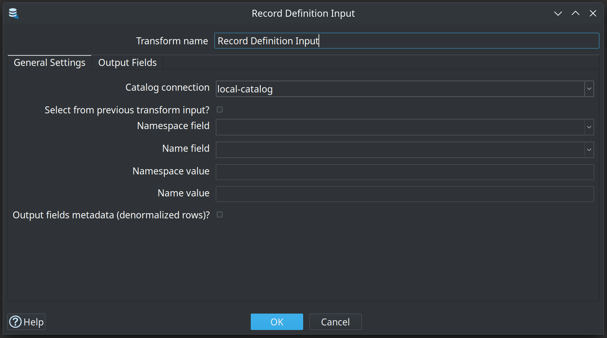
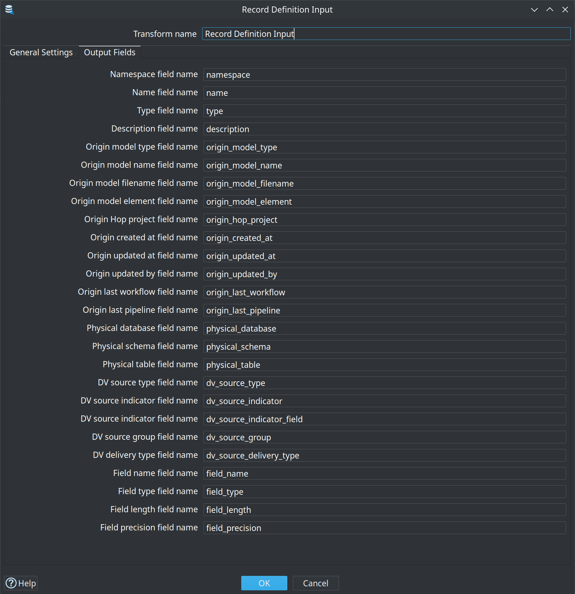

= Record Definition Input
:toc: macro
:toclevels: 3

toc::[]

The **Record Definition Input** transform reads record definitions from a Hop **data catalog** connection and outputs their metadata as pipeline rows. It is an input transform (category **Input**) and appears in the transform palette with the data catalog icon.

Use it when you want to drive pipelines from catalog metadata instead of hard-coding connection, schema, table, and column details. A common pattern is to read field layouts from the catalog and pass them to Hop's built-in **DDL** transform to create or recreate source tables before loading data.

== Prerequisites

* A configured **data catalog connection** (DataCatalogMeta) that points at your catalog storage. The transform's **Catalog connection** dropdown lists every catalog connection in the project.
* Record definitions published to that catalog (for example Data Vault sources under namespace `hop/integration-tests/sources`).

You can inspect and manage catalog entries from the **Data Catalog** perspective in Hop GUI.

== Dialog overview

The transform dialog has two tabs: **General Settings** and **Output Fields**.

=== General Settings

[cols="1,3", options="header"]
|===
|Option |Description

|Transform name
|The name of this transform in the pipeline graph.

|Catalog connection
|Required. The data catalog connection used to look up record definitions.

|Select from previous transform input?
|When disabled (default), the transform runs as a standalone input: it emits rows without reading from an upstream transform.
When enabled, the transform reads every input row and looks up one record definition per row using the namespace and name taken from the input fields you specify.

|Namespace field
|Enabled when **Select from previous transform input?** is on. Name of the incoming field that holds the catalog namespace (for example `hop/integration-tests/sources`).

|Name field
|Enabled when **Select from previous transform input?** is on. Name of the incoming field that holds the record definition name (for example `CRM-customer`).

|Namespace value
|Enabled when **Select from previous transform input?** is off. Optional fixed namespace to read. Leave empty together with **Name value** to output *all* record definitions stored under the selected catalog connection.

|Name value
|Enabled when **Select from previous transform input?** is off. Optional fixed record name to read. When set (with or without **Namespace value**), only that single definition is output.

|Output fields metadata (denormalized rows)?
|When disabled (default), each output row describes one record definition (one row per catalog entry).
When enabled, the transform emits one output row per *column* in the record's field layout, repeating the record-level metadata on every row. This is the shape expected by the **DDL** transform when you map `field_name`, `field_type`, `field_length`, and `field_precision` from the stream.
|===

=== Selection modes

The transform supports three ways to choose which definitions to read:

[cols="1,1,3", options="header"]
|===
|Select from input |Namespace / name values |Behavior

|No |Both empty |List every record definition in the catalog connection and output one row per definition (or one row per field when denormalized).

|No |Namespace and/or name set |Read the single definition identified by the given namespace and name.

|Yes |— |For each input row, read the definition whose namespace and name come from the configured input fields. If no definition is found, the transform still outputs a row with null catalog columns appended.
|===

When **Select from previous transform input?** is enabled, upstream transforms must supply the namespace and name fields before **Record Definition Input** runs. A **Get variables** or **Get records from stream** step works well when values come from pipeline parameters.

=== Output Fields

The **Output Fields** tab lets you rename every column the transform adds to the stream. Defaults are sensible for catalog-driven DDL and filtering.

[cols="2,2,3", options="header"]
|===
|Default output name |Always present |Description

|`namespace` |Yes |Catalog namespace of the record definition.

|`name` |Yes |Record definition name within the namespace.

|`type` |Yes |Semantic type (`DV_SOURCE`, `DV_HUB`, `DV_LINK`, `DV_SATELLITE`, `PHYSICAL_TABLE`, and others).

|`description` |Yes |Business description stored on the definition.

|`origin_model_type` |Yes |Type of the Hop model that published this record (when origin metadata is set).

|`origin_model_name` |Yes |Name of the originating model.

|`origin_model_filename` |Yes |Filename of the originating model.

|`origin_model_element` |Yes |Element name inside the model (hub, link, satellite, or source name).

|`origin_hop_project` |Yes |Hop project that published the record.

|`origin_created_at` |Yes |Creation timestamp (`yyyy-MM-dd HH:mm:ss`).

|`origin_updated_at` |Yes |Last update timestamp.

|`origin_updated_by` |Yes |User or process that last updated the catalog entry.

|`origin_last_workflow` |Yes |Last workflow that touched this record.

|`origin_last_pipeline` |Yes |Last pipeline that touched this record.

|`physical_database` |Yes |Hop database connection name for the physical table (from `PhysicalTableRef`).

|`physical_schema` |Yes |Database schema or catalog for the physical table.

|`physical_table` |Yes |Physical table or view name.

|`dv_source_type` |Yes |Data Vault source type (for `DV_SOURCE` records).

|`dv_source_indicator` |Yes |Fixed record source indicator value.

|`dv_source_indicator_field` |Yes |Source column used as record source indicator.

|`dv_source_group` |Yes |Record source group tag.

|`dv_source_delivery_type` |Yes |Delivery type metadata on the source.

|`field_name` |When denormalized |Column name from the record's field layout.

|`field_type` |When denormalized |Hop data type description for the column.

|`field_length` |When denormalized |Column length (Integer).

|`field_precision` |When denormalized |Column precision (Integer).
|===

Origin and physical-table columns are null when the catalog entry does not carry that metadata. DV source columns are populated only for definitions whose type is `DV_SOURCE`.

== Example: create source tables from the catalog

The sample project uses **Record Definition Input** together with the **DDL** transform to prepare CRM source tables automatically before the Data Vault test suites run.

=== Orchestrator pipeline

`integration-tests/tests/shared/create-source-tables-from-data-catalog.hpl` runs at the start of `integration-tests/tests/run-tests.hwf`:

1. **Record Definition Input** — catalog connection `local-catalog`, no input selection, no namespace/name filter (all definitions), denormalized output off.
2. **Filter rows** — keeps definitions in namespace `hop/integration-tests/sources` whose name starts with `CRM`.
3. **Select values** — passes `namespace`, `name`, `physical_database`, `physical_schema`, and `physical_table` downstream.
4. **Pipeline executor** — calls `create-source-table-from-data-catalog.hpl` once per filtered record, mapping those fields to pipeline parameters.

=== Per-table DDL pipeline

`integration-tests/tests/shared/create-source-table-from-data-catalog.hpl` creates one source table from a single catalog entry:

1. **Get variables** — supplies `CATALOG_NAMESPACE` and `CATALOG_NAME` from pipeline parameters.
2. **Record Definition Input** — **Select from previous transform input?** enabled; reads namespace and name from input; **Output fields metadata** enabled so each column becomes its own row.
3. **Select values** — keeps physical table coordinates plus `field_name`, `field_type`, `field_length`, and `field_precision`.
4. **DDL** — connection, schema, and table from parameters; field metadata from the stream; **Execute DDL** and **Drop table if exists** enabled so each test run starts from a clean table that matches the catalog layout.

This replaces hand-maintained CREATE TABLE scripts with metadata that stays in sync with the data catalog (including column types and lengths imported when sources were published or re-imported from the database).

=== Minimal DDL wiring

When you build a similar pipeline yourself, configure **DDL** roughly as follows:

* **Connection** — use the `physical_database` value from the stream, or a pipeline parameter resolved from it.
* **Schema name** / **Table name** — from `physical_schema` and `physical_table` (or parameters).
* **Field name / type / length / precision fields** — map to the denormalized output columns (`field_name`, `field_type`, `field_length`, `field_precision`).
* Enable **Execute DDL** when you want the transform to run the generated statements on the database.

== Tips

* Use the standalone mode (no input selection) with an empty namespace and name to discover everything in a catalog, then **Filter rows** or **Switch / case** to narrow the set.
* Turn on **Output fields metadata** whenever the next step needs per-column detail (DDL, field-level validation, or custom code generation).
* Keep catalog connection names stable across environments; override physical database connection names in the catalog or via parameters if dev and test use different DatabaseMeta names.
* After importing tables into the catalog from the Data Catalog perspective, re-run pipelines that depend on **Record Definition Input** so DDL reflects the latest field layout.
* Variables are supported on catalog connection name, namespace value, name value, and all output field renames.