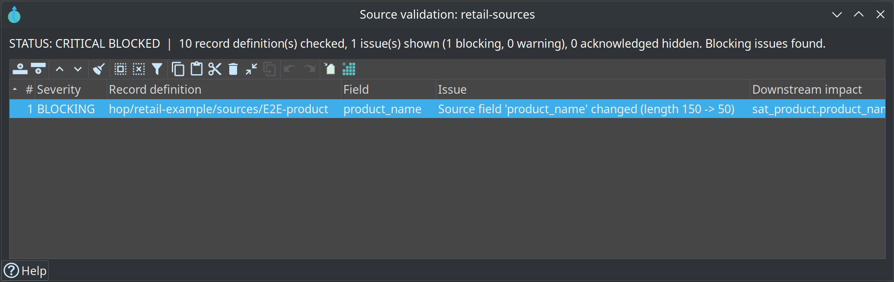
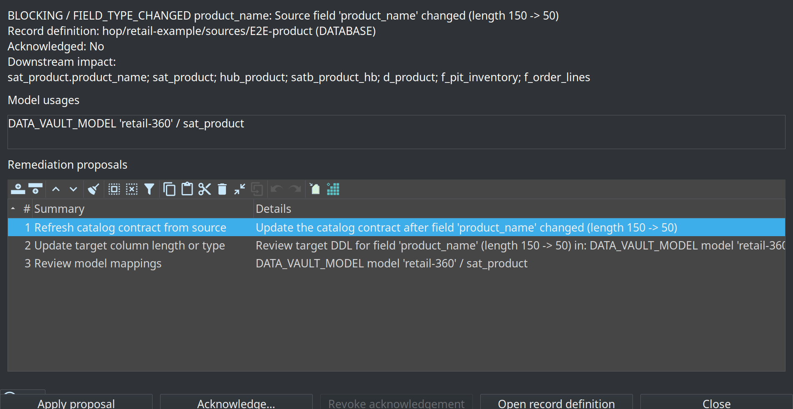
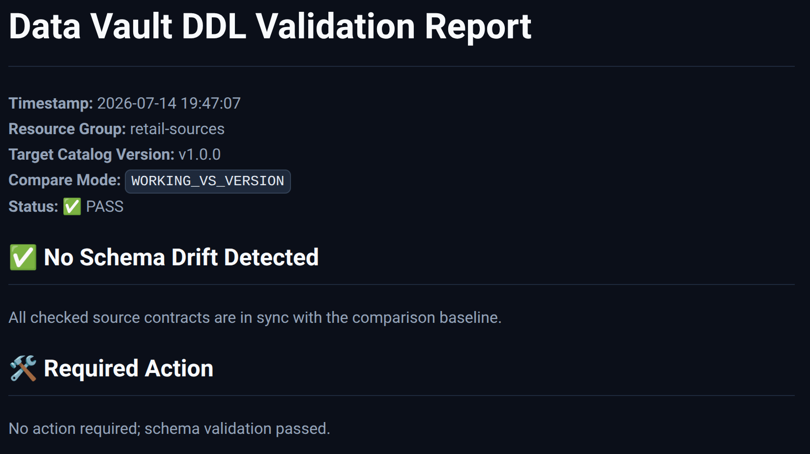
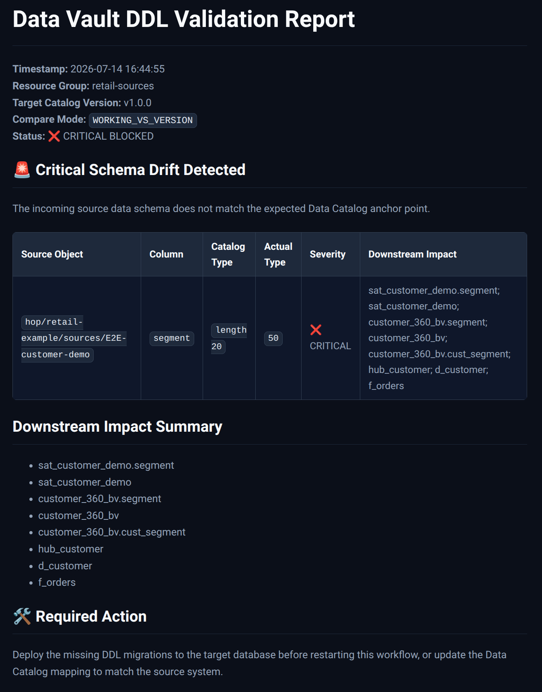

= Resource definition validation
:toc: macro
:toclevels: 3

toc::[]

Beyond **Check model** on `.hdv` / `.hbv` / `.hdm` files, the plugin validates **Data Catalog record definitions** — especially `DV_SOURCE` feeds — and surfaces issues in the Hop GUI with optional remediation, acknowledgements, **downstream impact**, and **catalog version** baselines for CI/CD.

== When validation runs

* Explicit **Validate sources** on a **Resource definition group** metadata editor (design time)
* Workflow action **Validate resource definitions (schema gate)** before DV/BV/DM loads (CI/CD)
* Pipelines that depend on catalog layout (indirectly, via model checks and source resolution)

Model validation and catalog validation are complementary: a passing model check still requires accurate source definitions in the catalog.

== Resource definition group (design time)

Open metadata type **Resource definition group**. A group scopes which DV / BV / DM model files participate in validation and catalog-version tagging. Set **Default catalog connection** to your FILE catalog (retail: `local-catalog` → `work/edw-catalog`).

Bottom of the editor:

* **List catalog versions** — review tags already stored under the catalog’s `catalog-versions/` folder
* **Tag catalog version** — freeze current source contracts for a semantic tag (for example `v1.0.0`)
* **Validate sources** — run schema comparison and open the results dialog

image::images/resource-definition-group-editor-with-version-mgt-buttons.png[Resource definition group editor for retail-sources with List catalog versions, Tag catalog version, and Validate sources,align="center"]

Catalog version storage and scope are described in link:data-catalog.adoc#catalog-versions[Data Catalog — Catalog versions].

== Workflow action (CI/CD schema gate)

Add **Validate resource definitions** to a workflow (category General) and place it **before** Data Vault / Business Vault / Dimensional update actions.

image::images/validate-resource-definitions-action-dialog.png[Validate resource definitions action dialog with WORKING_VS_VERSION, baseline v1.0.0, and report path under work/reports,align="center"]

| Parameter | Purpose |
|-----------|---------|
| Resource definition group | Required validation scope (for example `retail-sources`) |
| Target catalog version | Tag such as `v1.0.0` / `${TARGET_VERSION}`, or a ComboVar free-typed expression. **LIVE_SOURCE:** expected contract (empty = working tree). **VERSION_VS_VERSION:** the *actual* tag. **WORKING_VS_VERSION:** used as baseline if Baseline is empty. |
| Compare mode | `LIVE_SOURCE` (default), `WORKING_VS_VERSION`, `VERSION_VS_VERSION` |
| Baseline catalog version | **WORKING_VS_VERSION / VERSION_VS_VERSION:** expected/reference tag. **LIVE_SOURCE:** used as expected when Target is empty. ComboVar list is filled from tags in the group’s FILE catalog. |
| Report output path | Folder/path for Markdown and/or HTML (Hop VFS), for example `${PROJECT_HOME}/work/reports` |
| Report file base name | Optional base name without extension (defaults to a group/timestamp name) |
| Report format | `MARKDOWN`, `HTML`, or `BOTH` |
| Failure severity | `FAIL_ON_BLOCKING` (default), `FAIL_ON_WARNINGS`, `WARN_ONLY` |
| Fail on warnings (legacy) | Older workflows only; prefer **Failure severity** |
| Include downstream impact | Annotate issues with Source→DV→BV→DM blast radius |

=== Compare modes

| Mode | Expected (baseline) | Actual | Typical use |
|------|---------------------|--------|-------------|
| `LIVE_SOURCE` | Working tree, or Target/Baseline tag | Live physical source discovery | Daily CI against CRM/source DB |
| `WORKING_VS_VERSION` | Baseline (or Target if Baseline empty) tag | Working-tree catalog | Detect catalog field length/type edits without a live DB |
| `VERSION_VS_VERSION` | Baseline tag | Target tag | Offline PR review between two frozen contracts |

Version fields support Hop variables (for example `${PROMOTED_TAG}`). Tag lists refresh when the resource definition group changes.

== Validation results dialog (GUI)

After **Validate sources**, the **Source validation** dialog lists issues with a status banner (`PASS` / `WARNINGS` / `CRITICAL BLOCKED`):

* **BLOCKING** rows are highlighted in red
* **WARNING** rows are highlighted in amber
* **Downstream impact** shows hubs, satellites, BV, and DM dependents when known
* Toolbar actions support filtering, copy, and related catalog operations

== Issue detail and remediation

Select (or open) an issue for the **Issue** dialog:

* Severity / issue code (for example `FIELD_TYPE_CHANGED`) and full description
* Record definition identity (`namespace/name`)
* **Downstream impact** list (satellite fields, BV tables, dimensions, facts)
* **Model usages** (for example `DATA_VAULT_MODEL 'retail-360' / sat_product`)
* **Remediation proposals** when the engine can suggest a fix:
** Refresh catalog contract from source
** Update target column length or type
** Review model mapping
* **Apply proposal** — accept a selected proposal and update the catalog record (blocking applies confirm blast radius)
* **Acknowledge…** — record that a warning is accepted with a reason and optional expiry
* **Open record definition** — jump to the catalog editor

Acknowledgements persist with the catalog record so teams can document conscious exceptions (for example known schema drift in a non-production feed).

== HTML / Markdown gate reports

When the workflow action has a **Report output path**, it writes scannable artifacts via Hop VFS (local, S3, Azure, and similar). The HTML report title is **Data Vault DDL Validation Report** and includes resource group, target/baseline tags, compare mode, status, issue table, downstream impact summary, and required action.

**Pass** (no schema drift vs the comparison baseline):

**Critical blocked** (length/type drift with blast radius):

Markdown siblings are intended for CI log scrapers and PR comments. Retail writes files such as `work/reports/retail-schema-validation.md` and `.html`.

== Practical design-time workflow

. Edit or import sources in the Data Catalog (or refresh contracts from the live system).
. Open the **Resource definition group** → **Validate sources** before attaching feeds to a new `.hdv` model.
. Fix errors; apply proposals where appropriate.
. Acknowledge warnings that are accepted risk, with a short reason.
. **Tag catalog version** when the contract is ready for DTAP promotion.
. Run **Check model** on the `.hdv` file — detailed type checking uses live database schemas when enabled.

== Schema impact simulation (programmatic)

`SchemaImpactSimulationService` orchestrates catalog schema comparison and optional downstream impact enrichment for CI/CD and design-time dry-runs (same modes as the workflow action).

Results include a `ValidationReport`, optional `ImpactGraph` blast-radius labels on issues, and overall status (`PASS` / `WARNING` / `CRITICAL_BLOCKED`).

`SchemaValidationReportFormatter` emits log text, Markdown (CI artifact layout), and HTML. `SchemaValidationReportFileWriter` writes those artifacts via Hop VFS.

== DTAP promotion recipe

Use catalog versions and the schema gate to keep Development, Test, Acceptance, and Production aligned without “deploy and pray.”

. **DEV — approve schema change**
.. Import or refresh source definitions in the Data Catalog.
.. Run **Validate sources** on the resource definition group; review **downstream impact**.
.. Apply remediations or acknowledge accepted warnings.
.. **Tag catalog version** (for example `v2.4.0` or `2026-Q3-Release`) after the contract is agreed.
. **Git promote**
.. Commit model files (`.hdv` / `.hbv` / `.hdm`) and any **seeded** version fixtures. Prefer a gitignored runtime catalog (`work/edw-catalog/`) for working-tree and snapshot files generated on each machine.
.. Promote the same tag through DTAP branches or release artifacts.
. **TEST / ACC / PROD — gate before load**
.. In the daily update workflow, place **Validate resource definitions** before Data Vault / Business Vault / Dimensional update actions.
.. Configure for example:
+
----
Resource definition group: ${RESOURCE_GROUP}
Target catalog version:    ${PROMOTED_TAG}   # empty = working tree only
Compare mode:              LIVE_SOURCE
Report output path:        ${PROJECT_HOME}/work/reports
Report format:             BOTH
Failure severity:          FAIL_ON_BLOCKING  # or FAIL_ON_WARNINGS
Include downstream impact: Y
----
.. On failure, open the Markdown/HTML report under `work/reports/` (or your CI artifact path) and fix DDL / mappings before re-running loads.
. **Offline design review** (optional)
.. `WORKING_VS_VERSION` — compare a tagged baseline to the current working-tree catalog without touching live sources.
.. `VERSION_VS_VERSION` — compare two tags when reviewing a PR that only changes frozen contracts.

=== Retail example

The retail project workflow `retail-example/workflows/run-retail-update-models.hwf` runs **Validate resource definitions** on group `retail-sources` with:

* Compare mode: **`WORKING_VS_VERSION`** — picks up catalog field edits (length/type) against a frozen tag
* Baseline catalog version: **`v1.0.0`** (seeded from `fixtures/schema-gate-baseline/` into `work/edw-catalog/catalog-versions/` by `bootstrap-retail-work.py`)
* Report output path: `${PROJECT_HOME}/work/reports`
* Report base name: `retail-schema-validation`
* Format: Markdown and HTML
* Failure severity: fail on warnings (strict sample)
* Downstream impact enabled

To detect a length change from the tagged baseline, edit the working-tree source JSON (or catalog UI) and re-run the workflow. `LIVE_SOURCE` compares to the **physical** CRM table and will not see catalog-only metadata edits.

Generated files look like `retail-example/work/reports/retail-schema-validation.md` (and `.html`) when the gate runs. See also link:getting-started-retail.adoc[Getting started with the retail example].

=== Limitations (MVP)

* Catalog version snapshots freeze **source record definitions**, not model files (models stay in Git).
* Dimensional impact from free-form SQL is **table-level** only.
* The validation action does **not** auto-apply DDL; pair with update-action `failIfDdlNeeded` for target-DB readiness.
* Content quality (nulls, ranges, allowed values) uses the separate Measure / Evaluate quality gate stack — see link:data-quality.adoc[Data quality].

== Related documents

* link:data-catalog.adoc[Data Catalog]
* link:datavault-source.adoc[Data Vault Source]
* link:datavault-update-action.adoc[Data Vault Update action] (model check options)
* link:data-quality.adoc[Data quality]
* link:getting-started-retail.adoc[Getting started — retail example]
