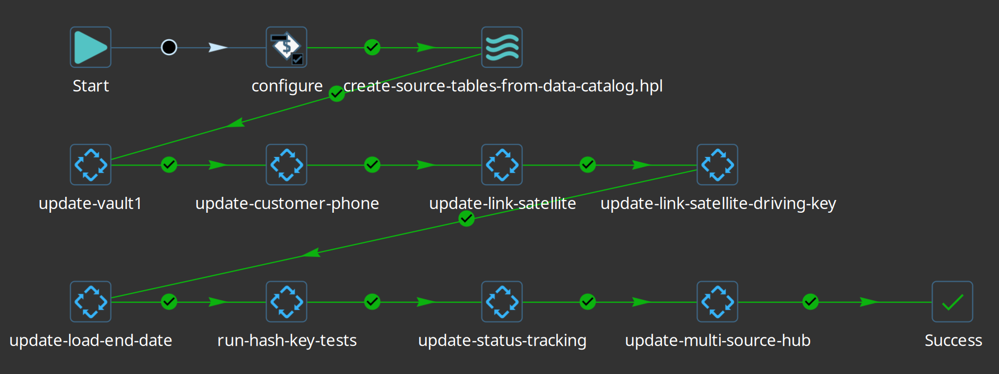
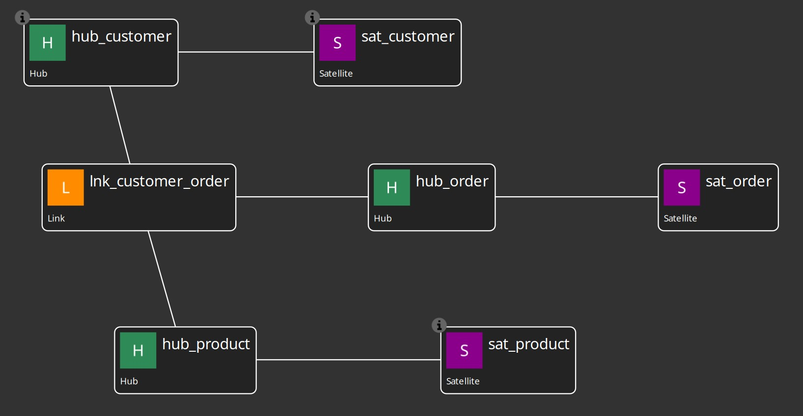
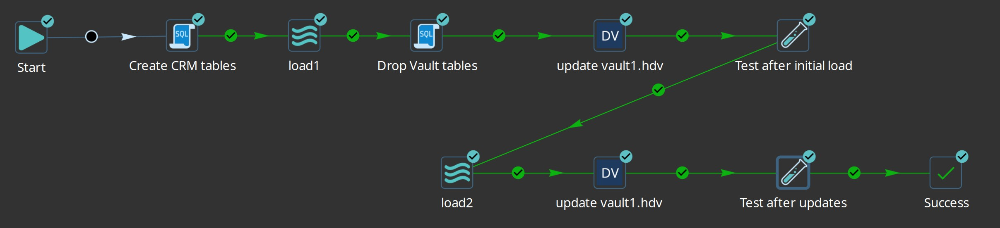
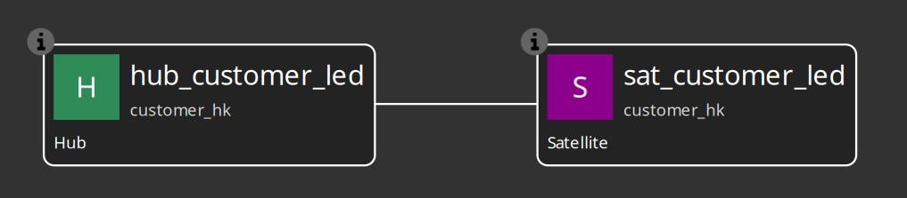
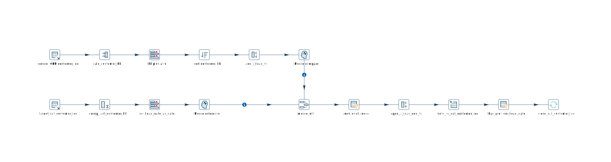
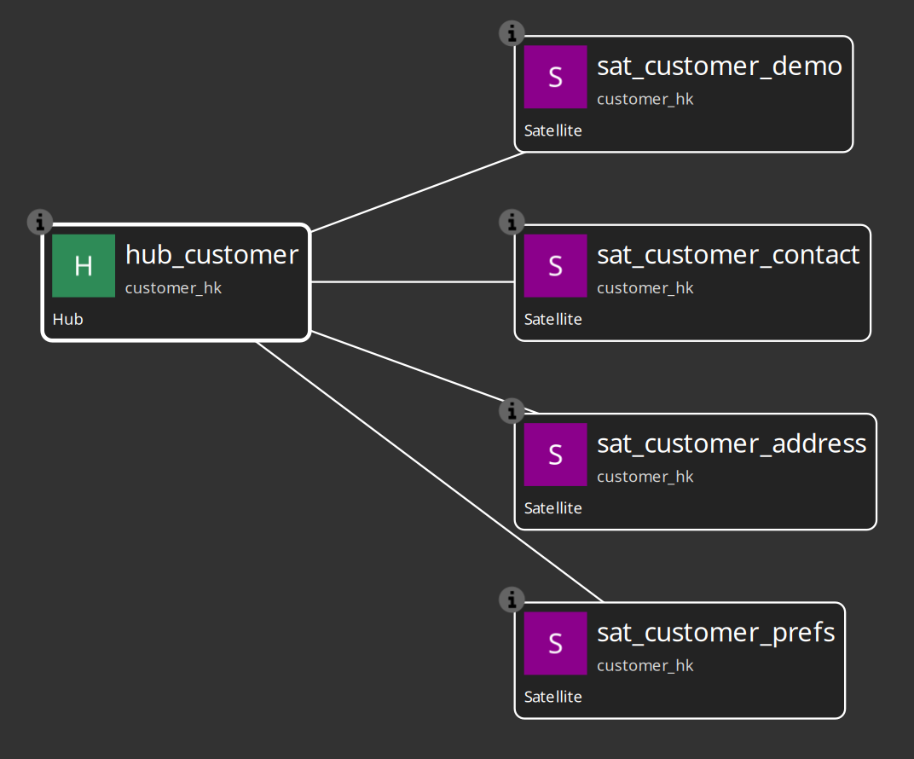

# Integration tests — Hop Data Vault project

> **Prerequisites**
>
> - Register this `integration-tests/` folder as a Hop project (name: **`hop-data-vault`**).
> - Configure the two database connections **`CRM`** and **`Vault`** in project metadata (`metadata/rdbms/CRM.json` and `metadata/rdbms/Vault.json`).
> - **Docker** with Compose v2 — used by `run-tests.sh` and `run-tests-all-databases.sh` to run workflows in a short-lived Hop container (`docker-hop:latest`). No local Hop installation is required for command-line testing.
> - **Python 3** — used by the test scripts to print the metrics overview table at the end of a run (stdlib only; no extra packages).
> - Testing has been done with **PostgreSQL**, **MySQL**, and **SingleStore** (see [Docker multi-database tests](#docker-multi-database-tests) below).
> - For Hop GUI use, install the **hop-datavault** plugin (**0.0.16-SNAPSHOT**) in your Hop 2.18.1 environment.

**CI and regression reference** — not the primary tutorial. For learning, use [retail-example](../retail-example/) and [docs/getting-started-retail.adoc](../docs/getting-started-retail.adoc). Documentation index: [docs/README.md](../docs/README.md).

This folder is a sample Hop project demonstrating the Data Vault 2.0 and Business Vault plugin: model-driven DDL, pipeline generation, initial and incremental loads, multi-active satellites, link satellites, load end date satellites, status tracking, multi-source hubs, **multi-satellite Business Vault SCD2**, external read-only DV tables, and golden-dataset unit tests.

DV source catalog entries use namespace **`hop/integration-tests/sources`** (must match paths under `catalog-data/hop/integration-tests/sources/`).

## Project layout

```
integration-tests/
├── project-config.json          # Hop project settings (metadata, datasets, unit tests)
├── run-postgres.sh              # Wrapper → ../scripts/run-postgres.sh
├── run-tests.sh                 # Wrapper → ../scripts/run-hop.sh integration-tests …
├── run-tests-all-databases.sh   # Full suite against Docker PostgreSQL, MySQL, SingleStore
├── run-svg.sh                   # Export DV/BV/pipeline SVGs via hop svg in Docker
├── SCRIPTS.md                   # How the shell scripts work together
../scripts/docker/               # Docker image, compose files (shared with retail-example)
│   ├── Dockerfile               # Extends apache/hop:2.18.1 with plugin + JDBC drivers
│   ├── compose.hop.yml          # Hop-only (host network, for run-tests.sh)
│   ├── compose.postgres-local.yml # PostgreSQL only on port 54320 (for run-postgres.sh)
│   ├── compose.<engine>.yml     # Database + Hop (for run-tests-all-databases.sh)
│   └── hop-docker-lib.sh        # Shared image build, metrics, and ownership helpers
├── metrics/                     # DV update metrics JSON + overview CSV (gitignored)
├── vault-catalog/               # DV Update catalog publish output (gitignored)
├── catalog-data/                # Stable source record definitions (version controlled)
├── metadata/                    # RDBMS, DV config/sources, datasets, unit-test definitions
├── datasets/                    # Golden CSVs referenced by Hop unit tests
├── files/                       # Source CSVs fed into CRM staging tables by load pipelines
├── images/                      # Screenshots (models, workflows, generated pipelines)
└── tests/
    ├── run-tests.hwf            # Orchestrator: runs all test suites in sequence
    ├── shared/                  # Shared pipelines (catalog DDL, metrics collection)
    ├── basic/
    ├── satellite-multi-active/
    ├── link-satellite/
    ├── link-satellite-driving-key/
    ├── load-end-date/
    ├── status-tracking/
    ├── multi-source-hub/
    ├── multi-satellite-bv/
    └── hash-key/
```

| Path | Purpose |
|------|---------|
| `metadata/data-vault-configuration/` | Hash / naming / satellite strategy (`vault-config`, `load-end-date-config`) |
| `metadata/data-catalog/` | Data catalog connections (`local-catalog` → `catalog-data/`, `vault-catalog` → `vault-catalog/`) |
| `catalog-data/hop/integration-tests/sources/` | DV record sources (CRM feeds, field layouts, groups) under namespace `hop/integration-tests/sources` — read by pipelines and DV Update |
| `vault-catalog/` | Runtime catalog output from Data Vault Update publish (gitignored) |

**Two catalogs:** `local-catalog` holds stable, version-controlled DV source record definitions. Data Vault Update actions with **Update data catalog** enabled publish only target table snapshots (`hop/project/models/`) to `vault-catalog` so test runs do not dirty `catalog-data/` in git.
| `metadata/dataset/` | Hop dataset definitions pointing at `datasets/*.csv` |
| `metadata/unit-test/` | Pipeline unit test metadata |
| `tests/basic/vault1.hdv` | Classic hub / link / satellite model (customer, order, product) |
| `tests/satellite-multi-active/customer-phone.hdv` | Hub + multi-active satellite (`phone_type` driving key) |
| `tests/link-satellite/link-satellite.hdv` | Hubs + link + link satellite (customer–product relationship attributes) |
| `tests/link-satellite-driving-key/link-satellite-driving-key.hdv` | Hubs + link + multi-active link satellite (`line_number` driving key) |
| `tests/load-end-date/load-end-date.hdv` | Hub + standard satellite with load end date (`x_load_end_ts`) |

`project-config.json` sets `metadataBaseFolder`, `dataSetsCsvFolder`, and `unitTestsBasePath` relative to `${PROJECT_HOME}`.

## Quick start: run tests

### Command line (Docker)

Both test scripts use the same Hop Docker image (`docker-hop:latest`). The image is built automatically on first use and reused on later runs. Shared logic lives in `docker/hop-docker-lib.sh`.

**`run-postgres.sh`** — start a local PostgreSQL 16 container on port **54320** (`test` / `test` / `test`). Required before `run-tests.sh`.

```bash
./run-postgres.sh up       # start and wait for healthy
./run-postgres.sh status   # check container and connectivity
./run-postgres.sh down     # stop (keeps data volume)
```

**`run-tests.sh`** — run against the local Docker PostgreSQL above. The Hop container uses host networking and loads [`environments/local-docker-postgres.json`](environments/local-docker-postgres.json) so CRM/Vault connections resolve `${DB_*}` variables in `metadata/rdbms/`.

```bash
./run-postgres.sh up

# All suites (~20 seconds)
./run-tests.sh

# One workflow
./run-tests.sh tests/load-end-date/update-load-end-date.hwf

# Skip metrics overview collection
COLLECT_METRICS=N ./run-tests.sh
```

See [`SCRIPTS.md`](SCRIPTS.md) for full script reference.

**`run-tests-all-databases.sh`** — run the full suite against containerised PostgreSQL, MySQL, and SingleStore (no host database required).

```bash
# All three engines (postgres → mysql → singlestore)
./run-tests-all-databases.sh

# One engine
./run-tests-all-databases.sh postgres
```

Each engine uses `project/docker/compose.<engine>.yml`: a database service (`db`) and a short-lived `hop` service that runs `run-tests.hwf` with the matching environment file under `project/environments/`. Connection metadata is swapped in at container start from `project/metadata/rdbms/profiles/<engine>/`.

`run-tests-all-databases.sh` backs up your local `metadata/rdbms/CRM.json` and `Vault.json` before the run and restores them when finished (including on failure or interrupt), so GUI and `run-tests.sh` keep using your configured connections.

### Hop GUI

Open this folder as a Hop project and run **`tests/run-tests.hwf`**, or run any child workflow directly. Requires a local Hop 2.18.1 installation with the hop-datavault plugin.



### Orchestrator: `tests/run-tests.hwf`

The orchestrator creates CRM source tables from the data catalog, then runs each test suite in sequence:

1. **`tests/basic/update-vault1.hwf`** — vault1 initial + incremental load with validation
2. **`tests/satellite-multi-active/update-customer-phone.hwf`** — multi-active satellite
3. **`tests/link-satellite/update-link-satellite.hwf`** — link + link satellite
4. **`tests/link-satellite-driving-key/update-link-satellite-driving-key.hwf`** — multi-active link satellite with driving key
5. **`tests/load-end-date/update-load-end-date.hwf`** — load end date satellite
6. **`tests/hash-key/run-hash-key-tests.hwf`** — hash key generation unit tests
7. **`tests/status-tracking/update-status-tracking.hwf`** — status tracking satellite
8. **`tests/multi-source-hub/update-multi-source-hub.hwf`** — multi-source hub
9. **`tests/multi-satellite-bv/update-customer-360.hwf`** — four DV satellites → Customer 360 BV SCD2

All suites must succeed for a full test run.

### Metrics collection

Every **Data Vault Update** action in the test workflows writes per-run metrics JSON when `METRICS_FOLDER` is set (via the `METRICS_FOLDER` workflow parameter, passed through `HOP_RUN_PARAMETERS` in Docker).

| Script | Metrics folder | Example path |
|--------|----------------|--------------|
| `run-tests.sh` | `metrics/local/` | `project/metrics/local/vault1-<channel>.json` |
| `run-tests-all-databases.sh` | `metrics/<engine>/` | `project/metrics/postgres/vault1-<channel>.json` |

After a run, the scripts execute `tests/shared/collect-metrics-results.hpl` in a short-lived Hop container. That pipeline reads all `metrics/**/*.json` files and writes `project/metrics/metrics-overview.csv`. A formatted summary table is then printed to the console using **Python 3** (stdlib `csv` module only).

The `project/metrics/` tree is gitignored. Override the metrics folder:

```bash
METRICS_FOLDER=/project/metrics/custom ./run-tests-all-databases.sh postgres
```

### Regenerating documentation SVG images

Use **`run-svg.sh`** to export canvases via the same Docker image as the test runner (`docker-hop:latest` = `apache/hop` + **hop-datavault** plugin). Host paths are translated to `/workspace/...` inside the container (repository root is mounted).

```bash
cd project

# Single model → docs image (paths relative to project/ or repo root)
./run-svg.sh -f tests/multi-satellite-bv/customer-360.hdv \
             -o ../docs/images/data-vault-model-customer-360.svg --no-notes

./run-svg.sh -f tests/multi-satellite-bv/customer-360.hbv \
             -o ../docs/images/business-vault-model-customer-360.svg --no-notes

# Or via environment variables (HOP_COMMAND defaults to svg)
HOP_COMMAND_PARAMETERS="-f tests/multi-satellite-bv/customer-360.hdv \
  -o ../docs/images/customer-360.svg --no-notes" ./run-svg.sh

# Batch folder
./run-svg.sh -s tests/multi-satellite-bv -t ../docs/images/generated -r --no-notes
```

Optional: `HOP_IMAGE_VERSION=2.18.1` when building the image to pin the base `apache/hop` tag.

With a local Hop install and plugin, you can also run `hop svg` directly (see [docs/README.md](../docs/README.md)). Convert `.svg` to `.png` if your docs use PNG screenshots.

### Docker multi-database tests

A custom image extends `apache/hop:2.18.1` with the **hop-datavault** plugin and JDBC drivers (fetched at image build time via Maven). The project folder is bind-mounted into the container at `/project`.

**Requirements:** Docker with Compose v2. SingleStore needs ~6 GB RAM for the dev image.

---

## Test suite: `tests/basic/` (vault1)

### Sample model

- **Model file:** `tests/basic/vault1.hdv`
- **Configuration:** `vault-config`
- **Hubs:** `hub_customer`, `hub_order`, `hub_product`
- **Link:** `lnk_customer_order` (customer ↔ order ↔ product)
- **Satellites:** `sat_customer`, `sat_order`, `sat_product`
- **Record sources:** `CRM-customer`, `CRM-order`, `CRM-product`



### Workflow: `tests/basic/update-vault1.hwf`

End-to-end demonstration — **initial load** and **incremental update** in one run:

1. **Create CRM tables** — `customer`, `product`, `order` on the CRM connection.
2. **load1** — `tests/basic/load1.hpl` loads `files/basic/*_load1.csv` into CRM.
3. **Drop Vault tables** — clean slate for hub, satellite, and link tables.
4. **update vault1.hdv** — Data Vault Update action:
   - Generates update pipelines per table / record source
   - Creates or alters vault tables and performs insert-only loads
5. **Test after initial load** — hub, satellite, and link unit tests against golden datasets.
6. **load2** — `tests/basic/load2.hpl` loads `files/basic/*_load2.csv`.
7. **update vault1.hdv** (second run) — applies deltas only.
8. **Test after updates** — re-runs validation for the post-load2 state.



Golden datasets: `hub-customer-golden`, `hub-customer-golden-load2`, `sat-customer-golden`, `sat-customer-golden-load2`, and similar for order, product, and link tables. Validation pipelines are in `tests/basic/validate-*.hpl`.

---

## Test suite: `tests/satellite-multi-active/` (customer phone)

### Sample model

- **Model file:** `tests/satellite-multi-active/customer-phone.hdv`
- **Configuration:** `vault-config`
- **Hub:** `hub_customer_phone` (business key `customer_id`)
- **Satellite:** `sat_customer_phone` with **driving key** `phone_type`, attribute `phone_number`
- **Record source:** `CRM-customer-phone` → `customer_phone` table

Multi-active behavior: one satellite row per customer **and** phone type (e.g. MOBILE and HOME for the same customer).


### Workflow: `tests/satellite-multi-active/update-customer-phone.hwf`

1. **Create customer_phone table** on CRM.
2. **Drop Vault tables** — `hub_customer_phone`, `sat_customer_phone`.
3. **load-customer-phone1** — from `files/multi-active-satellite/customer_phone_load1.csv`.
4. **update customer-phone.hdv** — first Data Vault Update (DDL enabled, model checks on).
5. **Test after initial** — validate-hub-customer-phone UNIT, validate-sat-customer-phone UNIT.
6. **load-customer-phone2** — incremental batch from `customer_phone_load2.csv`.
7. **update customer-phone.hdv** — second update (delta load).
8. **Test after initial 2** — validate-hub-customer-phone2 UNIT.

Golden datasets: `hub-customer-phone-golden1/2`, `sat-customer-phone-golden1/2` in `datasets/`.

---

## Test suite: `tests/link-satellite/` (customer–product link satellite)

### Sample model

- **Model file:** `tests/link-satellite/link-satellite.hdv`
- **Configuration:** `vault-config`
- **Hubs:** `hub_customer_ls` (`customer_id`), `hub_product_ls` (`product_id`)
- **Link:** `lnk_customer_product` — connects both hubs; references `sat_lnk_customer_product`
- **Link satellite:** `sat_lnk_customer_product` — parent is the link; attributes `quantity`, `discount_pct`
- **Record source:** `CRM-customer-product` → `customer_product` table

Link satellite behavior: descriptive attributes on the relationship are stored in a satellite keyed by the **link hash key**.


### Workflow: `tests/link-satellite/update-link-satellite.hwf`

1. **Create customer_product table** on CRM.
2. **Drop Vault tables** — `hub_customer_ls`, `hub_product_ls`, `lnk_customer_product`, `sat_lnk_customer_product`.
3. **load-customer-product1** — from `files/link-satellite/customer_product_load1.csv`.
4. **update link-satellite.hdv** — first Data Vault Update (DDL enabled, model checks on).
5. **Test after initial** — validate-lnk-customer-product UNIT, validate-sat-lnk-customer-product UNIT.
6. **load-customer-product2** — incremental batch from `customer_product_snapshot_after_updates.csv`.
7. **update link-satellite.hdv** (second run) — applies deltas only.
8. **Test after update** — validate-lnk-customer-product2 UNIT, validate-sat-lnk-customer-product2 UNIT.

Golden datasets: `lnk-customer-product-golden1/2`, `sat-lnk-customer-product-golden1/2` in `datasets/`. Validation pipelines are in `tests/link-satellite/validate-*.hpl`.

---

## Test suite: `tests/link-satellite-driving-key/` (multi-active link satellite)

### Sample model

- **Model file:** `tests/link-satellite-driving-key/link-satellite-driving-key.hdv`
- **Configuration:** `vault-config`
- **Hubs:** `hub_customer_lsd` (`customer_id`), `hub_product_lsd` (`product_id`)
- **Link:** `lnk_customer_product_lsd` — connects both hubs; references `sat_lnk_customer_product_lsd`
- **Link satellite:** `sat_lnk_customer_product_lsd` — parent is the link; **driving key** `line_number`; attributes `quantity`, `discount_pct`
- **Record source:** `CRM-customer-product-line` → `customer_product_line` table

Multi-active link satellite behavior: one satellite row per link hash key **and** driving key (e.g. multiple order lines for the same customer–product relationship). Change detection is scoped per driving key — updating line 1 does not affect line 2.

### Workflow: `tests/link-satellite-driving-key/update-link-satellite-driving-key.hwf`

1. **Create customer_product_line table** on CRM.
2. **Drop Vault tables** — `hub_customer_lsd`, `hub_product_lsd`, `lnk_customer_product_lsd`, `sat_lnk_customer_product_lsd`.
3. **load-customer-product-line1** — from `files/link-satellite-driving-key/customer_product_line_load1.csv` (3 lines across 2 relationships).
4. **update link-satellite-driving-key.hdv** — first Data Vault Update (DDL enabled, model checks on).
5. **Test after initial** — validate-lnk-customer-product-lsd UNIT, validate-sat-lnk-customer-product-lsd UNIT.
6. **load-customer-product-line2** — incremental batch from `customer_product_line_load2.csv` (attribute change on one line, new relationship).
7. **update link-satellite-driving-key.hdv** (second run) — applies deltas only.
8. **Test after update** — validate-lnk-customer-product-lsd2 UNIT, validate-sat-lnk-customer-product-lsd2 UNIT.

Golden datasets: `lnk-customer-product-lsd-golden1/2`, `sat-lnk-customer-product-lsd-golden1/2` in `datasets/`. Validation pipelines are in `tests/link-satellite-driving-key/validate-*.hpl`.

---

## Test suite: `tests/load-end-date/` (load end date)

### Sample model

- **Model file:** `tests/load-end-date/load-end-date.hdv`
- **Configuration:** `load-end-date-config` (`useLoadEndDate` enabled)
- **Hub:** `hub_customer_led` (business key `customer_id`)
- **Satellite:** `sat_customer_led` with attributes `name`, `email`
- **Record source:** `CRM-load-end-date` → `customer_led` table



### Configuration

The `load-end-date-config` metadata object sets custom column names and enables end-dating:

| Setting | Value |
|---------|--------|
| `loadDateField` | `x_load_ts` |
| `loadEndDateField` | `x_load_end_ts` |
| `recordSourceField` | `x_record_source` |
| `useLoadEndDate` | `true` |


### Load end date behavior

When satellite attributes change on an incremental load:

1. A **new row** is inserted with the updated attributes and an **open** end date (`x_load_end_ts IS NULL`).
2. The **prior row** is closed: `x_load_end_ts` is set to the new batch load timestamp.

On initial load, all rows are inserted with a null end date — no close/update step runs.

**Query current satellite attributes:**

```sql
SELECT customer_hk, name, email, x_load_ts
FROM sat_customer_led
WHERE x_load_end_ts IS NULL
```

**Query history** for a customer:

```sql
SELECT customer_hk, name, email, x_load_ts, x_load_end_ts
FROM sat_customer_led
WHERE customer_hk = '<hash>'
ORDER BY x_load_ts
```

The generated update pipeline reads only current rows from the target (`WHERE x_load_end_ts IS NULL`) before the merge diff, which keeps incremental loads efficient as history grows.



### Workflow: `tests/load-end-date/update-load-end-date.hwf`

1. **Create customer_led table** on CRM.
2. **Drop Vault tables** — `hub_customer_led`, `sat_customer_led`.
3. **load-customer-led1** — from `files/load-end-date/customer_led_load1.csv` (3 customers).
4. **update load-end-date.hdv** — first Data Vault Update (DDL enabled, model checks on).
5. **Test after initial** — validate-hub-customer-led UNIT, validate-sat-customer-led UNIT.
6. **load-customer-led2** — from `customer_led_load2.csv` (email change for 1001, new customer 1004).
7. **update load-end-date.hdv** — second update (delta load with end-dating).
8. **Test after update** — validate-hub-customer-led2 UNIT, validate-sat-customer-led2 UNIT.

Golden datasets: `hub-customer-led-golden1/2`, `sat-customer-led-golden1/2` in `datasets/`.

---

## Test suite: `tests/basic/` — Business Vault intro (`vault1.hbv`)

After the raw vault load in `update-vault1.hwf`, you can rebuild a simple Business Vault SCD2 table:

- **BV model:** `tests/basic/vault1.hbv` (links to `vault1.hdv`)
- **SCD2 table:** `sat_customer_hb` — one satellite derivative (`sat_customer`)
- **Workflow:** `tests/basic/update-bv-vault1.hwf` (optional; not in the main orchestrator)

See [docs/business-vault-scd2.adoc](../docs/business-vault-scd2.adoc) for SCD2 concepts.

---

## Test suite: `tests/multi-satellite-bv/` (Customer 360 Business Vault)

### Sample models

- **DV model:** `tests/multi-satellite-bv/customer-360.hdv` — hub `hub_customer` and four satellites (demo, contact, address, preferences)



- **BV model:** `tests/multi-satellite-bv/customer-360.hbv` — SCD2 table `customer_360_bv` with 11 field mappings across four satellites


The SCD2 table dialog (General, Field mappings, Satellite settings):


- **External variant:** `customer-360-external.hdv` / `customer-360-external.hbv` — same BV layout; all satellites use **External read-only** integration mode (Hop skips DV DDL/pipelines; BV reads warehouse history from metadata)


### Workflow: `tests/multi-satellite-bv/update-customer-360.hwf`

1. Generate catalog sources and load CSV waves into CRM staging tables
2. **Data Vault Update** on `customer-360.hdv` (or external variant if vault tables are pre-loaded)
3. **Business Vault Update** on the matching `.hbv` — rebuild `customer_360_bv`
4. **validate-customer-360-bv.hpl** — unit test against golden dataset

Fixture walkthrough: [docs/getting-started-integration-tests.adoc](../docs/getting-started-integration-tests.adoc).

---

## Data Vault Update action

All test workflows use the same **Data Vault Update** workflow action. Point it at an `.hdv` file, choose a pipeline run configuration, and optionally enable DDL generation, special-record insertion, and metrics output (`metricsOutputFolder` → `${METRICS_FOLDER}`).


Typical settings for a first run in these tests:

- **Update target database structure:** yes (creates vault tables)
- **Ensure special records:** yes (UNKNOWN / INVALID hub rows)
- **Log / abort on model check failures:** yes on first run
- **Detailed data type checking:** yes (validates source-to-target field types against live CRM schema)
- **Parallel pipeline copies:** `1` (default; increase for faster multi-table loads on larger models)

Second runs in the same workflow usually disable DDL and special-record steps and only apply deltas.

### Model validation in the GUI

Before running workflows you can validate any `.hdv` file with **Check model** on the model toolbar. The same checks run in the update action when logging or abort-on-failure is enabled. Validation includes structural rules and source-to-target type compatibility (detailed mode reads live database column metadata).

In the visual model editor, use **left-click context menus with icon actions** to add and edit tables and notes — there is no right-click or double-click interaction.

---

## Notes

- **Dependencies for command-line testing:** Docker (with Compose v2) and Python 3. The Hop GUI and plugin remain optional for interactive development.
- Link tables (`lnk_*`) are created and loaded in the vault1 flow; dedicated link unit tests exist there (`validate-lnk-customer-order UNIT`). The link-satellite suite adds full coverage for link + link satellite loads and change detection.
- The Data Vault Update action supports **`recordSourceGroup`** on record sources tagged with **`group`** in metadata — useful for partial scheduled loads (not exercised in these sample workflows; all groups are empty).
- All connections, run configurations, sources, and unit tests are under `metadata/`.
- Source CSVs under `files/` are inputs to load pipelines; `datasets/` holds expected outputs for Hop unit tests.
- Plugin documentation is under `docs/`. Start with [`docs/README.md`](../docs/README.md) (index), [`docs/getting-started-retail.adoc`](../docs/getting-started-retail.adoc) (tutorial), [`docs/getting-started-integration-tests.adoc`](../docs/getting-started-integration-tests.adoc) (fixtures), and [`docs/datavault-plugin.adoc`](../docs/datavault-plugin.adoc) (reference).