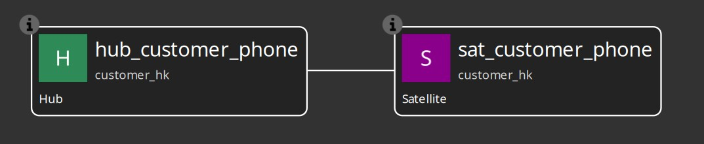
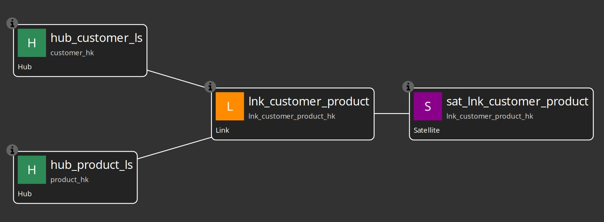
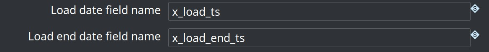
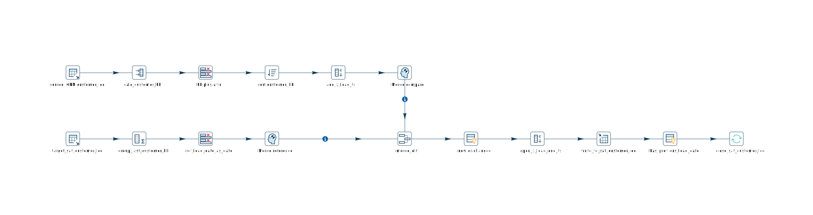

# Sample Hop Data Vault Project

> **Prerequisites**
>
> - Register this `project/` folder as a Hop project (name: **`hop-data-vault`**).
> - Configure the two database connections **`CRM`** and **`Vault`** in project metadata (`metadata/rdbms/CRM.json` and `metadata/rdbms/Vault.json`).
> - Testing has been done with **PostgreSQL**, **MySQL**, and **SingleStore** (see [Docker multi-database tests](#docker-multi-database-tests) below).
> - Install the **hop-datavault** plugin (**0.0.8-SNAPSHOT**) in your Hop 2.18.0 environment.

This folder is a sample Hop project demonstrating the Data Vault 2.0 plugin: model-driven DDL, pipeline generation, initial and incremental loads, multi-active satellites, link satellites, load end date satellites, and golden-dataset unit tests.

## Project layout

```
project/
├── project-config.json          # Hop project settings (metadata, datasets, unit tests)
├── run-tests.sh                 # Shell wrapper to run workflows via hop run
├── metadata/                    # RDBMS, DV config/sources, datasets, unit-test definitions
├── datasets/                    # Golden CSVs referenced by Hop unit tests
├── files/                       # Source CSVs fed into CRM staging tables by load pipelines
│   ├── basic/
│   ├── multi-active-satellite/
│   ├── link-satellite/
│   ├── link-satellite-driving-key/
│   └── load-end-date/
├── images/                      # Screenshots (models, workflows, generated pipelines)
└── tests/
    ├── run-tests.hwf            # Orchestrator: runs all test suites in sequence
    ├── basic/
    ├── satellite-multi-active/
    ├── link-satellite/
    ├── link-satellite-driving-key/
    └── load-end-date/
```

| Path | Purpose |
|------|---------|
| `metadata/data-vault-configuration/` | Hash / naming / satellite strategy (`vault-config`, `load-end-date-config`) |
| `metadata/data-catalog/` | Data catalog connection (`local-catalog` → `catalog-data/`) |
| `catalog-data/hop/project/sources/` | DV record sources (CRM feeds, field layouts, groups) |
| `metadata/dataset/` | Hop dataset definitions pointing at `datasets/*.csv` |
| `metadata/unit-test/` | Pipeline unit test metadata |
| `tests/basic/vault1.hdv` | Classic hub / link / satellite model (customer, order, product) |
| `tests/satellite-multi-active/customer-phone.hdv` | Hub + multi-active satellite (`phone_type` driving key) |
| `tests/link-satellite/link-satellite.hdv` | Hubs + link + link satellite (customer–product relationship attributes) |
| `tests/link-satellite-driving-key/link-satellite-driving-key.hdv` | Hubs + link + multi-active link satellite (`line_number` driving key) |
| `tests/load-end-date/load-end-date.hdv` | Hub + standard satellite with load end date (`x_load_end_ts`) |

`project-config.json` sets `metadataBaseFolder`, `dataSetsCsvFolder`, and `unitTestsBasePath` relative to `${PROJECT_HOME}`.

## Quick start: run tests

### Command line

`run-tests.sh` changes to your local Hop client build and runs `hop run` against the `hop-data-vault` project. Edit the `cd` path at the top of the script if your Hop installation differs.

```bash
# All suites (~20 seconds on a local PostgreSQL)
./run-tests.sh

# One workflow
./run-tests.sh tests/load-end-date/update-load-end-date.hwf
```

### Hop GUI

Open this folder as a Hop project and run **`tests/run-tests.hwf`**, or run any child workflow directly.

### Orchestrator order

1. **`tests/basic/update-vault1.hwf`** — vault1 initial + incremental load with validation
2. **`tests/satellite-multi-active/update-customer-phone.hwf`** — multi-active satellite
3. **`tests/link-satellite/update-link-satellite.hwf`** — link + link satellite
4. **`tests/link-satellite-driving-key/update-link-satellite-driving-key.hwf`** — multi-active link satellite with driving key
5. **`tests/load-end-date/update-load-end-date.hwf`** — load end date satellite

All suites must succeed for a full test run.

### Docker multi-database tests

Run the full `tests/run-tests.hwf` orchestrator against PostgreSQL, MySQL, and SingleStore without a local Hop installation. A custom image extends `apache/hop:2.18.0` with the **hop-datavault** plugin and JDBC drivers (fetched at image build time via Maven).

```bash
# All three engines (postgres → mysql → singlestore)
./run-tests-all-databases.sh

# One engine
./run-tests-all-databases.sh postgres
```

Each engine uses `project/docker/compose.<engine>.yml`: a database service (`db`) and a short-lived `hop` service that runs `run-tests.hwf` with the matching environment file under `project/environments/`. Connection metadata is swapped in at container start from `project/metadata/rdbms/profiles/<engine>/`.

`run-tests-all-databases.sh` backs up your local `metadata/rdbms/CRM.json` and `Vault.json` before the run and restores them when finished (including on failure or interrupt), so GUI and `run-tests.sh` keep using your configured connections.

Data Vault Update metrics JSON is written to `project/metrics/<engine>/` (for example `project/metrics/postgres/`). The project folder is bind-mounted into the container at `/project`; `HOP_RUN_PARAMETERS` passes `METRICS_FOLDER=/project/metrics/<engine>` so each database run keeps its metrics separate. After all database runs, `run-tests-all-databases.sh` runs `tests/shared/collect-metrics-results.hpl` in a short-lived Hop container and writes a combined `project/metrics/metrics-overview.csv`, then prints a formatted table. The `project/metrics/` tree is gitignored. To use a different folder:

```bash
METRICS_FOLDER=/project/metrics/custom ./run-tests-all-databases.sh postgres
```

Requirements: Docker with Compose v2. SingleStore needs ~6 GB RAM for the dev image.

---

## Test suite: `tests/basic/` (vault1)

### Sample model

- **Model file:** `tests/basic/vault1.hdv`
- **Configuration:** `vault-config`
- **Hubs:** `hub_customer`, `hub_order`, `hub_product`
- **Link:** `lnk_customer_order` (customer ↔ order ↔ product)
- **Satellites:** `sat_customer`, `sat_order`, `sat_product`
- **Record sources:** `CRM-customer`, `CRM-order`, `CRM-product`


### Workflow: `tests/basic/update-vault1.hwf`

End-to-end demonstration — **initial load** and **incremental update** in one run:

1. **Create CRM tables** — `customer`, `product`, `order` on the CRM connection.
2. **load1** — `tests/basic/load1.hpl` loads `files/basic/*_load1.csv` into CRM.
3. **Drop Vault tables** — clean slate for hub, satellite, and link tables.
4. **update vault1.hdv** — Data Vault Update action:
   - Generates update pipelines per table / record source
   - Creates or alters vault tables and performs insert-only loads
5. **Test after initial load** — hub, satellite, and link unit tests against golden datasets.
6. **load2** — `tests/basic/load2.hpl` loads `files/basic/*_load2.csv`.
7. **update vault1.hdv** (second run) — applies deltas only.
8. **Test after updates** — re-runs validation for the post-load2 state.


Golden datasets: `hub-customer-golden`, `hub-customer-golden-load2`, `sat-customer-golden`, `sat-customer-golden-load2`, and similar for order, product, and link tables. Validation pipelines are in `tests/basic/validate-*.hpl`.

---

## Test suite: `tests/satellite-multi-active/` (customer phone)

### Sample model

- **Model file:** `tests/satellite-multi-active/customer-phone.hdv`
- **Configuration:** `vault-config`
- **Hub:** `hub_customer_phone` (business key `customer_id`)
- **Satellite:** `sat_customer_phone` with **driving key** `phone_type`, attribute `phone_number`
- **Record source:** `CRM-customer-phone` → `customer_phone` table

Multi-active behavior: one satellite row per customer **and** phone type (e.g. MOBILE and HOME for the same customer).



### Workflow: `tests/satellite-multi-active/update-customer-phone.hwf`

1. **Create customer_phone table** on CRM.
2. **Drop Vault tables** — `hub_customer_phone`, `sat_customer_phone`.
3. **load-customer-phone1** — from `files/multi-active-satellite/customer_phone_load1.csv`.
4. **update customer-phone.hdv** — first Data Vault Update (DDL enabled, model checks on).
5. **Test after initial** — validate-hub-customer-phone UNIT, validate-sat-customer-phone UNIT.
6. **load-customer-phone2** — incremental batch from `customer_phone_load2.csv`.
7. **update customer-phone.hdv** — second update (delta load).
8. **Test after initial 2** — validate-hub-customer-phone2 UNIT.

Golden datasets: `hub-customer-phone-golden1/2`, `sat-customer-phone-golden1/2` in `datasets/`.

---

## Test suite: `tests/link-satellite/` (customer–product link satellite)

### Sample model

- **Model file:** `tests/link-satellite/link-satellite.hdv`
- **Configuration:** `vault-config`
- **Hubs:** `hub_customer_ls` (`customer_id`), `hub_product_ls` (`product_id`)
- **Link:** `lnk_customer_product` — connects both hubs; references `sat_lnk_customer_product`
- **Link satellite:** `sat_lnk_customer_product` — parent is the link; attributes `quantity`, `discount_pct`
- **Record source:** `CRM-customer-product` → `customer_product` table

Link satellite behavior: descriptive attributes on the relationship are stored in a satellite keyed by the **link hash key**.



### Workflow: `tests/link-satellite/update-link-satellite.hwf`

1. **Create customer_product table** on CRM.
2. **Drop Vault tables** — `hub_customer_ls`, `hub_product_ls`, `lnk_customer_product`, `sat_lnk_customer_product`.
3. **load-customer-product1** — from `files/link-satellite/customer_product_load1.csv`.
4. **update link-satellite.hdv** — first Data Vault Update (DDL enabled, model checks on).
5. **Test after initial** — validate-lnk-customer-product UNIT, validate-sat-lnk-customer-product UNIT.
6. **load-customer-product2** — incremental batch from `customer_product_snapshot_after_updates.csv`.
7. **update link-satellite.hdv** (second run) — applies deltas only.
8. **Test after update** — validate-lnk-customer-product2 UNIT, validate-sat-lnk-customer-product2 UNIT.

Golden datasets: `lnk-customer-product-golden1/2`, `sat-lnk-customer-product-golden1/2` in `datasets/`. Validation pipelines are in `tests/link-satellite/validate-*.hpl`.

---

## Test suite: `tests/link-satellite-driving-key/` (multi-active link satellite)

### Sample model

- **Model file:** `tests/link-satellite-driving-key/link-satellite-driving-key.hdv`
- **Configuration:** `vault-config`
- **Hubs:** `hub_customer_lsd` (`customer_id`), `hub_product_lsd` (`product_id`)
- **Link:** `lnk_customer_product_lsd` — connects both hubs; references `sat_lnk_customer_product_lsd`
- **Link satellite:** `sat_lnk_customer_product_lsd` — parent is the link; **driving key** `line_number`; attributes `quantity`, `discount_pct`
- **Record source:** `CRM-customer-product-line` → `customer_product_line` table

Multi-active link satellite behavior: one satellite row per link hash key **and** driving key (e.g. multiple order lines for the same customer–product relationship). Change detection is scoped per driving key — updating line 1 does not affect line 2.

### Workflow: `tests/link-satellite-driving-key/update-link-satellite-driving-key.hwf`

1. **Create customer_product_line table** on CRM.
2. **Drop Vault tables** — `hub_customer_lsd`, `hub_product_lsd`, `lnk_customer_product_lsd`, `sat_lnk_customer_product_lsd`.
3. **load-customer-product-line1** — from `files/link-satellite-driving-key/customer_product_line_load1.csv` (3 lines across 2 relationships).
4. **update link-satellite-driving-key.hdv** — first Data Vault Update (DDL enabled, model checks on).
5. **Test after initial** — validate-lnk-customer-product-lsd UNIT, validate-sat-lnk-customer-product-lsd UNIT.
6. **load-customer-product-line2** — incremental batch from `customer_product_line_load2.csv` (attribute change on one line, new relationship).
7. **update link-satellite-driving-key.hdv** (second run) — applies deltas only.
8. **Test after update** — validate-lnk-customer-product-lsd2 UNIT, validate-sat-lnk-customer-product-lsd2 UNIT.

Golden datasets: `lnk-customer-product-lsd-golden1/2`, `sat-lnk-customer-product-lsd-golden1/2` in `datasets/`. Validation pipelines are in `tests/link-satellite-driving-key/validate-*.hpl`.

---

## Test suite: `tests/load-end-date/` (load end date)

### Sample model

- **Model file:** `tests/load-end-date/load-end-date.hdv`
- **Configuration:** `load-end-date-config` (`useLoadEndDate` enabled)
- **Hub:** `hub_customer_led` (business key `customer_id`)
- **Satellite:** `sat_customer_led` with attributes `name`, `email`
- **Record source:** `CRM-load-end-date` → `customer_led` table


### Configuration

The `load-end-date-config` metadata object sets custom column names and enables end-dating:

| Setting | Value |
|---------|--------|
| `loadDateField` | `x_load_ts` |
| `loadEndDateField` | `x_load_end_ts` |
| `recordSourceField` | `x_record_source` |
| `useLoadEndDate` | `true` |



### Load end date behavior

When satellite attributes change on an incremental load:

1. A **new row** is inserted with the updated attributes and an **open** end date (`x_load_end_ts IS NULL`).
2. The **prior row** is closed: `x_load_end_ts` is set to the new batch load timestamp.

On initial load, all rows are inserted with a null end date — no close/update step runs.

**Query current satellite attributes:**

```sql
SELECT customer_hk, name, email, x_load_ts
FROM sat_customer_led
WHERE x_load_end_ts IS NULL
```

**Query history** for a customer:

```sql
SELECT customer_hk, name, email, x_load_ts, x_load_end_ts
FROM sat_customer_led
WHERE customer_hk = '<hash>'
ORDER BY x_load_ts
```

The generated update pipeline reads only current rows from the target (`WHERE x_load_end_ts IS NULL`) before the merge diff, which keeps incremental loads efficient as history grows.



### Workflow: `tests/load-end-date/update-load-end-date.hwf`

1. **Create customer_led table** on CRM.
2. **Drop Vault tables** — `hub_customer_led`, `sat_customer_led`.
3. **load-customer-led1** — from `files/load-end-date/customer_led_load1.csv` (3 customers).
4. **update load-end-date.hdv** — first Data Vault Update (DDL enabled, model checks on).
5. **Test after initial** — validate-hub-customer-led UNIT, validate-sat-customer-led UNIT.
6. **load-customer-led2** — from `customer_led_load2.csv` (email change for 1001, new customer 1004).
7. **update load-end-date.hdv** — second update (delta load with end-dating).
8. **Test after update** — validate-hub-customer-led2 UNIT, validate-sat-customer-led2 UNIT.

Golden datasets: `hub-customer-led-golden1/2`, `sat-customer-led-golden1/2` in `datasets/`.

---

## Data Vault Update action

All test workflows use the same **Data Vault Update** workflow action. Point it at an `.hdv` file, choose a pipeline run configuration, and optionally enable DDL generation and special-record insertion.


Typical settings for a first run in these tests:

- **Update target database structure:** yes (creates vault tables)
- **Ensure special records:** yes (UNKNOWN / INVALID hub rows)
- **Log / abort on model check failures:** yes on first run
- **Detailed data type checking:** yes (validates source-to-target field types against live CRM schema)
- **Parallel pipeline copies:** `1` (default; increase for faster multi-table loads on larger models)

Second runs in the same workflow usually disable DDL and special-record steps and only apply deltas.

### Model validation in the GUI

Before running workflows you can validate any `.hdv` file with **Check model** on the model toolbar. The same checks run in the update action when logging or abort-on-failure is enabled. Validation includes structural rules and source-to-target type compatibility (detailed mode reads live database column metadata).

In the visual model editor, use **left-click context menus with icon actions** to add and edit tables and notes — there is no right-click or double-click interaction.

---

## Notes

- Link tables (`lnk_*`) are created and loaded in the vault1 flow; dedicated link unit tests exist there (`validate-lnk-customer-order UNIT`). The link-satellite suite adds full coverage for link + link satellite loads and change detection.
- The Data Vault Update action supports **`recordSourceGroup`** on record sources tagged with **`group`** in metadata — useful for partial scheduled loads (not exercised in these sample workflows; all groups are empty).
- All connections, run configurations, sources, and unit tests are under `metadata/`.
- Source CSVs under `files/` are inputs to load pipelines; `datasets/` holds expected outputs for Hop unit tests.
- Plugin reference documentation (AsciiDoc) is in the repository root under `docs/`. See [`docs/datavault-plugin.adoc`](../docs/datavault-plugin.adoc) for the visual editor, context menus, and **Check model** behaviour.